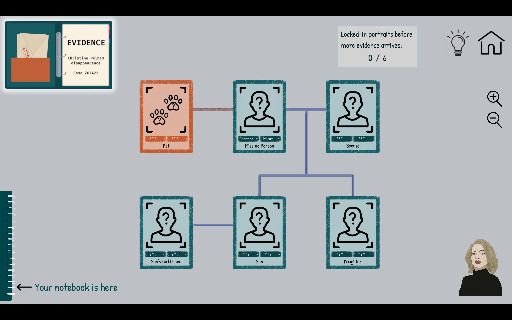
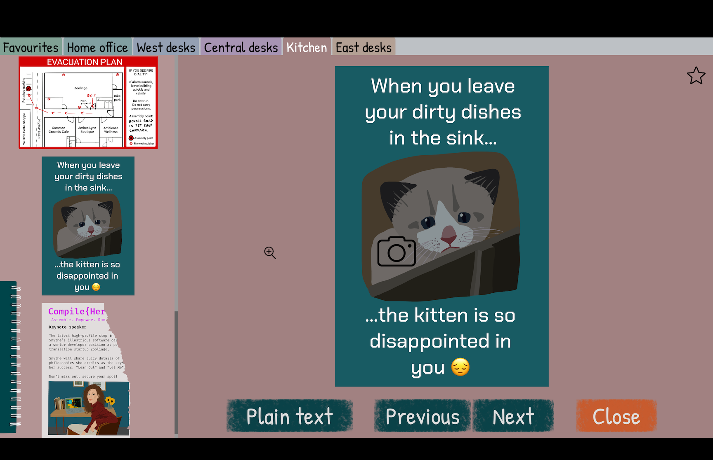
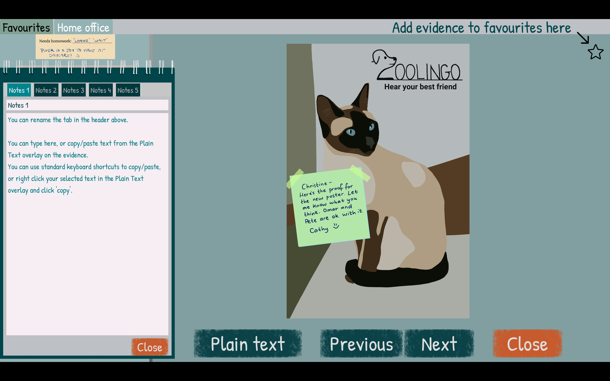
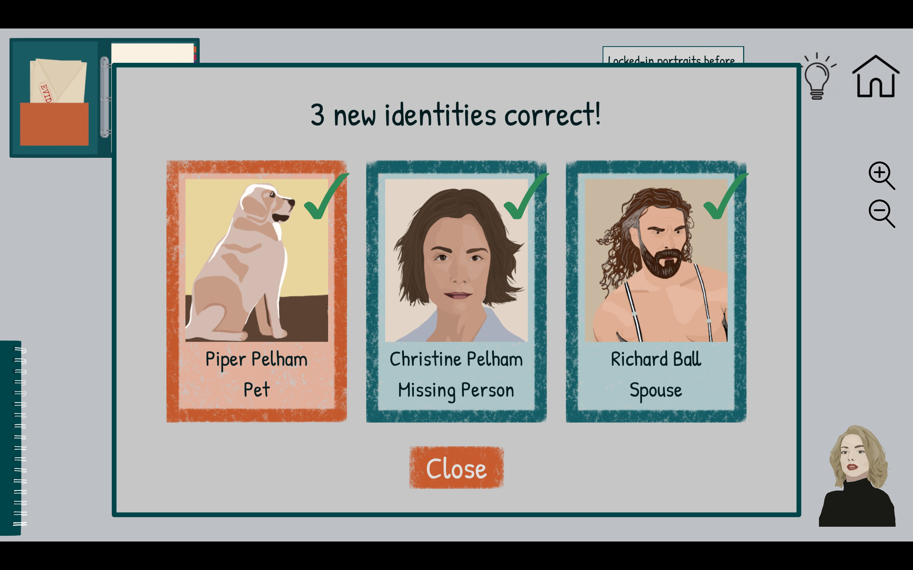
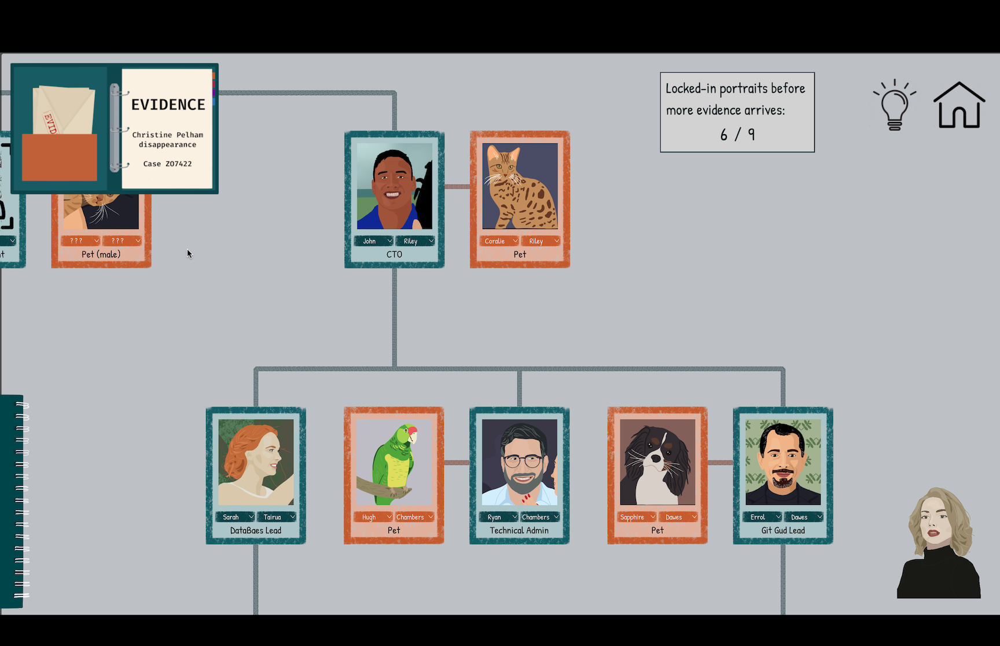

_[A Case of Fraud](https://www.hesperusgames.com/#CaseOfFraud)_ is the latest in the burgeoning genre of detective games popularized by [Return of the Obra Dinn](/games/return-of-the-obra-dinn/) and [The Roottrees are Dead](/games/the-roottrees-are-dead/). It's a well-written deduction game where you must unmask a murderer and ultimately, a case of fraud. The game consists of a series of micro-puzzles that culminate in a delightfully intricate finale. Its well-realized office setting provides a great backdrop, but much of its setup feels like filler rather than payoff.

<YoutubeEmbed youtubeId="vw7uQJwNUhs" />

After the CEO of Zoolingo (a tech startup for communicating with pets) is found murdered, it's up to you to crack the case. You'll spend your time poring over evidence in order to fill in the first and last name of every person (and pet!) on the company's [org chart](https://en.wikipedia.org/wiki/Organizational_chart). As you progress, you unlock new evidence in the form of scribbled notes, chat messages, and employee dating profiles. Eventually, you reach the game's capstone puzzle, giving you the opportunity to unmask a killer.

Veterans of _Roottrees_ will find the core gameplay familiar: each person on the board is their own little puzzle. Determining the name and photo attached to each job title takes logical deductions and some process of elimination. You'll spend most of your time sifting through documents to determine which details are important (which is somehow tedious in real life and surprisingly fun in a game).

Most of your playtime is spent looking at evidence, so I'm glad so much care was put into its creation. Each item feels like it was pulled straight from a real tech office (and I would know). Each handwritten note uses specific fonts for each character. The game's writer manages to elicit a lot of character development out of just a few words, so I felt like I knew all the employees by the time the credits rolled.

I found the moment-to-moment gameplay simplistic compared to other entrants in the space. Because of the game's relatively small scope, the pieces of a person's identity were never spread across more than one or two pieces of evidence. And, once identified, most characters were never relevant again. It didn't feel like I had much opportunity to leverage my findings to solve later puzzles, either. There's an in-game note taking system for unraveling the trickier mysteries, but we didn't end up needing it since everything came together so quickly.

I also didn't love that the game just handed me generally straightforward evidence. Maybe I've been spoiled by _Roottrees_ making me work for my deductions, but _A Case of Fraud_ felt less like making leaps of logic and more like I was doing paperwork. Don't get me wrong: the paperwork vibe is part of the charm of the detective game genre. But I still wish there was more of a sense of discovery.

Your commitment to busywork pays off in short order when _A Case of Fraud_ reaches its climactic capstone puzzle. Once you've identified most of the org chart, you're given the final bits of evidence you need to solve the game's main mystery. This puzzle is _much_ more intricate than everything leading up to it and was a ton of fun to piece together.

Earlier deductions have you skimming chat logs to find the line where a coworker calls another by their last name, letting you pin it to the board. This one has you cross-referencing keycard logs, a GPS smartwatch, autopsy documents, and more to unravel everything. It was a great change of pace from all of its setup and really made me wish there was more to the rest of the game.

The devs clearly knew how to make an engaging mystery game, but they saved it all for the ending. It almost felt like two games: a bunch of filler office setup and an exciting finale; neither has much to do with the other. Except for the characters involved in the final puzzle, the first and last names you've been so carefully placing aren't used for anything.

## In the End

So that's where we land: a competently executed game that drags a bit until suddenly, it becomes very exciting. I think _A Case of Fraud_ will act as a way for players who are curious about the detective genre to dip their toes in before committing to the much-longer _Roottrees_. At roughly 2.5 hours of playtime, _CoF_ doesn't overstay its welcome and is fairly engaging enough throughout. I just wish it was a little more consistent in its execution.
