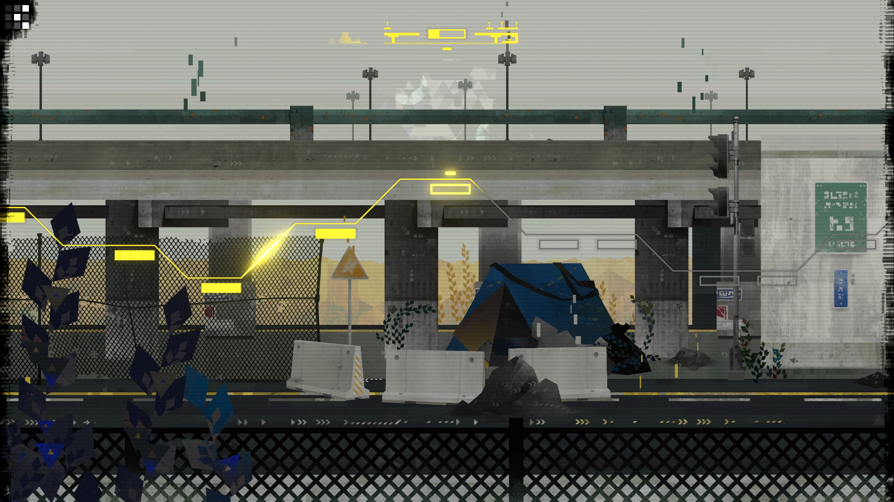

_CIPHER ZERO_ is a new "rule discovery" puzzle game that pushes minimalism to its limits. Its beautiful yet challenging puzzles kept me coming back, even when I felt stuck. I don't feel like the theme did anything to support the gameplay, but that didn't stop me from appreciating everything it does well.

## What works

Your time with _CIPHER ZERO_ will be spent entirely on its cryptic puzzles. They are both simple (easy to understand) and challenging (can be hard to arrive at a correct answer).

Each puzzle consists solely of tiles and glyphs. The tiles are geometric shapes that form a grid; each can be individually clicked on and off. The glyphs impart rules to the tiles around them. For instance, a rule might be "there must be exactly 1 illuminated tile in this column" or "there must be exactly 1 adjacent illuminated tile".

These rules are never explained to you explicitly -- that's the core of the [rule discovery](https://thinkygames.com/lists/best-rule-discovery-games/) genre. Instead, you make theories about each glyph's behavior and refine them when they don't pan out. It's simple, but satisfying each time you crack a new one.

After you've clicked on and illuminated your chosen tile(s), you can take the second of the game's two available actions: verifying your solution. Any glyphs whose rules were not met will flare red to help narrow down what's wrong. Or you'll get a cheery tone and a splash of color (plus an arrow that loads up the next level):

Comparisons to other popular grid puzzles like [sudoku](https://en.wikipedia.org/wiki/Sudoku) and [nonograms](https://en.wikipedia.org/wiki/Nonogram) are obvious, but that would be underselling the elegance of _CIPHER ZERO_. You know the rules, you have all the information; can you produce a correct grid?

This simplicity helped reinforce that I was never _really_ stuck, I just wasn't thinking hard enough. That's not to say I never got frustrated. I'd be stuck on one that seemed impossible and would set the game down for the afternoon. By that evening my head had cleared, and I'd come back and solve it in a minute or two. Knowing I had everything I needed was a great motivator to keep coming back.

The puzzles themselves are well designed. I was nervous that there could only be as many puzzles as there were glyphs. After all, solving your 5th Sudoku isn't _really_ different from your 10th; you're just better at it. My favorite part of rule discovery is the _discovery_ part, so I wasn't sure that _CIPHER ZERO_ would keep my attention once I had seen all the mechanics.

To keep things fresh, you'll soon see puzzles that use more than one glyph at a time. This shifts the challenge from "how well do you know this rule" to "how well can you understand the interaction between these rules". Each combination feels almost like a new rule, so you'll still be scratching that "rule discovery" itch even after you've seen every glyph. Plus, even without additional glyphs, there are lots of little twists that make an old rule feel new again.

It's hard to describe, but at some point the puzzles felt playful. The developers know you understand enough to have made it this far, so they throw you a curveball: a puzzle with many glyphs but whose answer is actually really simple (like a straight line or a perfect circle). These felt like little winks from the devs. Elements like that tell me that the designers really understood the way a player will experience the game: they know what you expect and how to delight you by subverting those expectations.

Pacing wise, I felt like _CIPHER ZERO_ really shone in short-to-medium bursts. I never want to do an entire sudoku book in one sitting, but I love the idea of doing them 15 minutes at a time basically indefinitely; this game feels similarly bite-sized. In some ways, it feels like a better fit for mobile than Steam. I don't mean to denigrate it -- it doesn't have the low production value or predatory microtransactions of many mobile games. Just that the puzzles (and UI!) are perfect for quiet minutes of downtime throughout my day.

Lastly, there are lot of great little details that make the game feel good:

- The controls are well thought out, useful but also out of your way while solving.
- There's a 3-color flagging system to help keep track of guesses and eliminate specific tiles. You get to decide what each of the colors mean to you, making it flexible enough for any system you devise.
- Most of the puzzle answers are visually pleasing. They're often symmetrical or beautiful, which I really liked.

## What doesn't work

While I loved _CIPHER ZERO_'s gameplay, its underdeveloped theme left me wanting.

Each of the game's sections has a name and a matching backdrop (`ROAD`, `POWERPLANT`, etc). But nothing about the puzzles in that section feel tied to the location. They could have been called `WORLD 1` and `WORLD 3` without losing anything, which to me means the theme is distracting more than it's supporting.

The puzzles themselves have a "glitchy computer" vibe. It's a cool visual style, but it doesn't have anything to do with the landscapes, so it just feels out of place.

It would be one thing if the theme was just acted as window dressing. But each time you solve a block of puzzles, an unskippable cutscene plays that shows the current locale whizzing by while background details are transformed. Focusing on it so heavily implied that something important must be happening, but as far as I could tell nothing does.

It sort of makes me wonder why there's a theme at all. There are plenty of great puzzle games that don't have themes (like [Hexcells](/games/hexcells/), which feels like a newspaper puzzle). There are also games whose theme informs the puzzles directly (like [Murder by Numbers](/games/murder-by-numbers/), whose nonogram solutions are all pixelated versions of clues the protagonist has found). And in an interesting parallel, newly released [Flicker](https://store.steampowered.com/app/3350460/Flicker/) is a "text-free, rule-discovery puzzle game" that touts "uncover[ing]... mechanics naturally—no instructions, just the joy of discovery." In that game, a flame jumps between candles to illuminate them. The way that fire can hop and duplicate informs the puzzle design and the whole thing feels cohesive as a result.

That cohesion is what _CIPHER ZERO_ ultimately felt like it was lacking. It commits the same sin as genre peer [The Witness](/games/the-witness/), mysteriously implying there's something to discover without actually delivering anything (besides stellar gameplay). This miss won't keep it from success, but it does feel like a lost opportunity.

Past that, my other gripes are comparatively minor:

- The level selector is _really_ slow and annoying to use, classic form over function in the name of minimalism. It's basically impossible to find a specific previous level because of the lack of numbers & names.
- The game is perfectly linear, meaning there's only ever a single unsolved level. I appreciate being able to jump around when I'm stuck, so it would have been nice for later sections to open when you're part way through your current one.
- A hint system would be nice. Sometimes you're just thinking about something incorrectly and a little nudge would be appreciated (especially because you can't jump around).

## In the End

That big complainy section aside, there's nothing preventing me from a wholehearted recommendation of _CIPHER ZERO_. Without being explicit, the game is constantly teaching you new rules while reaffirming your understanding of previous ones. The things it does right it _really_ nails: a steady stream of tricky rules, playful puzzles, and beautiful art.
