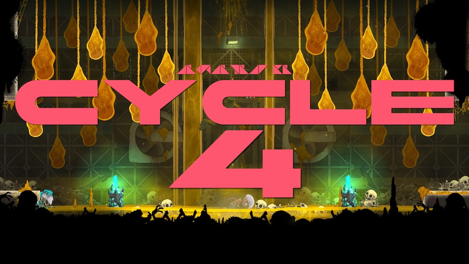
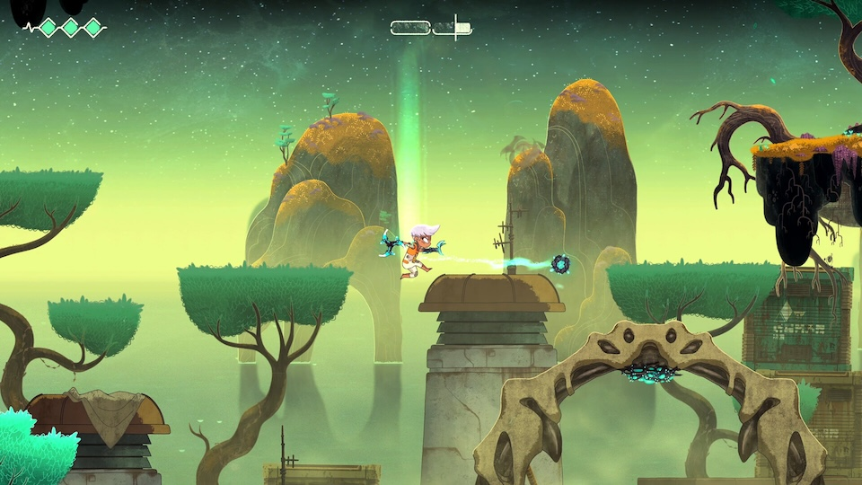
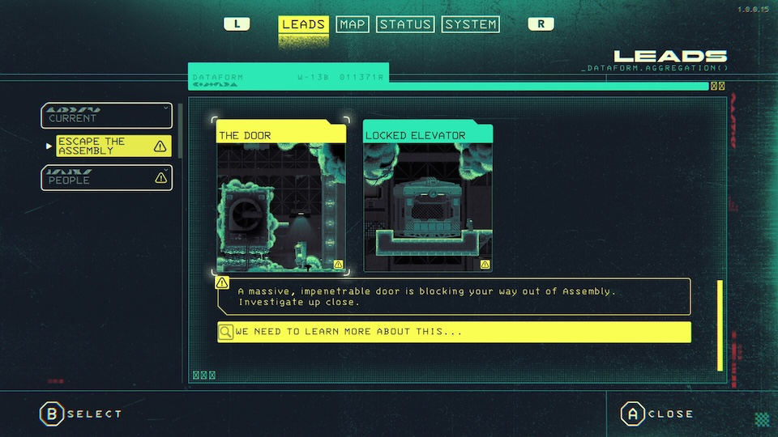
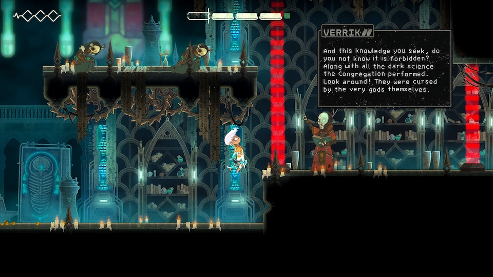
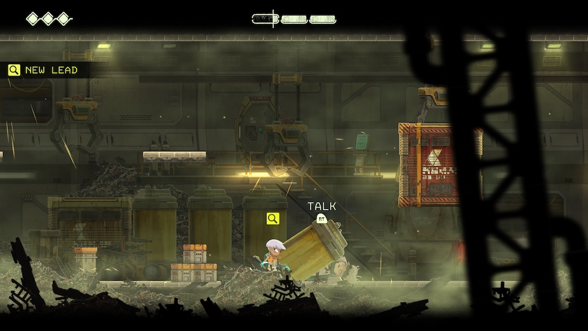

_Echo Weaver_ is a new [knowledge-gated](https://thinkygames.com/features/metroidbrainia-an-in-depth-exploration-of-knowledge-gated-games/) time-loop platformer by [Moonlight Kids](https://www.moonlightkids.co/). It follows in the footsteps of other discovery-heavy games like [Outer Wilds](/games/outer-wilds/), but with a lot more capital-g Game packed in there. As a platforming enthusiast and time-loop media connoisseur, it feels like this game was made just for me.

To advance the game’s non-linear plot, you play the same day over and over, carrying what you learn forward into the next run.I loved how much there was to find. And for me, figuring out a new ability before you're "supposed to" never got old.

<YoutubeEmbed youtubeId="8ce9ZTGcAEU" />

## Welcome to the loop

Each trip through _Echo Weaver_'s time loop is on a strict countdown (see also: [Minit](/games/minit/)). You can extend it by finding time crystals, but eventually you always wake up back where you started. And, with the exception of one _teeny_ bit of in-game state (and some permanent power-ups), everything in the world resets when you do.

Progression is based on what you, the player, learn during each of your loops (just like recent classic [Outer Wilds](/games/outer-wilds/)). Each shortcut you find extends the distance you can cover during a single loop. Each new ability broadens the hazards you can overcome and platforms you can reach.

Most interesting of all, information about the world reshapes your understanding of it, shedding new light on areas you visited before. And though you do some backtracking, I didn't find the gameplay repetitive. There were enough new things to tackle in old areas that nothing felt stale, even on repeated visits.

The combination of puzzle and platforming gameplay works well. Learning to navigate the world is a puzzle in and of itself, while understanding how to make a particularly tricky jump is the quiz that tests that knowledge. The moment-to-moment experience reminded me a lot of the beautifully layered [Animal Well](/games/animal-well/).

You have all the abilities you'll ever get at the very start of the game; knowing how to use them is a different story (reminiscent of the obscure button sequences in [Chroma Zero](/games/chroma-zero/)). In a particularly clever bit of design from the developers, the methods for executing your abilities are pretty hard to just guess. Some of them have specific conditions or button sequences that you're unlikely to just stumble upon... which is not to say you _can't_. Discovering abilities "early" always felt like a special treat, as if I was pulling one over on the devs. (Not that there's a single order players will find things in - just a general flow. The game's open-ended design means there are a lot of paths through to its finale.)

I also liked how you only get new information if you go looking for it -- nothing is spoon-fed to you. If you feel a little directionless, you can check out _Echo Weaver_'s "leads" journal, which tracks major story beats and side quests. The journal’s notes make it so there's always a thread to pull on, which helps the game's overall pacing. It also notes important codes & timestamps, saving you the trouble of using an external notebook. And if you want to avoid the main plot, there are plenty of other activities, like side quests and time trials. A loop is never boring, even if it doesn’t necessarily advance the game.

The gameplay supports the sci-fi story, told through cutscenes scattered throughout the map. Because you can find the scenes in any order, they have to be a little self-contained, but they work well.

Over time, you'll learn which events happen at which times. For example, a lake springs a leak early in the day. If you need to visit when there's still water, that has to be one of your first destinations. Similarly, NPCs move around throughout the day, so you'll have to plan your route well if you want to have specific conversations.

You also get to play with cause and effect. If you notice something bad has happened late in the loop, there's a good chance you can do something earlier in the day to prevent it, often with exciting or beneficial consequences. _Echo Weaver_ correctly keeps these sequences simple (in contrast to [The Sexy Brutale](/games/the-sexy-brutale/), which I found too hard to reason through).

Overall, _Echo Weaver_ nails its core design. The world is your oyster as soon as you know how to navigate it. It manages to make you feel powerful just by learning, which is a rare feat.

## Rough edges

My biggest frustration was the inconsistency in the platforming. It was hard to put my finger on, but I _think_ it has to do with the variation in jump height based on how long you hold the button. That's a common feature in platformers, but I suspect in this game the height of your jump can be _any_ value up to a maximum, rather than the more common low / medium / high presets.

As a result, when jumping up a wall for the second time, you'll land in slightly different spots (unless you're _very_ precise with your button presses). As a result, replaying a platforming section requires basically re-solving it because you can't reliably take the identical path you did before. It didn't stop me enjoying the game -- the exploration and sense of discovery is truly excellent -- but it made the overall flow of movement a little less fluid than may have been intended.

My other gripe was the dark sections, where the screen is nearly blacked out. I don't enjoy navigating without sight (no matter how many hints/tricks there are). You get a "light" ability partway through which will illuminate those areas, but they were still a personal low point.

## In the end

_Echo Weaver_ earns a place among the pantheon of excellent time loop games; the non-linear story comes together nicely and the overall vibe and art style is excellent. It combines and refines ideas from its contemporaries to create an experience that's more than the sum of its parts. By placing a lot of trust in the player to explore and work things out (and giving them the tools to do so), it delivers an unparalleled exploration experience.

I loved that I _could_ have figured out my abilities at any time, and wasn't able to guess many of them. To that end, it felt like the best sort of magic trick. As soon as everything is explained, you're delighted to have been deceived by something so simple. That was the experience I had over and over while playing _Echo Weaver_: surprise and delight.
