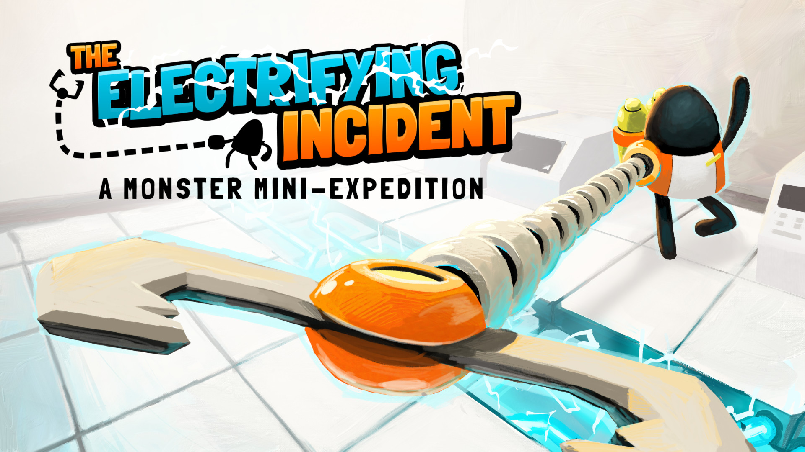
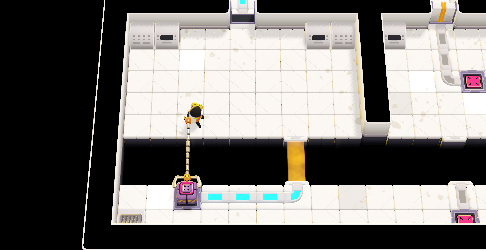
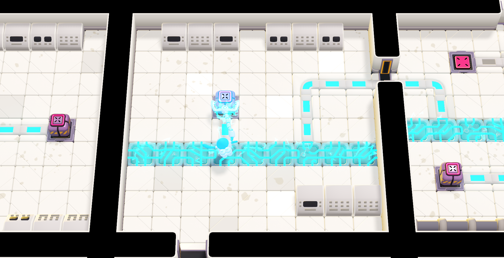

_The Electrifying Incident_ bills itself as a "bite-sized adventure", which is an important phrase to remember when setting your expectations. It's fun and tightly designed, but it ends before you know it.

The game stars the monster from [A Monster's Expedition](https://www.monsterexpedition.com/) (an earlier game from developer [Draknek & Friends](https://www.draknek.org/)). Since his debut in 2020, he's traded an island adventure for a job maintaining a large reactor that's currently melting down. Uh oh!

Gameplay wise, _The Electrifying Incident_ is a clever twist on the [Sokoban](https://thinkygames.com/lists/latest-sokoban-games/) genre. Rather than just pushing adjacent boxes, you can pick them up at a distance. This small change ushers in a new style of puzzle: you still need to get boxes to switches, but you must also consider the distance at which you need to grab the box. Plus, the length of your extended arm affects which doorways you can squeeze through, so a little planning goes a long way.

Alongside the boxes is the constant threat of electric shock. While electricity provides power to the doors you use to navigate the facility, it'll also fry you if you (or a box you're carrying) get too close. It becomes increasingly tricky to maneuver your arm and its cargo as the game progresses. There are more cool mechanics that get introduced towards the end of the game that I don't want to spoil here. But the devs combined them in interesting ways for some good end-game puzzles.

The elephant in the room is the game's length. In a world of 100+ hour marathon RPGs, it was refreshing to be able to finish the game in a sitting. But, it _felt_ short. As I realized I'd come to the game's climax, I was sad that there wasn't more to solve. Leaving me wanting more is a good problem to have, but it's a problem nonetheless.

It's up front about its short duration -- the store page mentions it'll take most players 30-90 minutes to complete. The upside of its short runtime is that there's zero cruft:

- Each puzzle was carefully chosen with nary a stinker to be found.
- There's a bit of story, but very little exposition.
- There's a super brief tutorial, but it mostly turns you loose to let you learn.

So by all accounts, the game is exactly what the devs set out to make: a focused puzzle game about electricity. If the worst thing I can say about it is "I wish there were more of it", I'd say the outing was a success. My advice is to appreciate it for what it is: short and sweet.
