Come one, come all, to my 10th annual Media Year in Review! Hard to believe I've been doing this so long.

This hobby was originally inspired by MacStories' [Must-Have apps list](https://www.macstories.net/roundups/my-must-have-ios-apps-web-services-2016-edition/), except I wanted a space to gush about [Factorio](https://www.factorio.com/). That turned into [a blog post](https://xavd.id/blog/post/a-few-of-my-favorite-things/), an increasingly complex Airtable setup, and eventually, a yearly tradition of cataloguing media consumption. That tradition led to the eventual creation of this site, the addition of its articles, and finally, getting compensated to write.

This year's article is extra exciting because it represents some big changes in my life. Firstly, it's no longer published on my [personal site](https://xavd.id/blog/tags/yearly-review/)! My setup here on **david.reviews** is finally robust enough that I felt comfortable publishing my marquee article on this site.

Secondly, some personal news: [I'm a dad](https://xavd.id/blog/post/first-day-of-the-rest-of-my-life/)! We adopted a beautiful baby girl late in 2025. While it didn't affect the content of this article much (since she arrived so late in the year), I probably won't be playing nearly as many games in the next couple of years. So in a way, this article is the last of its kind: a record of when I had tons of free time. I plan to keep writing _something_ in the future, but I won't have nearly the same amount of hours to devote to it.

But that's a later us problem. For now, enjoy a tour of the absolute best things I played, watched, or read for the first time this year (no matter when they came out).

---

- [Videogames](#videogames)
- [Movies](#movies)
- [TV Shows](#tv-shows)
- [Books](#books)
- [Updates To Previous Picks](#updates-to-previous-picks)
- [Just the List](#just-the-list)
- [That's all she wrote](#thats-all-she-wrote)

## Videogames

My gaming habits have evolved over the years, but the cause of this year's shift is a new one. It wasn't new hardware or a killer app, but the aforementioned [articles](/articles/) section of this site. Now that I can publish long-form reviews (like a more traditional publication does), developers and publishers have been sending me free keys to review their games. It's a personally validating milestone, but it's been a journey getting to this point.

When I added article support in late 2024, I wasn't sure if/how/when I'd be established enough that I'd be sent any review keys. Nevertheless, I set myself a goal: **receive 5 review keys in 2025**. I started by pounding the proverbial pavement. I emailed devs of recently announced games, joined discord servers, and generally tried to get my name out there. This outreach went surprisingly well: I had a 68% success rate across the 22 studios I contacted and completed my goal by June.

I ended up writing 12 long reviews using press keys this year. Getting free games was great, but writing at the level of quality I want took a lot of time. Next year (especially with a baby around) I'll be much more selective about the keys I accept and focus more on games I can finish at my own pace (without a looming review embargo date).

I also had a secret bonus goal: get listed in the "reviews" section of a Steam game. This one I couldn't really talk about because someone kind might just do it to humor me. I figured it would take a long time, but a scant 9 months into this experiment, something cool popped up on the [Cipher Zero](https://store.steampowered.com/app/1332180/CIPHER_ZERO/) Steam page:

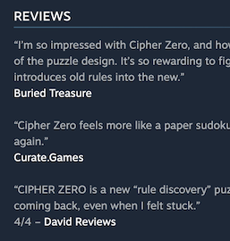

This public show of support meant a lot to me and I'm blown away it happened so quickly. It really makes me feel like a Publication instead of just a dude with a website.

To put a cherry on top, I got some lovely validation from one of the developers I admire most:

> This is the most thoughtful review of the game that I've seen.

Their sentiment reflects the key tenet I use when writing for the site: **give a shit**. It's supremely gratifying to see that recognized. I expect things will change around here, but I know that'll stay the same.

### Let's talk good games

Anyway, enough about the site. Let's get to the actual awards!

In 2025 I played 48 new games for a cumulative 526 hours (down from 69/674 last year). That number will almost certainly keep declining in the coming years.

I also let all my gaming subscriptions lapse, just like I [said I would](https://xavd.id/blog/post/favorite-media-2024/#videogames). My problem has never been too few games to play and it's been lovely not feeling pressured to make the most of my subscriptions.

I also didn't buy any new games until November, when I caved and got a bundle on sale. But between that, review keys, and a bunch of games from the [Tildes game giveaway](https://tildes.net/~games/1rso/tildes_game_giveaway_holiday_2025), I think I _still_ ended the year with a longer to-play list than I started with. I'll keep not buying things in 2026 and make a concerted effort to play through what I already have.

Until then, here are my favorite things I played last year.

### The Roottrees are Dead

Many games don't trust their players enough, preferring instead to coddle the lowest common denominator. _The Roottrees are Dead_, a narrative deduction game in which players investigate a wealthy family and its sordid secrets, has no such reservations.

After a brief tutorial about the use of its family tree and in-game search engine, you're set loose on the entire game. You can solve its puzzles in any order, and can progress as quickly as you can come up with new things to type into its search engine. The Roottrees’ world is vast and there's a million things to find, yet the game’s scope never feels overwhelming. And more than most detective games, it's really on you to solve everything instead of anything being handed to you from the story.

If _Roottrees_ was just its core gameplay, it would be a great game. But its polish and care really puts it into GotY territory for me. I loved the unbelievable number of search terms that were available. We came up empty handed occasionally, but there were just so many obscure things we searched for that still turned up results (albeit sometimes unhelpful ones). The game's writers truly thought of everything. And the excellent in-game notebook makes tracking all your clues a breeze. All the attention to detail adds up, making a great game into a superb experience.

As I wrote in my [full review](/articles/the-roottrees-are-dead-review/), _The Roottrees are Dead_ feels like lightning striking twice. Just 5 years after Obra Dinn defined a puzzle game subgenre, _Roottrees_ has done the same.

_[The Roottrees are Dead](https://roottrees.com/) is available on Steam._

<SteamGame steamId="2754380" />

---

### Neon White

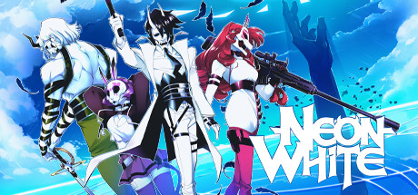

_Neon White_ shouldn't work on paper. The game mixes parkour platforming with a first person shooter set in a [vaporwave](https://en.wikipedia.org/wiki/Vaporwave)-style heaven... and it _rocks_. It's best seen in motion:

<YoutubeEmbed youtubeId="X0b-qZTF0Mc" />

The goal of each level is to reach the end after killing every enemy. Each of the guns can be fired as expected, but they also have an accompanying movement ability. Once you use the latter (or run out of ammo), you throw the gun away. So miss your shots too much or use the ability too early and you may find yourself lacking the jump you need to complete a section.

Each level becomes a little puzzle that demands you perform the right operations in the right order. But unlike most puzzle games, you're doing all of this while hurtling through the air at extreme speed. Progress through the game is eventually gated behind getting enough gold medal times, so you [gotta go fast](https://www.youtube.com/watch?v=Z9G1Mf6TZRs).

_Neon White_ does little wrong, but its intricate level design stood out the most to me. Even at speed, a level's layout wordlessly guides you towards where you should look next. Each level dropped me into this blissful flow state where I felt like I was in the matrix. Run, jump, shoot, spin, ability, shoot, reload, finish. I was unstoppable.

Developer Ben Esposito [said](https://gameinformer.com/interview/2021/07/29/ben-esposito-on-neon-white-if-this-is-for-you-its-your-favorite-game) "if this is for you, it's your favorite game" and boy did I love it.

_[Neon White](https://neonwhite.rip/) is available on Steam & consoles. You can also read my <SubtleLink href="/games/neon-white/">original review</SubtleLink>._

<SteamGame steamId="1533420" />

---

### Runner(s) up

#### Blue Prince

[Much](https://www.eurogamer.net/blue-prince-our-game-of-the-year-is-so-much-more-than-just-a-brilliant-puzzler) [ink](https://www.avclub.com/game-theory-blue-prince-review) has [been](https://aftermath.site/blue-prince-beginner/) [spilled](https://www.rockpapershotgun.com/ive-never-felt-more-at-home-than-in-the-labyrinths-of-blue-prince) over whether _Blue Prince_ is the best game ever or an exercise in frustration. There's no one answer, but I'll tell you this: we played the absolute heck out of it. It does a lot right and, despite some quibbles, nothing has hooked us quite like that since, well, _The Roottrees are Dead_.

As a [roguelike deckbuilder](https://store.steampowered.com/tags/de/Roguelike-Deckbuilder/), it's fun to play. You're given a lot of resources to succeed and using them strategically was always fun. There's a good power curve too. Day 50 plays _very_ differently from day 3 because your deck is so different and you've learned how to use what you're provided.

But as a puzzle game, it absolutely shines. I don't think I've ever felt a sustained sense of discovery across such a long game. It feels like every room and piece of decor could be part of a larger puzzle (which is true more than not). Everything is intertwined and there are layers upon layers of discoveries to make.

Like I mentioned in my <SubtleLink href="/games/blue-prince/">original review</SubtleLink>, we took more notes playing this game than I probably took in all of high school. Everything was organized into a 100+ file [Obsidian](https://obsidian.md/) vault that tracked every puzzle, loose thread, theory, and bit of lore we thought might be useful later. It's roughly 12k words, plus 350 screenshots (just in case we needed to reference the subject later, which we often did).

Its brilliance boils down to the way the puzzles inform the deckbuilding and the deckbuilding guides the puzzles. The intricacy of the whole thing is simply staggering.

So why "only" award it runner-up despite how brilliant I clearly thought it was? Two reasons.

Late into the game, there's friction where its two genres clash rather than support each other. Like many players, we hit points where we knew how to solve a puzzle but weren't drawing the right rooms to do it. You eventually have enough control over the deck to mitigate this somewhat, but if you never draw something there's nothing you can do. This doesn't _really_ matter for many hours of playtime because there's so much to do. But as those open threads dwindle, you become more reliant on specific draws, which can be frustrating.

The other knock is the ending. There are a few times the credits roll, but none of them actually end the game. Even the final (?) credits (that we only reached after 90 hours) has a puzzle after it that undoes some of the closure we'd just worked so hard for. I feel like the game should have put a bow on everything and ridden off into the sunset instead of teasing further mysteries that don't (appear to) exist. When we finally called it quits, we were left with a lack of closure that threatened to taint our whole experience. It doesn't matter how cool a trick is if you can't land the dang thing.

But, for all its faults, there was never a moment we regretted playing it. Top to bottom, the game is a design triumph, the exact likes of which we may never see again.

_[Blue Prince](https://www.blueprincegame.com/) is available on Steam, PS5, and Xbox. You can also read my <SubtleLink href="/games/blue-prince/">original review</SubtleLink>._

<SteamGame steamId="1569580" />

---

#### Strange Jigsaws

One of the last games I played this year, _Strange Jigsaws_ never stopped surprising me. All of the puzzles involve snapping pieces together to form an object, but it's never just an image. It might be an anvil you can use to weigh down another puzzle, a lava control panel, or a wire to power a computer (that itself contains more jigsaws).

More than anything else, it's playful. It delights in surprising you and thinking outside every box. Plus it never lingers long on a concept, preferring to flit through many fun twists instead.

I could gush about this for ages, but it's not a long game. Just go play it! It's better experienced than read about.

_[Strange Jigsaws](https://www.flebpuzzles.com/) is available on Steam. You can also read my [original review](/games/strange-jigsaws/)._

<SteamGame steamId="2702170" />

---

### Honorable mention(s)

- _[Leap Year](https://store.steampowered.com/app/2951770/Leap_Year/)_, for taking a great concept (a platformer where you die if you jump) and executing it flawlessly. Its entire world is tightly designed and its method of teaching you new abilities is elegant as heck. Short and sweet.
- _[Nine Sols](https://store.steampowered.com/app/1809540/Nine_Sols/)_, for its superb parry-based gameplay, beautiful visual design, and surprisingly good story. There's a learning curve, but when it clicks it _really_ clicked.
- _[Citizen Sleeper 2](https://jumpovertheage.com/)_, for remixing everything I loved about the first one - another great story that continues its tight coupling of narrative & gameplay. The ending deserves a special callout -- I was thinking about it for weeks.
- _[Wilmot Works it Out](https://wilmotworksitout.com/)_, for its focused scope and flawless execution. It's simpler than its predecessor and is the better for it. Many hours of (non-strange) jigsaws, some light story, and the zen-like activity of sorting pieces were a total delight.

<MediaYearLink items="games" verbed="played" year="2025" />

  {/* prettier-ignore */}
  <em>You can also [see this list](https://store.steampowered.com/curator/45203122-david.reviews/list/164843) on my Steam curator (and follow me if you haven't!)</em>

<SteamFollowButton />

## Movies

Our theater-going never really recovered after we stopped during the pandemic and I don't foresee that trend reversing now that we've got a baby. In fact, my movie watching in general was way down this year. I saw 70 movies total, 35 of which were new to me, 0 of which were in a theater (down from 104/52/2 the year before).

But, I watched 24 movies in December. When I'm doing the night shift with our baby, it's easy to put on a movie while she rests and they help me stay awake. So though 2025 was a down year overall, I'm guessing we'll see a spike in 2026 (or at least until I go back to sleeping regular hours). Only time will tell, but until then, our winners!

### Black Bag

I'm a sucker for a good spy movie and Steven Soderbergh's latest was a delight. It follows a married pair of spies (Cate Blanchett & Michael Fassbender) trying to track down a mole in their organization. There are plenty of suspects and some messy relationships tying them all together. Before long, the leads realize they might not even be able to trust each other. It's everything a James bond movie should be: chic, exciting, and a little bit dangerous. The best part? There are hardly any fight scenes.

Don't get me wrong -- fight scenes are fun enough (especially when well-choreographed). But I increasingly feel like they're dead air in movies. Maybe it's leftover Marvel fatigue, but for me the minutes of a movie are better served with basically anything else than yet another Foley-heavy brawl.

Instead, _Black Bag_ succeeds on its writing, characters, and mystery. It's a breath of fresh air in a world where action movies focus on big set pieces and while everything else is an afterthought.

_[Black Bag](https://www.justwatch.com/us/movie/black-bag) is currently streaming on Prime Video and is available to purchase. You can also read my <SubtleLink href="/movies/black-bag-2025/">original review</SubtleLink>._

---

### Ladies and Gentlemen... 50 Years of SNL Music

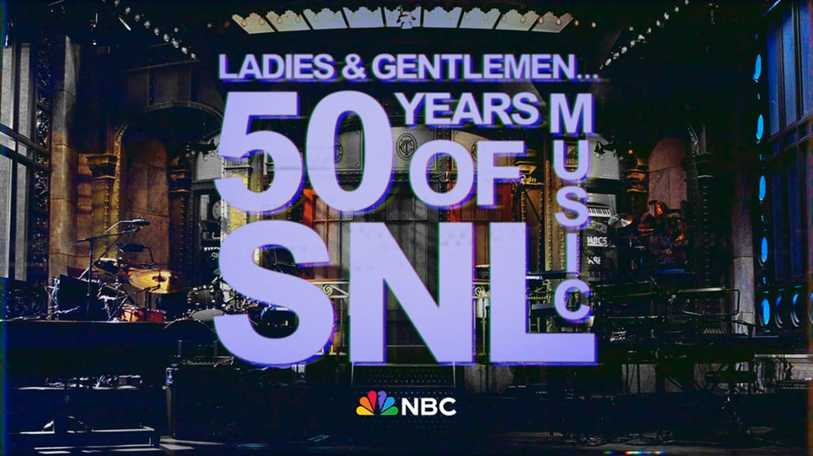

I've watched every episode of SNL for more than 15 years, but I usually skip through the musical guest. Sometimes they're someone I'm interested in hearing, but more often than not, the sound balance is weird and/or I don't care for the music so I just get on with my day.

Imagine my surprise when Questlove's documentary about the history of music on SNL was one of my favorite things to come out of the show's 50th anniversary celebrations. It gave a ton of cultural context to the history of music on the show and helped me appreciate how it's shaped the popular musical landscape.

It's brilliantly edited, especially the 8 minute opening montage. You can watch it here (currently):

<YoutubeEmbed youtubeId="sbSFTlWSKB8" />

The rest of it is good too though. Plenty of interviews, insights, and nostalgia. Even seeing everyone's outfits is fun on its own.

_[Ladies and Gentlemen](https://www.justwatch.com/us/movie/ladies-and-gentlemen-50-years-of-snl-music) is available to stream on Peacock. You can also read my <SubtleLink href="/movies/ladies-and-gentlemen-50-years-of-snl-music-2025/">original review</SubtleLink>._

---

### Runner(s) up

#### Wake Up Dead Man

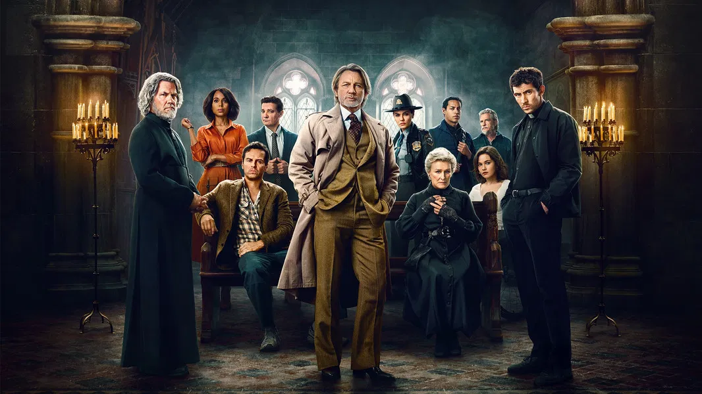

Rian Johnson's popular murder mystery series is no stranger to my best-of lists. In fact, its inclusion here makes the trilogy a hat trick: 3/3 on awards! Good for him.

_Wake Up Dead Man_ feels like a bit of a return to form for star detective Benoit Blanc. It's a little more plot focused than [Glass Onion](/movies/glass-onion-2022/)'s character-centric outing. Daniel Craig's Blanc also pulls less focus, instead channeling the audience through Josh O'Connor's superb performance as Father Jud. It's been fun watching Johnson play with the role of the detective in his stories: should they be the main character, a side character, or a vessel for the audience?

The ensemble, per usual, is impeccably cast. They felt a little under-developed this time around, but I think they serve their purpose. The actual mystery was better than the last movie too. It was more fair than _Glass Onion_ and there were good layers to the whole thing. Josh Brolin as the villain carried more of the weight than previous 3rd leads (e.g. neither Craig nor his assistant). And just like before, there's a monologue that will forever peg this as an extremely 2025 film (just like each of its predecessors).

I'm a simple man. These movies are fun as heck and I'll keep watching them as long as he's making them.

_[Wake Up Dead Man](https://www.justwatch.com/us/movie/wake-up-dead-man-a-knives-out-mystery) is available to stream on Netflix. You can also read my <SubtleLink href="/movies/wake-up-dead-man-2025/">original review</SubtleLink>._

---

### Honorable mentions

- [Not Just a Goof](https://www.justwatch.com/us/movie/not-just-a-goof), for diving deep into the history behind one of my favorite childhood (and frankly, adulthood) Disney movies: [A Goofy Movie](/movies/a-goofy-movie-1995/). They've got a remarkable amount of footage from the 90s!
- [The Naked Gun (2025)](https://www.justwatch.com/us/movie/the-naked-gun-2025), for making a big budget slapstick comedy in 2025. It captures the essence of the original movies while putting a fresh spin on them, to great effect.

<MediaYearLink items="movies" verbed="watched" year="2025" />

## TV shows

I don't publish my TV reviews on this site, but it's the not-so-secret 4th media category I track in Airtable. And honestly, it's probably my second favorite media type (after games).

We continue to live in a golden era of television. We might not get 22 episodes a year anymore, but the overall quality is high and there's an absolute tsunami of great things to watch (and I haven't even seen most of it yet)!

### Severance S2

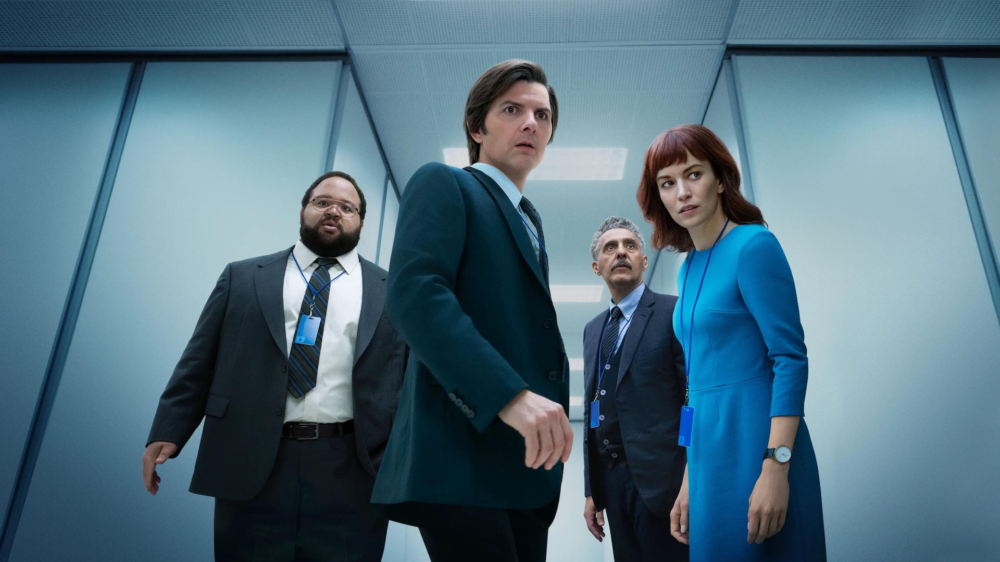

Shows that end on big cliffhangers and then take years to come back are always hit or miss. Audiences are left wondering if anything can live up to the expectations they've been building over time. So when _Severance_ finally returned, I was apprehensive. I needn't have been.

The first session set the stage for a world and season two takes it and expands on it, just like a good sequel should. The stark, beautiful, haunting world of the Lumon corporation gets bigger and spookier with every episode.

I didn't mind the second season's slow, methodical pace. There's so much detail in this world, they can show us as much as they want. Every episode built and expanded our narrow view of their world (much like the severed characters they depict) and I just ate it up. It's such a simple premise, but they explore so much of how it fits into the world.

I could reference standout performances from every cast member, but Tramell Tillman's "Mr. Milchick" and Adam Scott's "Mark S." are absolutely unstoppable. They each deliver absolutely knockout performances in a couple of key scenes that deserve all the awards (which Tillman won, happily). What an absolutely gripping delight.

And now for another long wait on yet another cliffhanger.

_[Severance](https://www.justwatch.com/us/tv-show/severance) is available on Apple TV_.

---

### The Studio S1

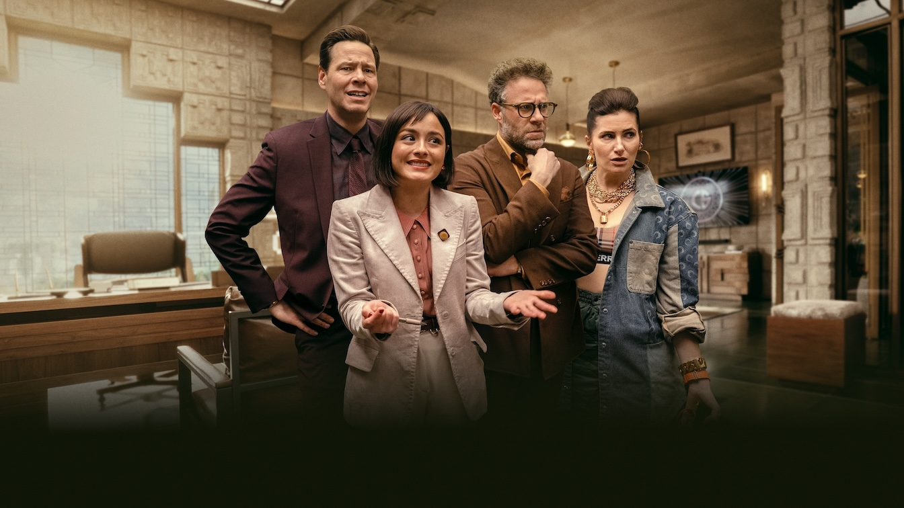

Sometimes there are shows that feel like they're grown in a lab just for me. This year, it's _The Studio_, a farcical ensemble comedy about the inner workings of a movie studio in modern day LA.

It's perfectly written. Little jokes come back in big ways while the main plots take big swings and knock it out of the park. Things go wrong in such precise and hysterical ways and every episode was laugh-out-loud. The entire Scorsese storyline was perfect, as was every one of Bryan Cranston's scenes.

The cinematography is unreal. Most of the episodes are a string of [long takes](https://en.wikipedia.org/wiki/Long_take) that makes it feel unlike anything else on TV. You're immediately immersed into the chaos on screen. The way they put it all together is really spectacular and [well-worth a read](https://www.indiewire.com/features/interviews/the-studio-episode-2-where-how-shot-the-oner-1235111760/). The whole show is just such a labor of love and you can tell.

_[The Studio](https://www.justwatch.com/us/tv-show/the-studio-2025) is available on Apple TV_.

---

### Chernobyl

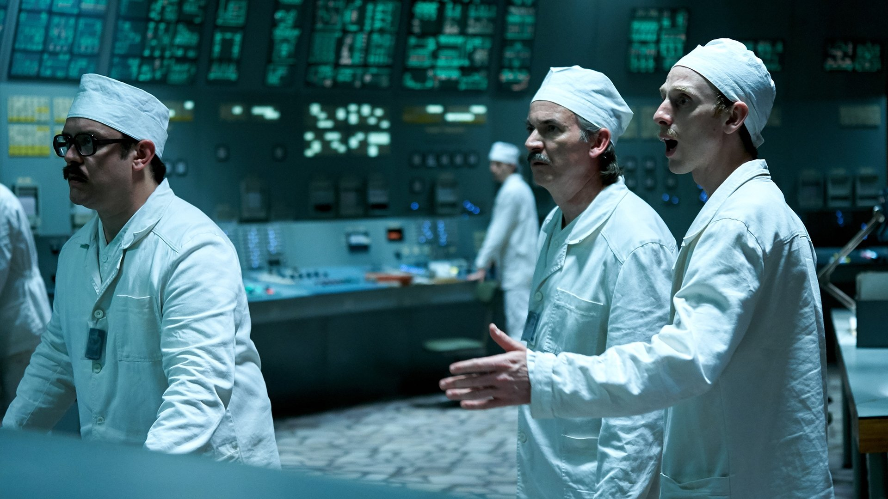

I love tense dramas but I had somehow never sat down to watch _Chernobyl_. It's not exactly breaking ground to say that I loved a years-old critically acclaimed show, but I did. I love how each episode focused on different parts of the disaster but they all fit into a larger frame story.

Each additional layer of the story was chilling. Over and over, we meet these characters, learn their motivations, and see what they're willing to do to fix it (or cover it up). The cast did a phenomenal job selling the sheer scale of the human cost of the whole thing. The bravery and frightened despair makes this a series of all-time performances.

It's also weirdly relevant today, with our spate of irresponsible politicians and lack of accountability. It'll probably always be relevant, unfortunately.

_[Chernobyl](https://www.justwatch.com/us/tv-show/chernobyl) is available on HBO Max_.

---

### Runner(s) up

#### Bad Monkey

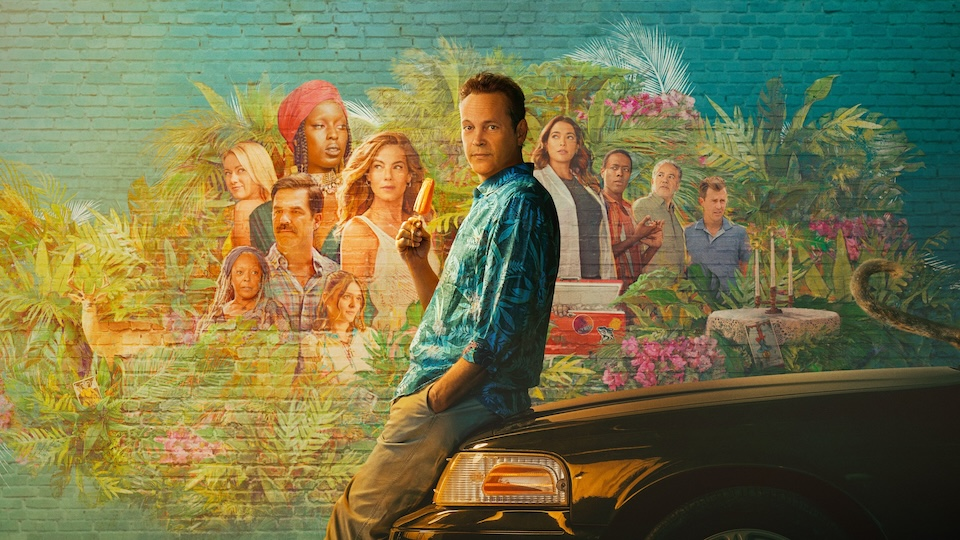

Adapting chaotic books can result in chaotic shows, but Bill Lawrence handled it with ease. It's perfectly cast and it weaves (and expands) the book's many interwoven plot lines. The mystery proceeds briskly and the locations are gorgeous. Darkly funny and thrilling all at once.

Vaughn's sympathetic performance grounds the entire ensemble, especially a truly unhinged performance from Meredith Hagner. The whole thing just works.

_[Bad Monkey](https://www.justwatch.com/us/tv-show/bad-monkey) is available to stream on Apple TV_.

---

### Honorable Mention(s)

- [Arcane](https://www.justwatch.com/us/tv-show/arcane) S2, for being a worthy follow-up to one of the greatest seasons of TV ever made. It was still gorgeous and the plot was good, if a little more abstract this time around.
- [Poker Face](https://www.justwatch.com/us/tv-show/poker-face) S2, for _really_ working when it works. S2 was less consistent than S1 (as if Johnson wrote 7 episodes but the studio upped their ask to 10 at the last minute), but the fun guest stars and inventive plotlines kept me happy.
- [Only Murders in the Building](https://www.justwatch.com/us/tv-show/only-murders-in-the-building) S5, for putting out a great season of TV yearly, without fail. I liked the bend towards a more personal story this year and have loved the character development they've gotten to do. And the guest stars! My goodness.

  See all the shows I watched during 2025 (including ratings & reviews) on
  [Airtable](https://airtable.com/appgycccClQwN0zHz/shrwKZu5kxbs3mw9s).

## Books

This year I read 27 books, which was a big increase from last year's 16. But 14 of those were audiobooks, so my actual "reading words on a page" time was down this year. That shift will likely continue, since it's easy to pop an audiobook in while hanging with a sleeping baby or doing baby chores. Audible's exclusives tend to be decent, but [LibroFM](https://www.libro.fm/) is great for DRM-free files and supporting your local bookstores!

### Parable of the Talents

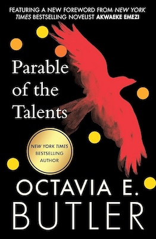

I was on something of a post-apocalyptic kick with my book selections this year. I was especially interested in books with characters who remembered "the before times", like _Handmaid's Tale_ or _The Road_. Each version of the world's descent into their current predicament was troubling in its own way. It's uhh, been a year, to put it mildly. Fiction helps me not worry about stuff so much though.

The best of these (or most chilling, anyway) was Octavia E. Butler's _[Parable of the Talents](https://www.octaviabutler.com/parableseries)_, the second book in her _Parable_ duology.

It's an intense read no matter what, but it felt especially relevant in 2025. It was originally published in 1998 but you could have told me it was written this year and I'd have believed you. Take this passage, describing a fictional politician whose campaign slogan is, I kid you not, "Make America Great Again":

> Jarret insists on being a throwback to some earlier, "simpler" time. Now does not suit him. Religious tolerance does not suit him. The current state of the country does not suit him. He wants to take us all back to some magical time when everyone believed in the same God, worshiped him in the same way, and understood that their safety in the universe depended on completing the same religious rituals and stomping anyone who was different.
>
> There was never such a time in this country. But these days when more than half the people in the country can't read at all, history is just one more vast unknown to them

I know Reagan used the slogan first, but still. Are we as a country so predictable that a sci-fi author could see where we were headed nearly 20 years before it happened? I guess part of her job was to imagine a future for the country, I just wish she was a little more off the mark.

Current relevance aside, proceed with some caution with this title. It's a fascinating and beautiful book about belief and perseverance, but it's a _rough_ road they travel.

---

### Heaven's River (Bobiverse Book 4)

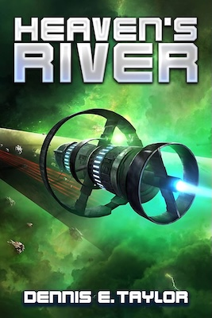

Dennis E. Taylor's _Bobiverse_ series is an Audible exclusive darling that comes up in recommendation threads a lot, and for good reason! It's expansive speculative sci-fi about exploring the universe and self-replicating probes with personalities.

The whole series is great. I always describe it using the [galaxy brain meme](https://knowyourmeme.com/memes/galaxy-brain) because each book feels huge in scope yet each sequel keeps expanding it while raising the stakes.

This award is sort of for the whole series, but in the spirit of picking just one, I think book 4 (_[Heaven's River](http://dennisetaylor.org/)_) was my favorite; the fifth (_Not Till We Are Lost_) was also very good. Book 4 was the most swashbuckling, so it slightly edges out the others. The whole series is great though, especially the audiobooks. Narrator Ray Porter does an expert job setting voices for all the different clones and giving unique personality to each. An already funny text really shines through his performance.

---

### Runner(s) up

#### The God of the Woods

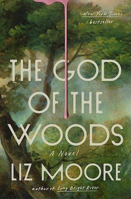

Liz Moore's _[The God of the Woods](https://www.lizmoore.net/books#/the-god-of-the-woods/)_ is a sprawling thriller that chronicles a series of crimes and tragedies across generations, set at a summer camp. On top of its compelling mystery, it touches on a lot of relevant themes, like class disparity, adolescence, and parenthood. The plot itself is layered and suspenseful, a perfect summer read.

I loved the way it jumped back and forth through time, building a much more complete understanding of these characters than most books can afford to give us. I thought the teenagers were especially well written. They argued, teased, and goofed around just like I remember.

Also worth mentioning: despite its title, there's nothing supernatural about it. Just a prose-heavy detective novel. Set those expectations accordingly!

---

### Honorable mention(s)

- [Cut & Run](https://www.audible.com/pd/Cut-and-Run-Audiobook/B082YHVMCG), for the best dark humor I've read in a while. It's unfortunately an Audible exclusive, but it's a great time. Fast, witty dialogue, a stacked cast, and a genuinely good-natured story. It's not technically a book, but it is one of my favorites for the year. Stealing organs was never so engaging!

<MediaYearLink items="books" verbed="read" year="2025" />

## Just the list

<TightList>

- Games
  - [The Roottrees are Dead](https://roottrees.com/)
  - [Neon White](https://neonwhite.rip/)
  - Runner(s) Up:
    - [Blue Prince](https://www.blueprincegame.com/)
    - [Strange Jigsaws](https://www.flebpuzzles.com/)
  - Honorable Mention(s):
    - [Leap Year](https://store.steampowered.com/app/2951770/Leap_Year/)
    - [Nine Sols](https://store.steampowered.com/app/1809540/Nine_Sols/)
    - [Citizen Sleeper 2](https://jumpovertheage.com/)
    - [Wilmot Works it Out](https://wilmotworksitout.com/)
- Movies
  - [Black Bag](https://www.justwatch.com/us/movie/black-bag)
  - Runner(s) Up:
    - [Wake Up Dead Man](https://www.justwatch.com/us/movie/wake-up-dead-man-a-knives-out-mystery)
  - Honorable Mention(s):
    - [Not Just a Goof](https://www.justwatch.com/us/movie/not-just-a-goof)
    - [The Naked Gun (2025)](https://www.justwatch.com/us/movie/the-naked-gun-2025)
- TV
  - [Severance S2](https://www.justwatch.com/us/tv-show/severance)
  - [The Studio](https://www.justwatch.com/us/tv-show/the-studio-2025)
  - [Chernobyl](https://www.justwatch.com/us/tv-show/chernobyl)
  - Runner(s) Up:
    - [Bad Monkey](https://www.justwatch.com/us/tv-show/bad-monkey)
  - Honorable Mention(s):
    - [Arcane S2](https://www.justwatch.com/us/tv-show/arcane)
    - [Poker Face S2](https://www.justwatch.com/us/tv-show/poker-face)
    - [Only Murders in the Building S5](https://www.justwatch.com/us/tv-show/only-murders-in-the-building)
- Books
  - [Parable of the Talents](https://www.octaviabutler.com/parableseries) by Octavia E. Butler
  - [Heaven's River](http://dennisetaylor.org/) by Dennis E. Taylor
  - Runner(s) Up:
    - [God of the Woods](https://www.lizmoore.net/books#/the-god-of-the-woods/) by Liz Moore
  - Honorable Mention(s):
    - [Cut & Run](https://www.audible.com/pd/Cut-and-Run-Audiobook/B082YHVMCG), by Ben Acker & Ben Blacker

</TightList>

## That's all she wrote

That's all for now! Thanks as always to:

- Vicky, my stalwart editor and everything else, without whom this wouldn't be possible.
- My sister [Karen](https://www.karenbrownman.com/), who made this year's lovely header image.
- Readers like you! I wouldn't be here without you.

Until next year!
