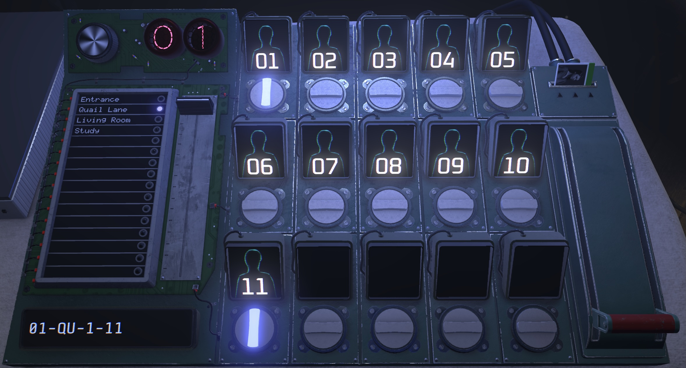
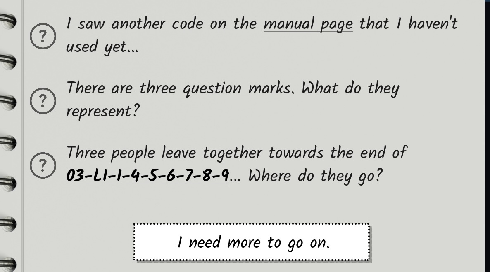
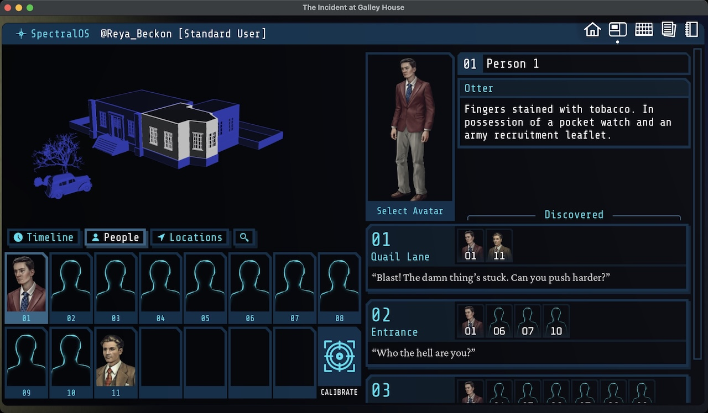
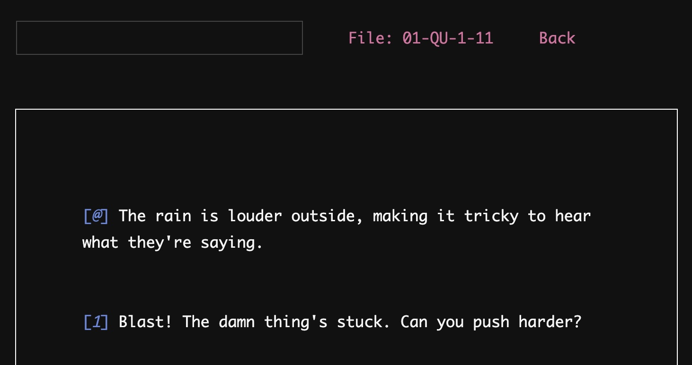
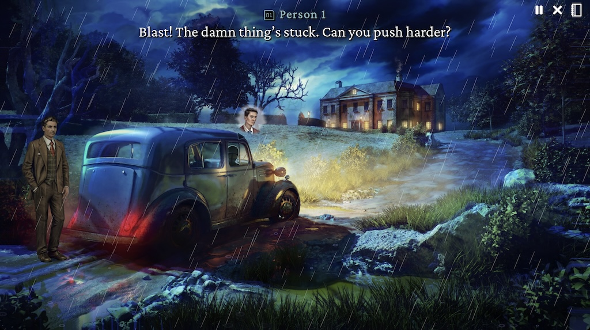

> Note: this review is free of puzzle spoilers! All screenshots come from the game's tutorial and are purposefully devoid of correct answers. That said, I do discuss (in vague terms) the nature of the newly added content. So if you played _Type Help_ and want to know as little as possible about the remake, then just go play!

_The Incident at Galley House_ is a remake of 2025's excellent but bare-bones and un-googleable _[Type Help](https://william-rous.itch.io/type-help)_. Much like the studio's last release (the Steam version of [The Roottrees are Dead](https://david.reviews/articles/the-roottrees-are-dead-review/)), _Galley House_ breathes new life into a beloved but niche game. While _Type Help_ was strictly text-based, _Galley House_ adds a GUI, a cast of voice actors, and an expanded ending in an effort to court a wider audience. The result is spectacular, delivering and engrossing blend of puzzles and story that will delight newcomers and returning players alike.

But, this broad appeal made review especially tricky to write because it feels like there are two distinct audiences. Some of you have played the original and are curious about whether the remake is worth your time (it is!). The rest of you have never heard of the original, so every word I spend comparing the two is wasted space. So bear with me while I try to write everything for everyone. Let's get to it.

<YoutubeEmbed youtubeId="UTDcP5s5gGQ" />

## `01-DA-gameplay`

You play as a junior researcher called into the mysterious Galley House to determine how a group of people met their grisly fates many years ago. To assist you in this endeavor, you're given a mysterious machine that can replay everything that was said in each room of the house.

The catch? You have to know exactly who was there and when the conversation took place. These conversations are keyed by specially formatted codes consisting of a timeslot, room name, and the ID of everyone present, like `01-QU-1-11`. The machine's pleasantly tactile sliders and knobs make generating these codes fun and easy:

A valid code rewards you with a fully performed version of that scene. Voice acting is always nice to have in games, but its inclusion here really elevates _Galley House_'s presentation. The emotional scenes hit differently, especially when compared to the text-only versions they're based on.

Correctly guessing scene codes is the lion's share of the gameplay. Sometimes, characters will announce where they're headed or who they're going to meet. More often, you need to use context clues from additional conversations in order to track the movement of all the characters.

For instance, character `3` might mention they talked to `5` earlier in the kitchen. If you know that both `3` and `5` were unaccounted for in one of the earlier timeslots, there's a good chance that's when that conversation happened. Reconstructing the story almost feels like putting together a big sudoku, since each character is _somewhere_ during each timeslot (until suddenly, they're not 💀).

When the going gets tough, there are a couple of ways to get unstuck. The lighter touch is a badge on each scene that indicates the number of other unwatched codes that scene has clues for. Higher numbers mean a scene is a good candidate for a re-watch to process clues you missed the first time around (or didn't have context for at the time).

There's also a comprehensive hint system, which poses a series of increasingly pointed questions about dialogue you've seen before eventually giving you the next scene code. As a somewhat impatient puzzle game player, I always appreciate a well-constructed hint system.

Because scenes unfold as you discover them, each player will experience a slightly different version of _Galley House_. It speaks to the strength of the writing that, no matter your path, the story is still engaging and exciting. Even though I played _[Type Help](/games/type-help/)_ early last year (and remembered most of the plot details), the story still sucked me in.

## `02-DA-interface`

There are a lot of leads to follow and the game does a good job helping you stay organized. Given that this same team put together the excellent notetaking system in _Roottrees_, it should come as no surprise that leads are easy to track in _Galley House_. Each line of dialogue can be bookmarked into your notebook for reference later. If you type scene codes into the notebook, they become clickable, so it's easy to organize complex trains of thought.

On the other hand, I found information in the game's scene UI to be spread a little thin. The original game's UI was so minimal that we derived our own notetaking system to track characters and rooms over time:

| Time | Person 1 | ... | Person 11 |
| ---- | -------- | --- | --------- |
| `1`  | `QU`     | ... | `QU`      |
| `2`  | `EN`     | ... |           |
| `2`  | `LI`     | ... |           |

Everything fit on a single page in a notebook, and it was easy to see when characters died and which timeslots had missing scenes. All that same information is available in the _Galley House_ UI, but it's spread across a few panels and involves a lot of scrolling.

It's not a big deal, but it's a little sad for all that work to be put into a GUI only for it to have such low information density. That said, it's perfectly usable and is a big improvement over the status quo. Plus, there's nothing stopping you from taking paper notes, so you can play it your way no matter what.

## `03-DA-adaptation`

As an adaptation of an existing game, _Galley House_ is an unqualified success. _Type Help_ always had good bones, but its challenging UI and lack of sound in a game _all about audio recordings_ made it hard to recommend.

The inclusion of [detailed depictions of the house's rooms](https://eviltrout.com/blog/2026-03-23-anatomy-of-a-room/) and voice acting elevates the whole experience. Not only are the scenes easier to follow, but the emotional beats land in a way they didn't before; the voice cast knocked it out of the park.

As someone who played _Type Help_, I'm still glad I played _Galley House_. When chatting with Robin, the lead developer over at [Evil Trout](https://eviltrout.com/), he likened the remake to seeing a movie adaptation of a book you've read. I think it's a little closer to listening to an audiobook after reading the paper copy (since so much dialogue is reused), but the point stands. It's a new take on an existing story.

Whether that's true for everyone who has played _Type Help_ will depend on how willing you are to re-read mystery novels. If you can still enjoy a story when you already know who did it and how, then _Galley House_ is sure to delight. But one-and-done readers may not find enough novelty here. (Instead, consider [The Red Pearls of Borneo](/games/the-red-pearls-of-borneo/) for a similar experience!)

The good news for re-players is that they've fixed _Type Help_'s abrupt and unsatisfying ending. I won't go into too much detail, but the landing is much smoother this time around (and includes ~ an hour of new scenes that weren't in the original at all).

And, in the spirit of making this game as accessible as possible, the whole thing is playable with a controller. Between that and the Mac & Linux builds, you can experience _Galley House_ anywhere, any time, any way you like. It plays equally great on the TV, monitor, and Steam Deck!

## `04-DA-conclusion`

Where does that leave us? Simply, _The Incident at Galley House_ is superb. It takes a good foundation from _Type Help_ and elevates every aspect of it to a more approachable, satisfying, and engrossing experience. The voice cast is impeccable and the game is sure to delight newcomers and returning investigators alike. Evil Trout has struck gold once again and I can't wait to see which niche game they tackle next!
