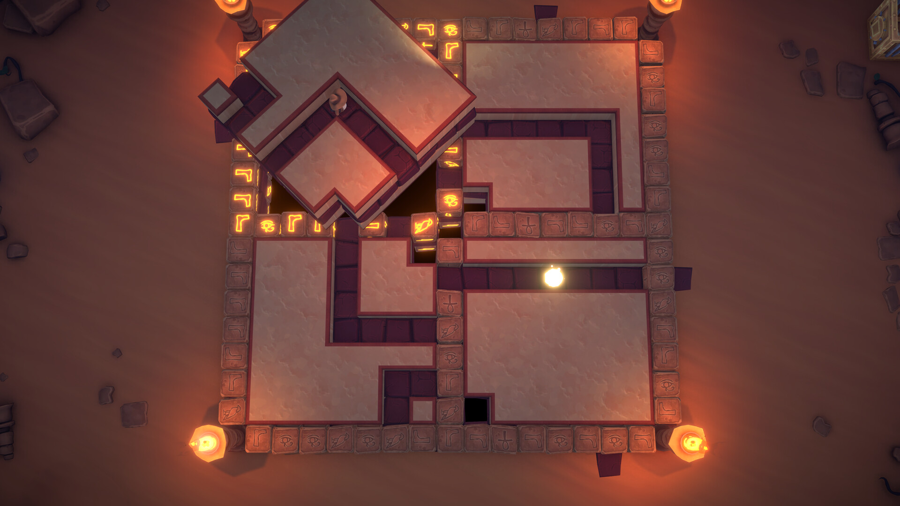
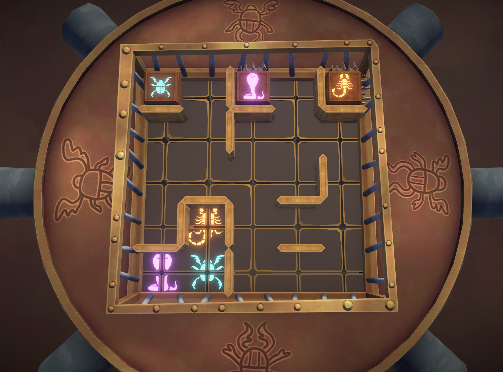
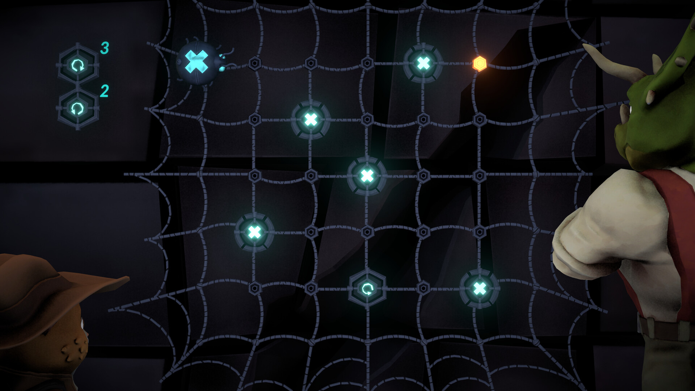
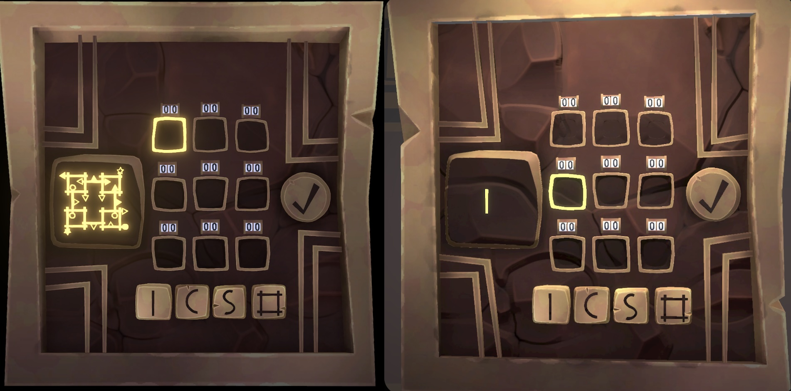
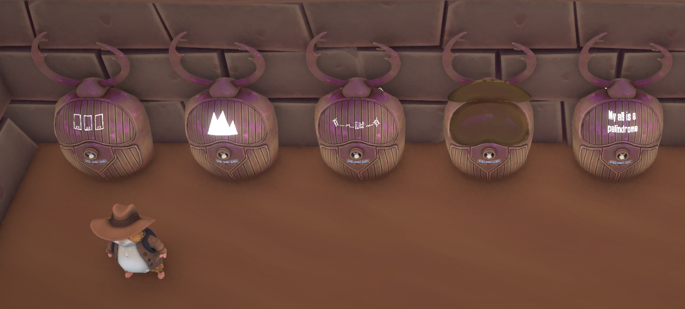

_Hamstermind_ is a new layered puzzle game from [Righteous Tree](https://righteoustreestudio.com/) studios. You play as the intrepid adventurer ~~Indiana~~ Hamster Jones who has been challenged to a battle of wits by the chaotic spirit Charaon. He's convinced you can't solve the mystery of his pyramid and it's up to you to prove him wrong.

You'll have to overcome a variety of puzzles, some of which I liked more than others. The whole experience is wrapped in a bubbly, cartoonish charm that evokes the very best of the PS2 era (and I mean that as a compliment).

<YoutubeEmbed youtubeId="Ae3Fe_9Fbuk" />

Let's dig in!

## Puzzles galore

_Hamstermind's_ pyramid holds 5 different puzzle types, only some of which are required to complete the game. I liked the emphasis on variety, since an entire game of a single puzzle type can get repetitive even if that puzzle is good.

The game's main puzzles involve rotating / sliding large floor tiles to collect glowing orbs. You can only rotate the tile you're standing on, so plotting your path gets pretty tricky. Mix in some confounding elements (like switches & teleporters) and you've got a strong foundation for a game.

The puzzles' difficulty runs the full gamut, so there's something here for everyone. Best of all, some rooms hold bonus objectives, so those puzzles can be completed multiple ways. Designing a puzzle that can be re-solved is an impressive feat!

Outside the bounds of the tile puzzles are small scarab cages. These are a series of rotational sliding block puzzles, where rotating a board causes all the blocks to fall in the new "down" direction. These puzzles remained a little simpler when compared to the tiles above, so they made for nice intermezzos between the more challenging sections.

There was one mechanic I didn't care for (the gusts of wind) but otherwise the scarab puzzles were fun. Completing enough of them rewards you with scarabs you can spend on cosmetic outfits for Hamster Jones. Not just new hats either; full outfits that were cute references to other puzzle games. I loved the detail here!

There were also web puzzles, where you place instructions on a grid so a drone can collect all the "X"s. I liked the difficulty curve on these, since the later puzzles got hard but stayed fair. Weirdly, these were the only puzzles in the game with built-in hints. I'm not sure if testers found them the hardest or they were the easiest to hint, but I always appreciate flexible difficulty.

### Going deeper

Like [Blue Prince](/games/blue-prince/), [Animal Well](/games/animal-well/), and [ogres](https://www.youtube.com/watch?v=aJQmVZSAqlc), _Hamstermind_ has layers. You can get to the game’s initial credits by completing the aforementioned puzzles, but there's more to find in Charaon's pyramid.

The game's starting area sports a vending machine-looking box with an inscrutable series of shapes, icons, and numbers. Though you can't solve it right away, you soon stumble upon a simplified version of the puzzle that lets you discover how each part works, á la a [rule discovery](https://thinkygames.com/lists/best-rule-discovery-games/) game.

I had a little trouble with the legibility of the harder puzzles since there are so many icons crammed into a small space, but it was cool to see a totally different puzzle genre from the game's main tile-rotation schtick.

After each rule discovery segment is complete, a side character will decode clues about the game's final puzzles: a series of chests with diagrams on them. Each takes a 6-digit code to unlock and the developer describes them as "the hardest in the game".

I found these to be the weakest part of the outing. Rather than take advantage of being in a videogame, these capstone puzzles felt like abstract brain teasers you might find in a newspaper. They're totally optional, but felt like a misguided use of a climactic puzzle. I only ended up solving one of them (and earned an underwhelming reward for my trouble).

## Presentation

On a more positive note, I absolutely adored _Hamstermind's_ art direction. Everything from the characters to the environments is pleasantly cartoonish and inviting. It felt like a love letter to the PS2, evoking games like [Jak & Daxter](https://en.wikipedia.org/wiki/Jak_and_Daxter:_The_Precursor_Legacy) that eschewed realism in favor of bubbly approachability.

The strong theming extends to the opening cutscene as well:

<YoutubeEmbed youtubeId="KlXeYoFz-4U" />

Unfortunately, most of the personality in that opening didn't make it into the main game, which felt like a missed opportunity. Many discussions with your companions consist of the same bits of dialogue, repeated every time you talk with them. Even slight variations in their lines would have helped them feel less like cardboard cutouts.

## In the end

_Hamstermind_ is easy to recommend based on the strength of its puzzle gameplay, but little complaints hold it back from an unequivocal recommendation. But for anyone who appreciates a variety of puzzles, a wide difficulty range, and beautiful art direction, it may be an adventure worth excavating.
