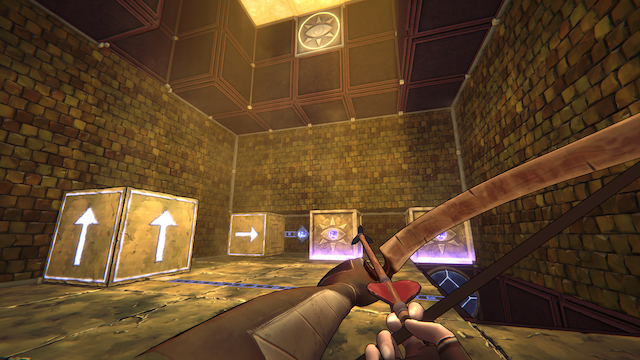
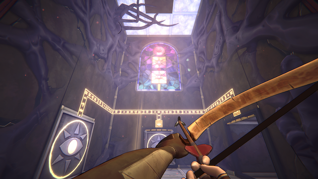

_He Who Watches_ is a tightly designed, mind bending puzzle game focused on manipulating gravity. It's a stunning debut from solo developer [Bobby Vanden](https://bsky.app/profile/danga.games) (and published by veteran developer [Draknek & Friends](https://www.draknek.org/)). I found it a little hard at times, but its playable hint system helped teach its tricks without giving away the answer. If you're impatient like I am, you might find yourself frustrated occasionally. But if you're willing to think through it, you're rewarded with an excellent puzzle experience that encourages you to think outside the box.

<YoutubeEmbed youtubeId="fhzPA9GDlck" />

## Motion

_He Who Watches_ has remarkable movement for a game that, for all intents and purposes, is not a platformer (in my narrow definition, there's no failure condition where you can fall off something and die). Whenever you walk up against a wall, you can step onto it; the room rotates around you. You can't jump over anything, but you _can_ walk up the wall behind it, over the impediment, and back onto the floor on the other side. This turns even simple navigation into a series of micro-puzzles.

I was nervous that this disorienting locomotion would be hard to wrap my head around. But _He Who Watches_' first, best trick is that the constant rotation feels downright natural after about the 3rd level. And despite the first-person UI and constant motion, there are no aiming or timing elements. Everything is turn-based, deterministic, on a grid, and infinitely rewindable.

Its closest puzzle subgenre is probably "[sokoban](https://thinkygames.com/lists/latest-sokoban-games/)". But as someone who gets bored by most block-pushing games, I think applying such a narrow label does the game a disservice. Sure, you're moving boxes around to reach an exit. But _He Who Watches_' unconventional use of gravity means there's much more at play than meets the eye.

<Video src="/videos/he-who-watches/moveblock.mp4" />

Any block you drop falls in whatever direction is currently "down" for you. That means every object in the room might have a different idea of what gravity is supposed to be doing at a given moment, leading to some truly ludicrous interactions. In combination with switches, sliding blocks, and a welding mechanism, the conditional gravity makes each room of the game an intricate puzzle box.

### Depth

To that end, _He Who Watches_ explores its mechanics more thoroughly than any other game I can remember off the top of my head. It introduces new tools slowly, but uses them ingeniously. Nearly every one of _HWW_'s 100+ puzzles explores the unexpected interactions between otherwise pedestrian objects.

<Video src="/videos/he-who-watches/squish.mp4" />

In the hands of a less careful designer, reasoning about a system this complex would get unwieldy, fast. But because each level is so small in scope, there are only so many ways the elements in a room can be used. The constrained problem space allowed Vanden to push the boundaries of what his puzzles expect of you.

The short solution sequences also help the levels feel approachable. Once you know the answer, actually executing it isn't a precariously executed chore. It's more like sliding a key smoothly into a lock. After finishing a level, the puzzles always felt like the best kind of magic trick: incomprehensible at the beginning and totally obvious in hindsight.

## Clues

When the going gets tough, there's a playable hint system built right into the game. Each level has within it a smaller, simpler version of the puzzle from the main level. The example version is set up at its last move, so you can see how the pieces fit together before doing a single obvious action, observing the result, and applying the concept to the main puzzle. I first remember seeing this approach in [Entwined Time](/articles/thinky-awards-2024-impressions/#entwined-time) and was impressed with the concept. (_edit_: some readers have pointed out that this concept originated with [Can of Wormholes](https://store.steampowered.com/app/1295320/Can_of_Wormholes/), which I haven't played. TIL!)

It works well in both games. But, if you're unable to connect the dots between the example and the real puzzle, there's no additional help available (in-game, anyway). The next best option was to take a break and mull it over in the back of my head. More often than not, I'd come back to the game only to solve the offending puzzle immediately.

While developing 2 versions of every puzzle is an undoubtedly impressive feat, impatient players (like myself) may get a little frustrated when they hit a wall and there isn't more help available.

## Misfires

Theme wise, there's a mysterious, almost Lovecraftian implication to the game; who is doing all this watching? The plot (such that it is) shows up very occasionally in the form of 3-sentence vignettes between sections of the game. And though the backdrop responds to your progress, there's not much _narrative_, as it were. It feels like it commits one of the cardinal sins of puzzle games: including just enough story to be enticing but not enough to actually be engaging. That said, I haven't finished the game at time of writing, so there could be a big narrative payoff I just haven't gotten to yet -- apologies if so.

There are also bonus puzzles in each of the game's hub areas. I found them to be harder than the discrete rooms because of the relatively larger problem space and the lack of hints. And, at least for the one bonus I completed, there wasn't much of a reward (as far as I can tell, it was just a "1/3 bonus puzzles completed" badge in that area). But I'm not really someone who seeks 100% completion in puzzle games, so I didn't spend a lot of time with the extra puzzles. But for those players who want to see every single thing, you'll find lots to chew on here!

## Verdict

_He Who Watches_ is a design masterpiece. I was apprehensive going in, but I just kept coming back to it throughout the week I spent writing this review. Each of its levels tickled my brain in unique ways, never failing to surprise me. Plus, I played through the whole game feeling like a cross between Hawkeye, Spider-Man, and the world's most clever puzzle boy. It's a triumph of design and I can't wait to see what Bobby Vanden gets up to next.
