_Kaizen: A Factory Story_ is a new programming/puzzle game by [Coincidence](https://coincidence.games/). The game’s production values are on point and the puzzles intricately designed. The theme provides a strong sense of place, tying the entire experience together to great effect.

_Kaizen_ will feel familiar to anyone who has played games from the now-defunct developer [Zachtronics](https://www.zachtronics.com/), since many of their staff were involved with the making of this game. That may be good news to you; it certainly was to me.

<YoutubeEmbed youtubeId="mpgRU2tKAEo" />

## Building blocks

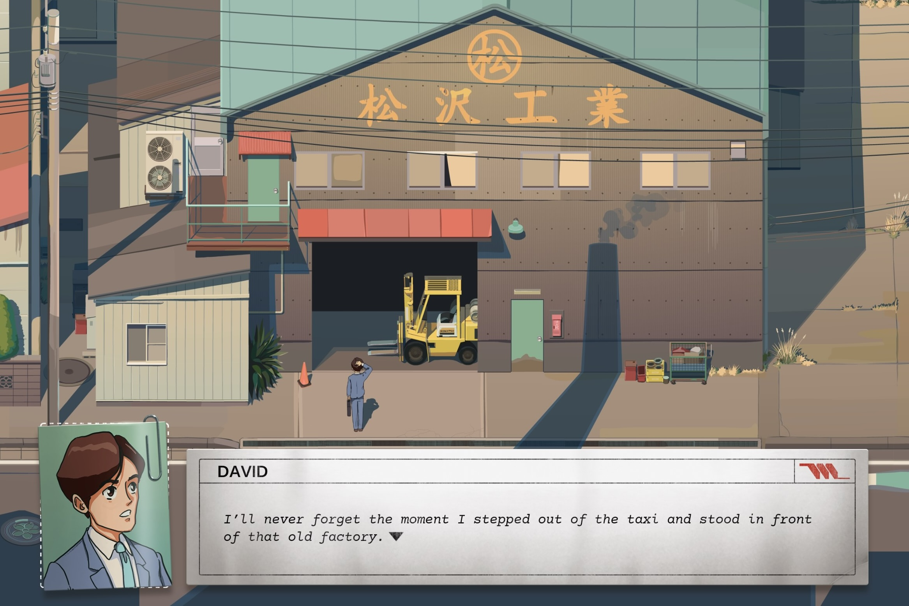

You play David Sugimoto, a Japanese American of the 1980s who has just arrived in Japan to work in the international sales department of the prestigious Matsuzawa Corporation. After a mixup lands you on the factory floor, you're tasked with automating the production of the company's many products. Once you show an aptitude for it, you and your new pals are reassigned to a number of divisions across Japan.

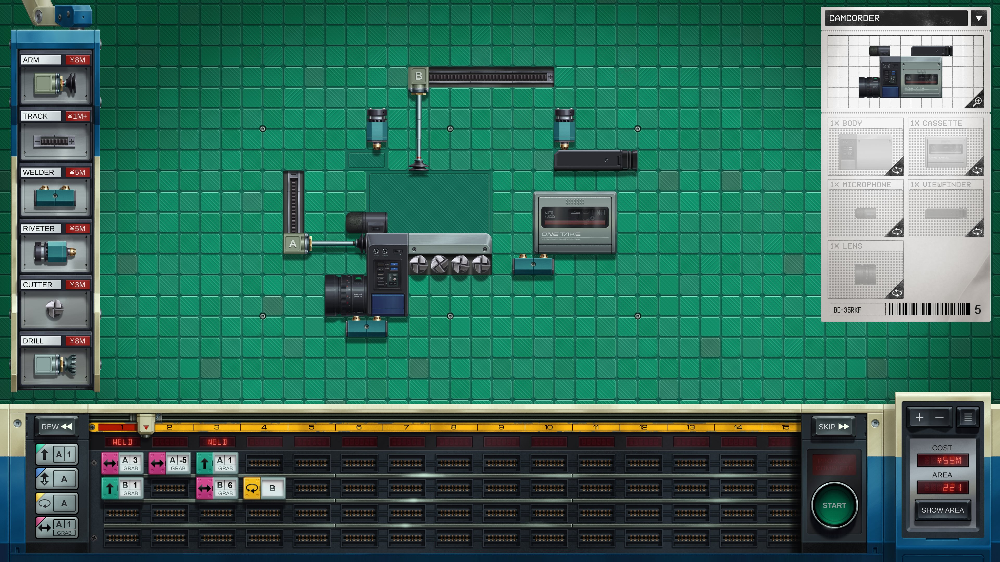

Though each region comes with a different theme, _Kaizen_'s core gameplay is the same: place tools and issue instructions to automate the production of an item (like a VCR or a plastic onigiri). You've got three classes of tools at your disposal:

- grabby arms that can extend, move along a track, and flip what they're holding
- drills that can carve away material (and can also move along tracks)
- stationary fasteners that combine two inputs

While early levels only require combining existing inputs with simple motion:

<Video src="/videos/kaizen/sushi.mp4" />

later levels are more involved, requiring you to cut and flip inputs to form more complex outputs:

<Video src="/videos/kaizen/coffee.mp4" />

To beat a level, you only need to produce its goal. There aren't any time / resource / size limitations, so _any_ solution will unlock the next level. On the one hand, this means the baseline difficulty is a little lower, since your solutions can be big, slow, expensive messes and still allow you to progress. On the other hand, if you enjoy optimizing your solutions for any of those factors, you'll have a lot to chew on. _Kaizen_ mostly stays out of your way and lets you choose what they find most fun.

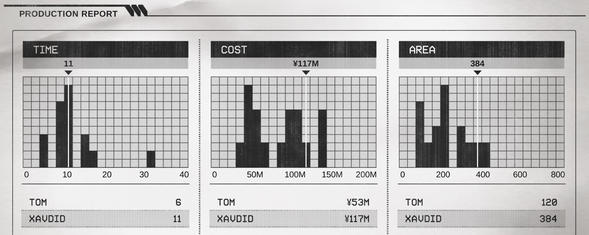

Per usual for a Zachtronics-style game, there are histograms at the end of each level that compare your solution's speed, cost, and size to the global pool of solutions. It's a fun way to see how far I was from the optimal solution (usually: far), but they're easily hidden if they stress you out.

You'll also see the scores of Steam friends who have finished that level. I loved this little bit of extra (optional) competition to push yourself towards making the best factory. While playing for this review, I'd finish a solution only to find that [my friend Tom](https://www.ign.com/person/tomrmarks) did it in half the time at the same price. Having a rival motivated me to optimize my solutions more than I might have otherwise, which I enjoyed.

<Video src="/videos/kaizen/ds.mp4" />

Gameplay wise, _Kaizen_ feels closest to [Opus Magnum](/games/opus-magnum/), but harder. The heavy use of flipping, the directionality of input items (they have a front and a back!), and the lack of arm rotation meant I had to unlearn some old tricks. My brain's apparently not great at reflectional symmetry, but I got there eventually. It's heartening to see the classic Zachtronics formula alive and well under Coincidence's banner.

## Making the complex simple

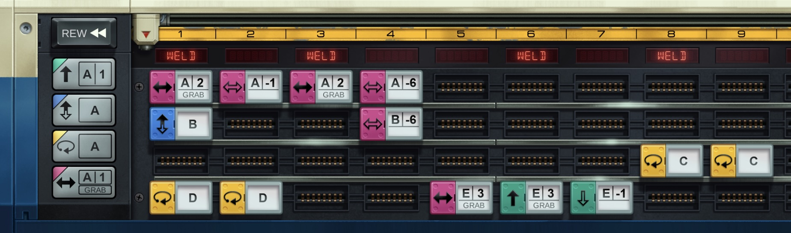

You might think the complexity of the logic engine would lead to an equally complex UI, but the team's done a great job streamlining everything. Everything is accessible using the mouse, but a suite of thoughtful keyboard shortcuts and scroll wheel gestures make editing your solution a breeze too. The cut, copy, and paste operations help keep writing repetitive solutions from feeling laborious.

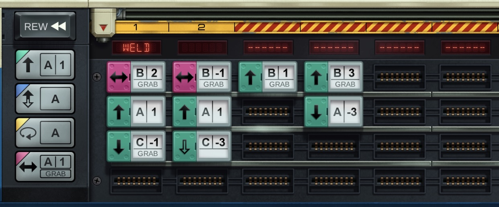

The time scrubber shows the state of the world at any point, making it easy to tell what effect small changes will make. They always animate through each step (complete with cute little hydraulic sound effects) so it's easy to keep track of what's going on. You can even move objects while viewing the middle of the timeline, causing everything to recalculate.

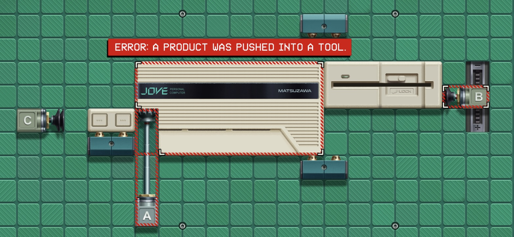

If your parts will collide at any point, your solution is invalid. The game helpfully highlights where that did (or will) happen, ensuring debugging is painless. It'll even warn you if an item isn't droppable because it _would_ have caused a collision, which is a nice touch that saved me from many mistakes. They've done a great job distilling what should be a complex concept (the state of a grid over time) into a miraculously intuitive UI.

My only real gripe was changing the length of a track after placement: because it's under other objects, it's hard to access its grabber. That's really the only thing that jumped out to me as an area for improvement though.

## Spinning a yarn

Interspersed between the many factory levels are brief story interludes where you learn more about your friends, your current bosses, and yourself. They do a great job providing breaks in the action and a bit of narrative color without becoming distracting or overpowering. The story stays light and a little tropey, but it’s nicely voice acted and further develops the game's setting and your growth as an engineer.

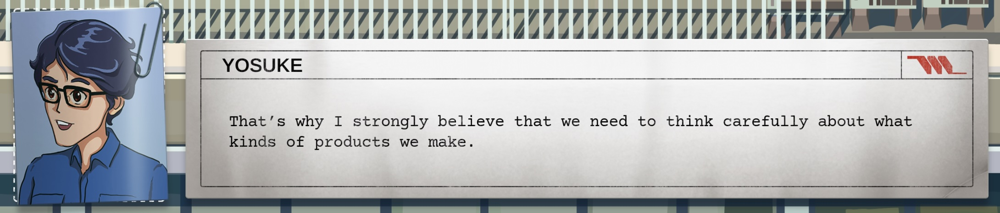

The characters' conversations repeatedly examine the question of "what makes a good product" and our relationship with consumer goods. As employees at a corporation, they're trying to decide how they can do best by their customers while still making money. This topic doesn't feel accidental -- it felt like the developers were examining their relationship with videogames themselves.

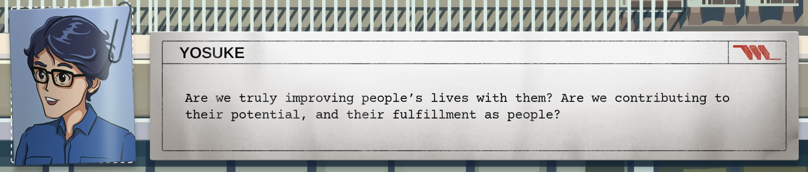

Given that they [closed their original studio](https://www.gamesindustry.biz/why-zachtronics-has-decided-to-call-it-a-day) and formed a new collective with looser goals, it makes sense that the relationship between the producers and the consumers might be on their minds. But even without the real-life parallel, the game's optimistic view of what automation might bring to the future of the 1980s lent an optimistic tone to the game that I enjoyed.

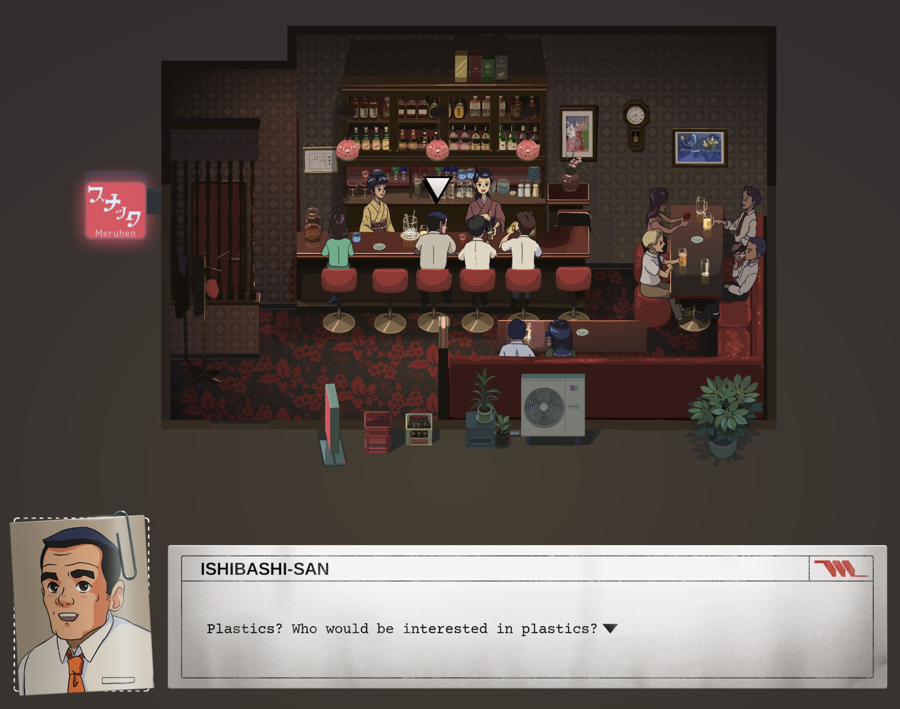

Unlike games that exist in some vague fantasy world, _Kaizen_ is explicitly set in late 1980s Japan, at the height of the [Japanese asset price bubble](https://en.wikipedia.org/wiki/Japanese_asset_price_bubble). All of the items we're producing are period-appropriate and the letters we get from our family back in Indiana reference relevant history (like the [Internment of Japanese Americans](https://en.wikipedia.org/wiki/Internment_of_Japanese_Americans)). The soundtrack was composed by longtime Zachtronics composer (and writer!) [Matthew Seiji Burns](https://matthewseiji.com/music). All the music is great, but I especially enjoyed the bright guitar riff that plays when you finish a level. It motivated me to keep doing great work in the factory; I may even play it for myself each time I finish a review in the future. All of these together produce a strong sense of place for _Kaizen_. Its setting supports its gameplay and its gameplay places it in a specific world – few games feel as seamless.

## One is the loneliest number

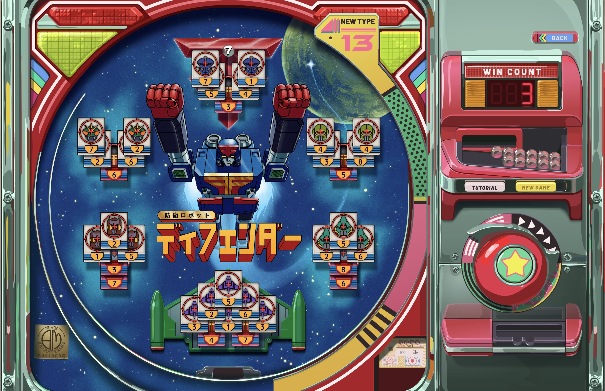

In line with the Zachtronics catalogue, _Kaizen_ includes a thematic spin on solitaire: Pachi-Sol. True to its [pachinko](https://en.wikipedia.org/wiki/Pachinko) roots, you're guiding a ball downwards, strategically eliminating cards as you go with a goal of clearing the board. I loved the presentation but found the gameplay too luck-based.

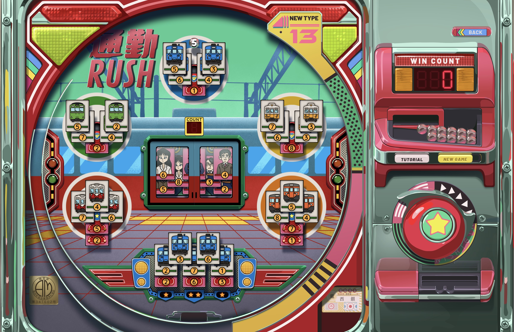

There's always a randomness element to solitaire (since you're shuffling a deck) but I found this one more frustrating than most. You ultimately need to draw balls with numbers matching your cards. But because you don't know what numbers are coming, it doesn't seem possible to plan very far ahead. You can do the best with what you draw, but I found myself in too many unwinnable situations for my tastes. That said, past solitaires have been [guaranteed to be winnable](https://old.reddit.com/r/opus_magnum/comments/1azoudk/what_makes_every_board_of_sigmars_garden_solvable/), so it may just be a skill issue on my part.

Luckily, playing Pachi-Sol is totally optional for progression, so you can partake as much or as little as you want.

## Putting it together

_Kaizen: A Factory Story_ does a superb job tying its theme to its combination puzzle / programming gameplay. The puzzles are restrictive but fair and allow players to find their own fun if they're looking to optimize the heck out of anything. The whole thing comes together for a really solid experience. I'm confident it'll earn its rightful place among the Zachtronics canon.

By the [sounds of it](https://www.gamesradar.com/games/simulation/make-games-and-die-thats-my-plan-coincidences-zach-barth-on-making-games-about-making-things-a-year-of-teaching-and-being-in-it-for-the-long-haul/), there are many more games coming from [Coincidence](https://coincidence.games/) and I couldn't be more excited.
