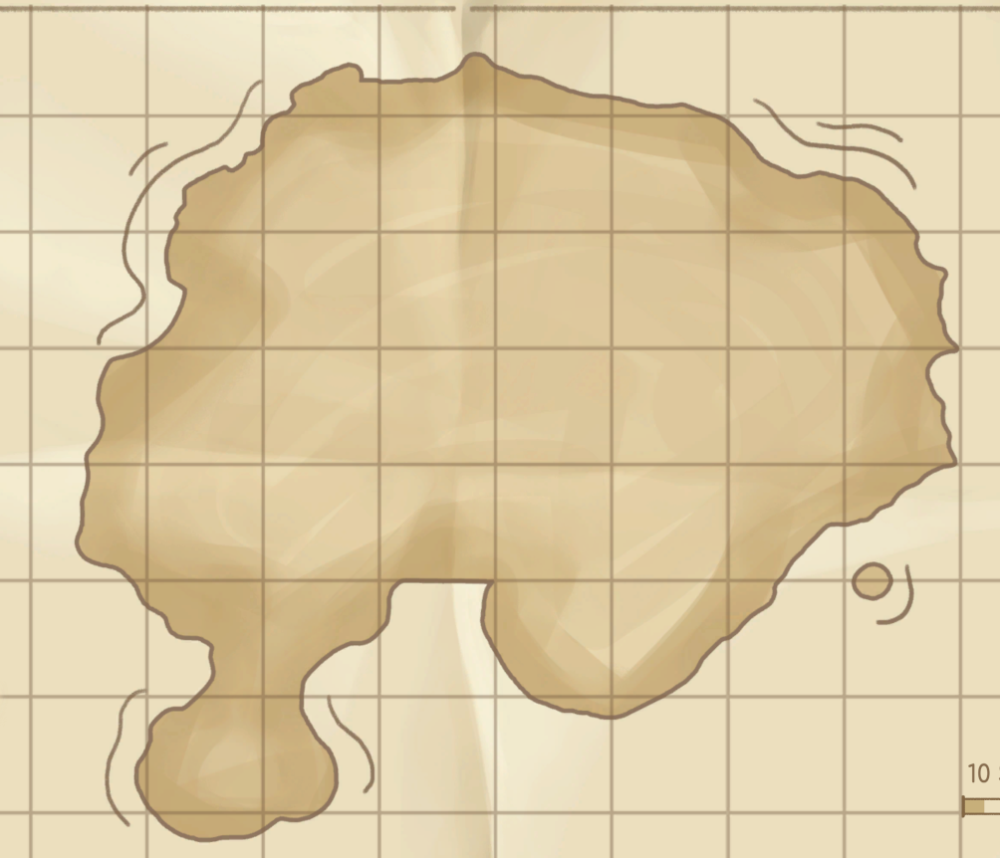
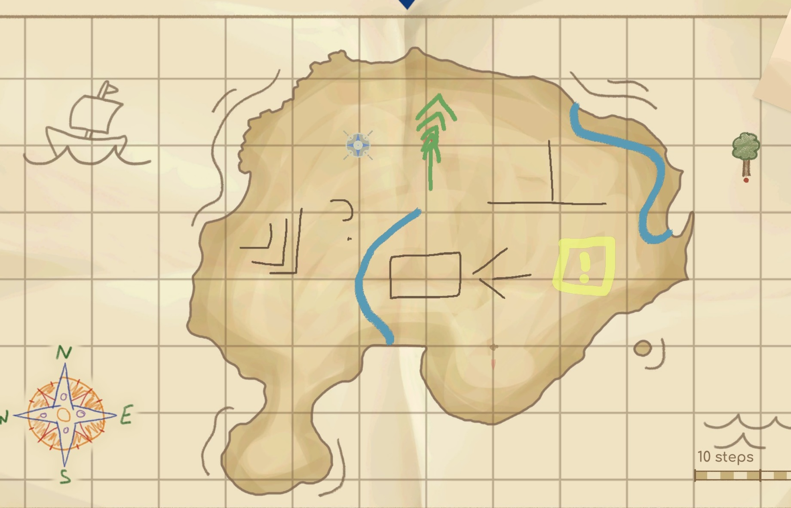
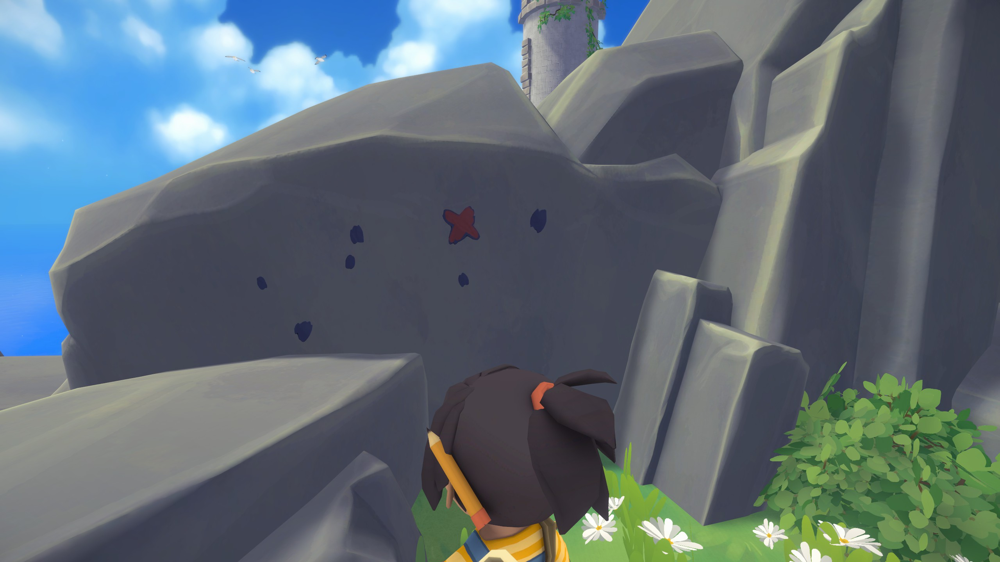
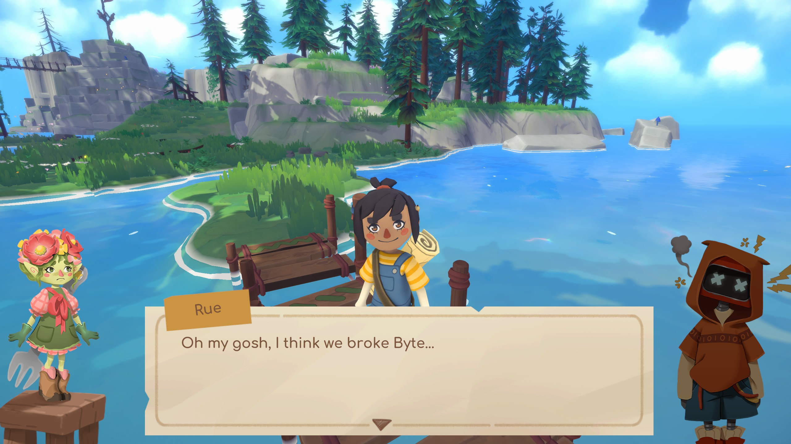
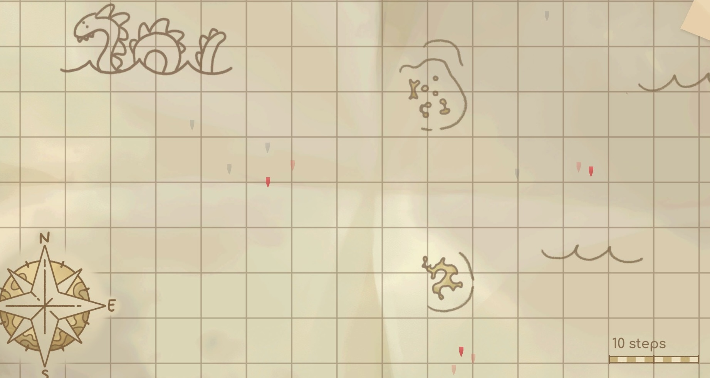

It's not often you come across a game unlike anything you've played before, but _Map Map - A Game About Maps_ manages to be exactly that. The game weaves mapmaking, platforming, building, and a charming little story into an exceedingly pleasant 5+ hour package.

<YoutubeEmbed youtubeId="Aeac4WTnvuQ" />

_Map Map_'s utterly original core gameplay is all about wayfinding: placing markers on an in-game paper map that correspond to a point in the level. You're given a description like "the tower" or "the stump that looks like this". You then run around the level, find the spot in question, and use context clues from the environment to drop a pin on your map. For instance, that stump might be exactly 8 steps from a recognizable bit of coastline.

Measure that same distance on the helpfully gridded map and you're able to make a pretty reasonable guess. The game has high expectations from the get-go: a 3-star result on each puzzle requires you to be within half a step of the true location (~ a foot, probably).

Early on, your maps are a complete and detailed depiction of your surroundings, acting as a helpful tutorial to the rest of the game. Before long, the maps you're given become less and less helpful. They may be missing important landmarks or bits of land entirely. To compensate, you embark on the game's other main activity: mapmaking.

Armed with your trusty pencil, you can chart anything you like on the map. Just like in the real world, nothing you do on the map affects anything off the page, but accurate measurements will translate to more accurate guesses on the puzzles. This comes in handy as the quests scale in difficulty. You'll find yourself triangulating an interior point from more recognizable landmarks. And just like that, the elegant simplicity of the game's many puzzles becomes evident: if you've confirmed location A, which measurements do you need to take to pinpoint location B?

The starting map for each level is less and less descriptive as the game progresses, which scales nicely with your empowered cartographical arsenal. You start by relying on a simple step counter. This works great in open fields, but requires a little more ingenuity when circumnavigating walls and gaps. Before long, you're given a [compass](<https://en.wikipedia.org/wiki/Compass_(drawing_tool)>) to measure distances and ranges more exactly on the page. Other tools are introduced as the game progresses, allowing for ever-more accurate and interesting illustrations.

My maps were mostly the chicken scratch of a very lost man, but I'm confident the community will be able to produce gorgeous, accurate renderings of _Map Map_'s charming little islands; I’m excited to see them.

For extra enthusiastic puzzle solvers, each level has bonus treasures to find. They're clued as cryptic graffiti hidden in each level. Once you decipher the meaning, you also need to actually locate the spot in which to dig; "x" marks the spot! These got pretty hard, but added a fun extra layer to the game's many puzzles.

## Travel buddies

Tying the whole adventure together is a cute story starring your character, a kid cartographer armed with oversized accessories, and an eclectic group of friends. Together, you find landmarks, dig up treasures, and learn to work as a team on the way to the Raven King's Treasure. It's light fare, but the script is pleasant and the whole thing had an air of [The Goonies](/movies/the-goonies-1985/) about it.

Also, the only voice acting consists of each character saying "map" in different cadences. It's so silly and charming, we've been doing it around the house all week.

## Wrong turns

I enjoyed nearly all of the puzzles, though I found some of the late-game a little frustrating. By this point, your maps are little more than three dots on a huge canvas, so you're _really_ on your own. Though the game tells you that future maps may be purposefully incomplete, you sometimes have to figure out the nature of their incompleteness on the fly (for example, only one of five little islands is shown). There are sometimes visual clues about missing regions, but other times I'd wander around confused until I realized, much like hitting [a rebus in a crossword](https://www.nytimes.com/2023/12/08/crosswords/rebus-crossword-puzzle.html), that I must be missing something. It wasn't the end of the world, but it was occasionally annoying.

_Map Map_ also seemed to lose a little focus as the game went on. I _adored_ the mapmaking and wayfinding, but felt like the Fortnite-style building mechanics and "the floor is lava" minigames introduced in later levels were distracting rather than rewarding. The game's controls were precise enough for basic navigation, but their shortcomings were evident when more precise jumps were required. I liked the vibe of a child jumping and exploring uncharted territory (it evoked the nostalgic summer vacation feeling I hold so dear), but in the game, it fell a little flat.

## You have arrived at your destination

All told, _Map Map - A Game About Maps_ walks the walk. The core gameplay loop is both challenging and accessible while being fun throughout. The gear and upgrades provide a good sense of progression as it expects more of your navigational skills. It's not a flawless outing, but it's a charming and original one. Kudos to the team at [Pipapo Games](https://pipapo.games/) on a terrific first game!
