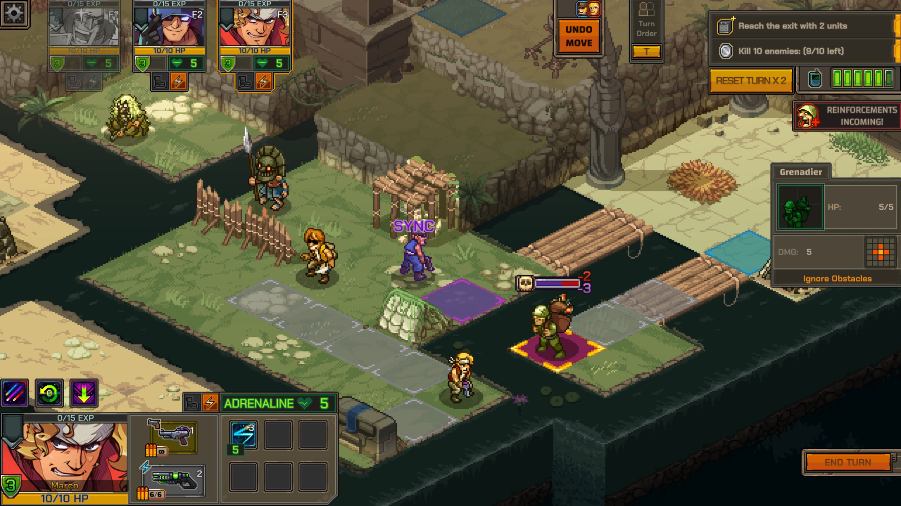
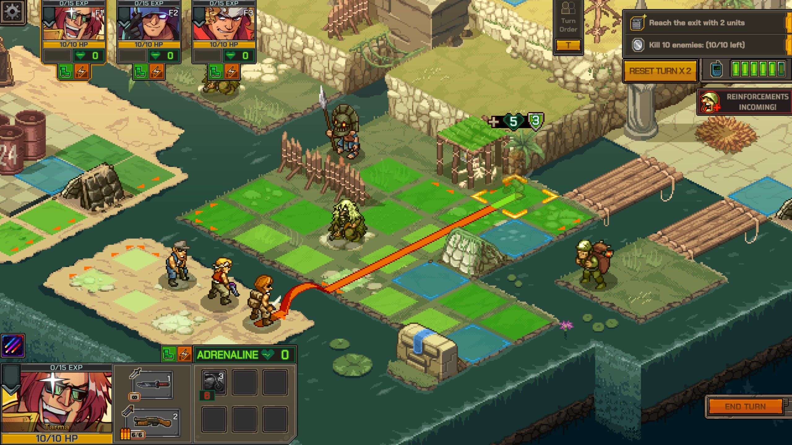
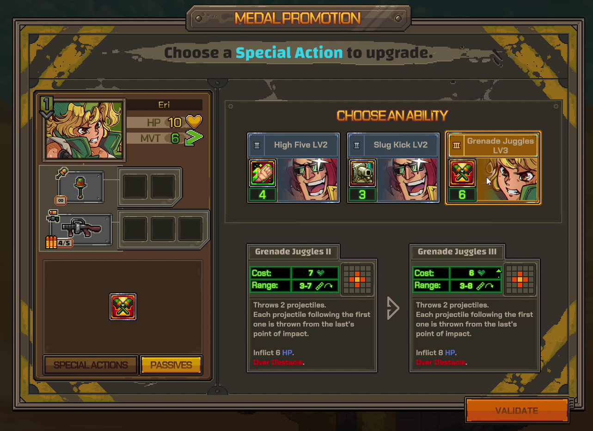
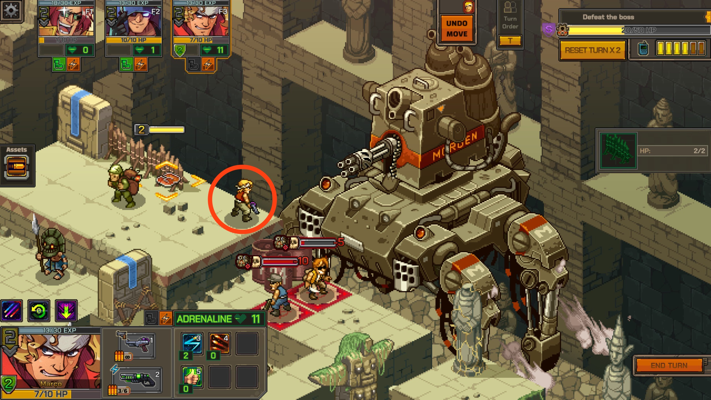

import RoundedLink from "../../components/links/RoundedLink.astro";
import ReviewSummary from "../../components/mdx/ReviewSummary.astro";
import YoutubeEmbed from "../../components/mdx/YoutubeEmbed.astro";

[Metal Slug Tactics](https://metalslugtactics.com/) is a fun, fresh take on a classic series known for its side-scrolling shooters. Its art direction shines alongside deep gameplay and an abundance of character customization options. People familiar with the original arcade games might think a slower tactical entry is an odd successor, but the continuity in style and clever gameplay design brought back fond memories of reaching for just one more quarter.

<YoutubeEmbed youtubeId="ljVNq3x2g_4" />

As a kid, I played a lot of the original <RoundedLink href="/games/metal-slug/">Metal Slug</RoundedLink> on a local arcade cabinet. Week after week, it would eat a few quarters and I'd slowly progress through the game's 6 levels (though I never beat it). Despite my limited access to it, Metal Slug captivated me with its catchy music, frenetic run-and-gun gameplay, and timeless animations. Though the genre has changed, the nostalgic vibes are spot on.

## The Battles Rock

_Metal Slug Tactics_ puts a unique spin on familiar gameplay mechanics with its "sync" attacks. These are special combo moves that are only available when two or more characters are both in range of the same enemy. When any of your characters attacks, the rest will join in with deadly effectiveness. Launching sync attacks consistently are a key to success, so clever positioning of your characters is vital.

Learning to maneuver effectively for syncs definitely takes some practice and helps _MST_ feel distinct from other tactics games I've played.

While you can always use a basic attack, each character also comes equipped with a collection of special moves. These require adrenaline (_MST_'s version of energy/mana) to perform. The only way to build adrenaline is by running your characters around the map; the farther they move, the more adrenaline they accumulate. I love this as a design touch. It perfectly captures the "run & gun" gameplay that the Metal Slug series is known for. If your characters stay put before shooting, they'll quickly be limited to their basic attacks, which lack the oomph of the specials.

By incentivizing repositioning your characters on every turn, _MST_ elegantly encourages you to position yourself for success. Extending your characters far enough to attack without leaving them vulnerable provides a delightful balance of risk and reward.

There's a good variety of mission types and objectives, from the standard "kill all enemies" or "reach the exit" to "survive N turns" and "defend this structure". Each mission also has a challenging bonus objective that yields extra rewards if you can pull it off. These are even more specific, like "participate in N kills with a certain character" or "kill N enemies in a single turn". These went a long way towards missions not feeling same-y, which is good when each run consists of 8-20 of them.

Lastly, some levels have powerful vehicles available for use (including the eponymous Metal Slug tank). These can provide a welcome boost in a pinch. Figuring out when they're worth sprinting to vs moving cautiously towards can be the difference between victory and defeat.

## Flexibility is Key

After each mission, you'll be rewarded with your choice of a new ability or weapon mod. You can start a run with a plan in mind, but what you find along the way will force you to stay on your toes. Depending on who you have with you and what you find, your mission may be best served by pivoting entirely.

For instance, Marco's default loadout is geared around using his abilities for free after participating in sync attacks. His default loadout has mostly abilities to empower allies. But find him some powerful attacks and you can leverage those discounts to pour out damage instead.

There's a good variety of new abilities on each run. Finding cool combos and weird ways to get too strong kept me coming back for the classic "one more run". The game also does a decent job explaining exactly how an ability will work before you buy it, taking some of the pressure off of each selection.

Staying flexible when faced with new opportunities will separate the average commanders from the great ones.

## Growing Your Arsenal

True to its "roguelite" label, there's very little meta-progression in _Metal Slug Tactics_. The only things you unlock are characters, loadouts, and a few weapon mods that are added to the available pool in future runs. Of those 3 categories, the characters and loadouts are clearly the focus. They're what power most of the game's variety.

Loadouts let you start a run with a new set of basic guns and abilities for each character. Interestingly, none of the loadouts are strictly better than others. So as you unlock more, you're not getting _stronger_ over time, like you might in other games. To that end, progression feels more like exploring a space than climbing a mountain. It's not a bad thing, but it's good to set expectations accordingly (especially if you're excited about the progression system from say, <RoundedLink href="/games/hades/">Hades</RoundedLink>).

To the game's credit, running a new loadout on a familiar character drastically changes the way you use them in battle. By my math, there are roughly 5,000 possible squad & loadout options, ensuring you'll never (need to) start the same run twice. (9c3 is 84. Each character has 4, so we multiply that by 43, giving 5,376)

## The Pixels are Perfect

I'll be the first to admit I've got a lot of nostalgia for Metal Slug's art style:

<YoutubeEmbed youtubeId="3x9ReF35t98" />

There's something about the little animations and that one [distinctive scream](https://www.youtube.com/watch?v=sJveGEWq69w) that bring me right back to the time I spent in front of that greasy arcade cabinet all those years ago.

Happily, _MST_ does a great job modernizing the classic sprites into beautiful pixel art. Each animation is lovingly crafted and fits the art style perfectly. Its sound design seems like it got equal love from the designers. Each weapon has unique sound effects and the little enemy screams never get old. Having the series' announcer start and end each mission was also a nice touch.

## Battles Get Unpredictable

While Metal Gear Tactics' core gameplay is strategic and satisfying, I found myself struggling with the UI a bit. First and foremost, it's surprisingly difficult to see when two characters will line up with each other. There's no grid drawn on the ground and the isometric perspective can play tricks on the eyes. For a game built around lining characters up on a grid, this felt like a surprising omission. The game _does_ provide an "undo move" button if you make a positioning mistake. But it's only available until one of your characters attacks, which led me to a few frustrating whiffs.

For instance, my top-left character (circled) can't attack this boss:

There's also a "reset turn" button which unwinds everything, usable twice per mission. Unfortunately, I mostly found myself reaching for it when I had misunderstood something in the UI rather than when I came up with a great new approach. If the UI was a little clearer, I probably wouldn't have needed this button at all. Call me spoiled by <RoundedLink href="/games/tactical-breach-wizards/">Tactical Breach Wizard</RoundedLink>'s rewind system, but some QoL here would go a long way without making battles feel too easy.

The cause and effect of abilities gets pretty muddled at the end of a run. The attack preview shows how much damage you'll do and which characters will sync. But each character has a number of passive abilities that will trigger, the exact result of which is left as an exercise for the player. One could argue that accurately tracking all this is an avenue for skill expression. All the same, ability chains got complex enough that I found myself really wishing for a "this will be the exact state of the world when the dust settles" view.

## The Story That Isn't

Though store descriptions tout that we'll be "[taking] down General Morden before the war escalates into catastrophe!", there didn't seem to be a lot of narrative arc. I did get a multi-mission sidequest that introduced a minor villain, but that felt more gameplay driven than narrative. (Full disclosure: I didn't have a _ton_ of time with this because of a tight turnaround with the embargo, so it's possible the story reaches some conclusion after enough runs. I'll update this line if I find later that there's more of a story.)

The story, such that is, is relegated to short text cutscenes between missions. It never gets in the way, but it also doesn't feel like it adds a ton. None of the character development moments between runs felt like they brought any dimension to the cast (which again, is fine, but feels like a missed opportunity). The whole thing plays out with the depth of a Saturday morning cartoon, for better or for worse.

## In the End

Though the UI has room for improvement, _Metal Slug Tactics_ kept me coming back for more. After a small learning curve, I was rewarded with deep, tactical gameplay. The vast variety of loadouts and powerups kept every run feeling new and exciting.

<ReviewSummary review={props.frontmatter.review} />

_[Metal Slug Tactics](https://metalslugtactics.com/) is available on PC, consoles, and Game Pass._
