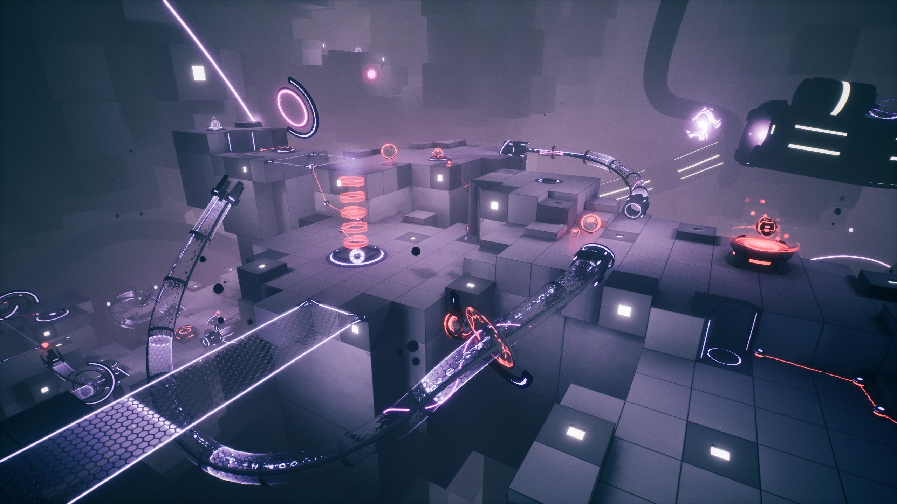
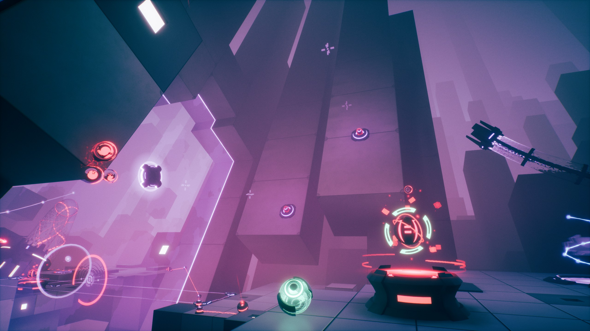
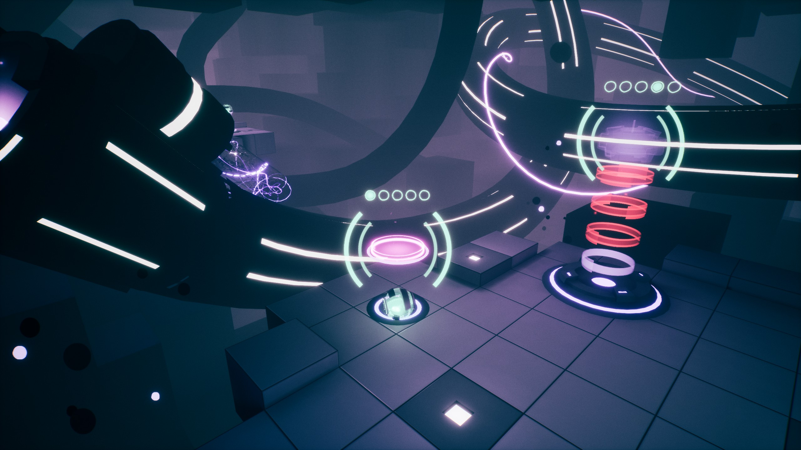
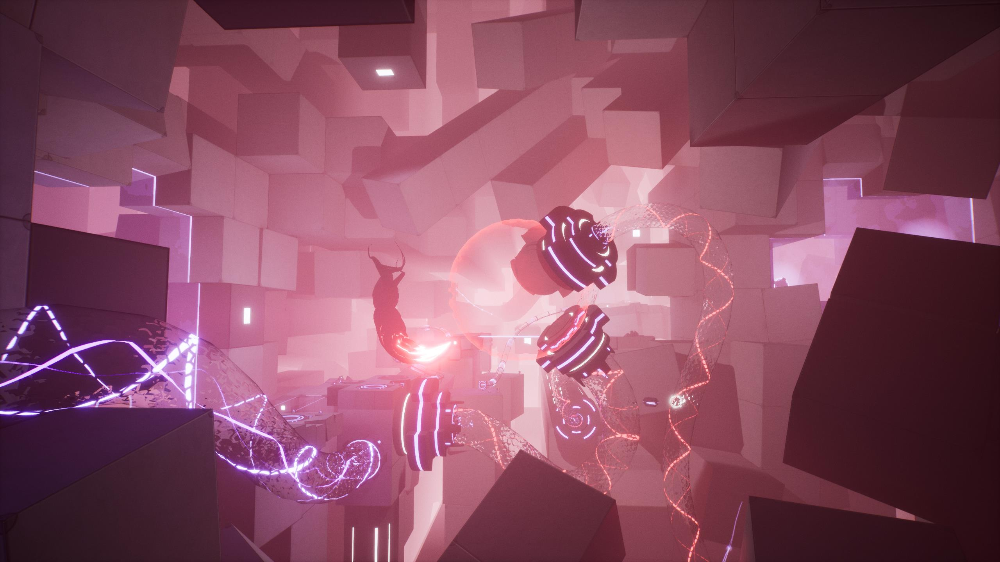

_Orbyss_ is an intricately crafted puzzle game that combines relaxing gameplay and an ethereal setting in a dynamite package. Its stellar UI makes complex puzzle elements simple to navigate in this strong debut game from developer [Misty Whale](https://mistywhale.com/).

<YoutubeEmbed youtubeId="eavgIS9Xf34" />

## On a roll

On its surface, _Orybss_ is a fairly simple puzzle game. To beat each level, your orb must reach the level’s exit area. That simplicity carries over to its basic mechanics. To power a switch, you have to place an orb in it. To conduct electricity? Put an orb in just the right spot. Pilot a flying saucer? Believe it or not, orb.

In addition to those standard puzzle elements, you'll also come across more novel fare (freezing time, flying saucers, record/replay stations, and more!)

On top of all that is _Orbyss_' main hook: controlling multiple orbs at once. Some of them can be controlled directly while others can only be dragged or given orders to move to a nearby spot. Puzzles rely on you organizing your minion orbs effectively to get you where you're going, which was a fun twist. Plus, being in two places at once is powerful, quickly raising the bar for what the game can ask of you.

Mastering swapping which orb you're controlling on the fly is essential for cracking the game's timing-based puzzles. While pure logic outings are a little more in fashion right now, I've long enjoyed the added pressure of having to execute actions in perfect time (for example, [CrossCode](/games/cross-code/)).

I was also impressed with the way _Orbyss_ uses 3D space. It sets all of these puzzles in large, shifting, alien rooms with floating platforms and bridges. At first it's just a stunning backdrop, but as you progress, you explore more of the space. Because many levels have multiple vertical tiers, puzzle elements that can get you to higher platforms become precious, even when the exit is on the ground floor. The flying saucer levels help you further explore this space, granting you free roam of the room.

Although the game demands precise movements, I don't think I ever messed up a puzzle because I fat-fingered the controls. And when you _do_ go careening off the side of a platform and into the ~~orbyss~~ abyss, you respawn right away. The lack of penalty encourages experimentation, since it doesn't cost you anything to try something that might not work.

The minimal UI is impeccably designed too, going out of its way to make hard things easy. Orbs roll gently, but magnetically snap into place when their precise location is important. Furthermore, floating glyphs identify key points in 3D space, making specific positions easy to visualize. Small timing indicators make it a cinch to line up all your moves the way you want as well. These niceties don't make the puzzles _easy_, they just let you focus on solving the puzzle itself rather than figuring out how to execute the solution you've already come up with.

I rolled credits in 4.5 hours or so, which felt about right. Each of the levels was engaging and I don't remember anything that felt like filler. If you're itching for more, each level has a few bonus goals that encourage you to re-solve the level in really specific ways (e.g. only switching between controllable orbs once). Given that _Orbyss_' levels seem labor intensive to design, harder solves for existing levels are a reasonable alternative to the work of adding additional, harder levels (that most players may not even see). Plus it means the game has tons of Steam achievements to hunt down, if that's your thing.

### Speed bumps

Though there's a lot to like, not every design is a winner. One of _Orbyss'_ most unusual mechanics is its sound-based puzzles. There are a few varieties, but none of them really landed for me. In one chapter, you need to activate 5 switches in a precise order. Instead of labeling the switches visually, each one plays a musical note when you get near it. So I started each of those levels by rolling around and bumping into each switch, trying to memorize its note while humming the others to myself.

While encouraging players to listen extra closely seems fun in theory, in practice it was an exercise in frustration. Puzzle games succeed on their clarity: I should be spending brainpower trying to solve the puzzle itself, not trying to remember notes so I can _then_ start to think about the solution. While I admit that labeling with audio tones is more elegant than a floating neon signs that says THIS ONE FIRST, forcing the player to keep that much additional context in their head didn't feel worth it. Thankfully, there's an option to enable visual cues to match the audio (pictured above), which made these puzzles more enjoyable. And, even though these audio puzzles weren't for me, I'm always glad to see developers try new things.

## The story that wasn't

_Orbyss_' biggest miss is its narrative, such that it is. Much like _[Cocoon](/games/cocoon/)_ (one of its listed inspirations), there is _something_ going on around you, but the game declines to explain exactly what. In this case, there's some sort of corruption infecting certain areas of the game, and some sort of space virus that flies menacingly through the background.

While each level is a discrete room, you roll from one to the next without many loading screens or big intros. That continuous flow makes the occasional cutscenes all the more jarring, yanking control away from the player without warning. Everything was flowing so smoothly, and suddenly I was watching a light show that felt like it should be narratively important, but which didn’t offer any explanation or real direction.

Games need to pick a lane with their narrative: a cogent story that drives puzzles or an inconsequential one that stays out of the way. _Orbyss_ was trapped in an awkward middle space with a story that pulled a lot of focus but didn't enrich the game in a meaningful way. It did lead to some unique "boss fights", but they were the weakest puzzles in the game.

## In the end

Although every element doesn't hit the mark, I came away from _Orbyss_ extremely impressed. Its vibrant, atmospheric setting blends perfectly with its complex yet forgiving puzzles. It goes out of its way to combine its mechanics in unexpected ways, ensuring none of its roughly 40 puzzles feel repetitive. If you like puzzles with tight design and some timing elements, definitely take _Orybss_ for a spin.
