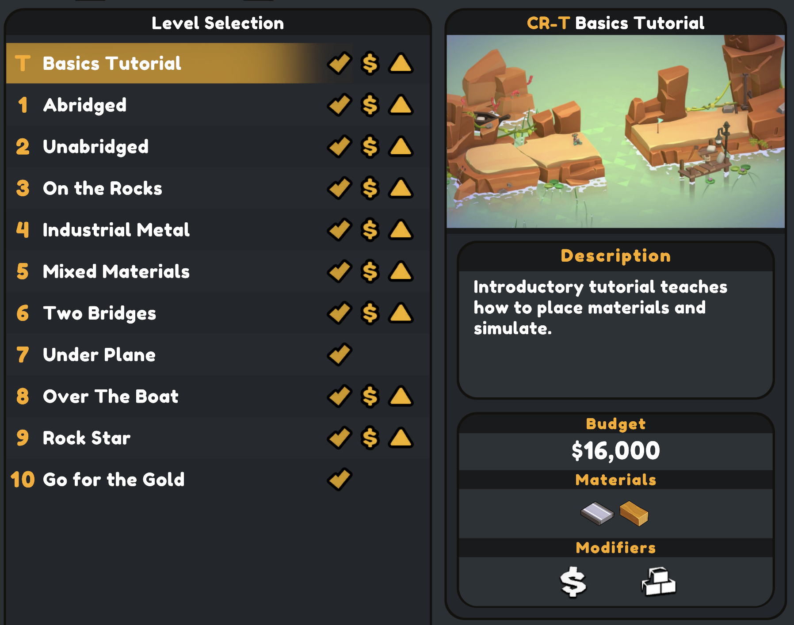
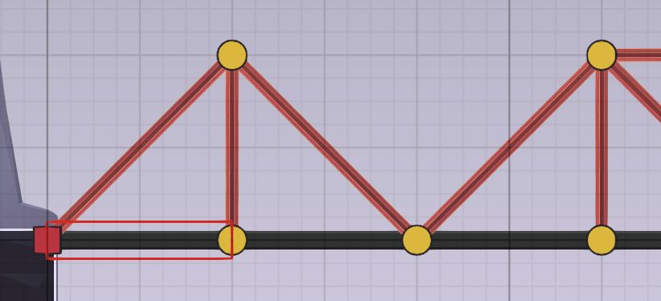
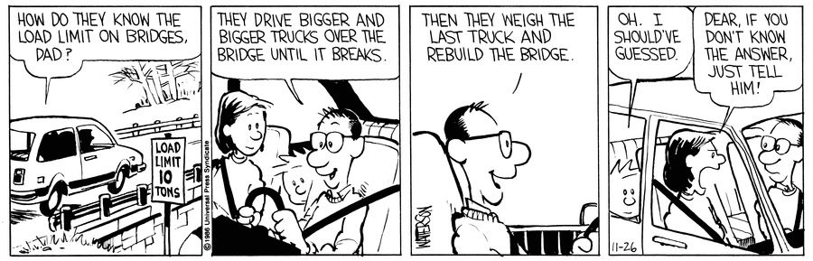

_Poly Bridge 3_ is a bridge-building puzzle game that's a blast regardless of whether your bridge actually stays standing. It combines open-ended challenges, a powerful physics engine, and an eye for detail into a goofy package I kept revisiting.

<YoutubeEmbed youtubeId="e5tSnAh3P14" />

## Building bridges

_PB3's_ core gameplay is simple: build bridge(s) to get a small fleet of vehicles from a starting point to their destination. You'll support roads using a variety of building materials, from wooden supports and steel beams to woven ropes and sproing-y springs. It's a simple concept executed well.

Early levels are simple: one vehicle crossing one gap. The latter half of the game kicks it up a notch, introducing multiple gaps, limits to available materials, and obstacles to build around.

<Video src="/videos/polybridge/drawbridge.mp4" />

The only requirement to complete each level is that all vehicles successfully reach their targets. For an optional challenge, each level includes a "par" for the money you can spend on materials. There's no penalty for exceeding that limit, but your par status is noted in level select (to motivate completionists).

There are enough permutations (locale, vehicles, gap shape, etc.) that the levels themselves don't feel repetitive. That said, the gameplay _itself_ can feel same-y eventually if you're not actively trying to stay under budget.

Triangles are the strongest shape, so you'll end up with a lot of similar designs unless you're making it a point to try new things. How weird a design can you make that still completes the level?

<Video src="/videos/polybridge/ramp.mp4" />

You don't have to use triangles at all if you have other ways of supporting your bridge. There's a _lot_ of design freedom, which I found impressive.

## ...and knocking them down

I love how _Poly Bridge 3_ leans into failure as a core mechanic. When a bridge fails, it does so with a spectacular ragdoll-style explosion where bits go every which way.

<Video src="/videos/polybridge/boom.mp4" />

Best of all, intact bridges are _not_ a requirement for completing a level. Learning what destruction you can leave while still finishing a level provided a funny little side-quest throughout the campaign.

<Video src="/videos/polybridge/nailed-it.mp4" />

For the perfectionists among you, the game gives you tools to narrow down points of failure when they happen. Back in the "builder" view after a bridge has failed, there's a helpful indicator to mark which segment of building material failed first.

Also, you can dynamically see the level of strain each piece is under while there's a vehicle on it. Unfortunately, I haven't taken a physics class in a decade(?) so that isn’t especially useful to me (in the end, it was just a prompt to add semi-random additional supports around the weaker areas). I suspect experience in civil engineering would be useful here (but is by no means required).

It would be useful if you could see those stress points while building as well, but it's a minor complaint. Switching between the test view and the building view was a single button, so switching between them was painless.

## Finding your fun

How you progress is up to you. You can beat the game by building the ugliest, most expensive bridges. Or, you can take time to really explore solutions to each level, making little optimizations as you go. It's up to you to find your fun.

The self-directed challenges of _PB3_ reminded me of one of my favorite [Zachtronics](https://www.zachtronics.com/) (RIP) games, [Opus Magnum](/games/opus-magnum/). Both games let you choose when you're done with a level: when you've gotten _any_ solution or when you've gotten one that meets specific resource criteria. (Strictly speaking, Opus Magnum doesn't have arbitrary cutoffs, but you're encouraged to optimize each solution for one of price, speed, and area.) This flexibility is an elegant design choice that allows every player to do what's most fun for them.

If you're a player that wished the game would never end, there are weekly bridge-building challenges that will keep you coming back even after you've perfected every campaign level. There really is something for everyone.

## Everything else

The big parts of _PB3_ are great, but I was equally impressed with all the little touches. Great care was clearly put into the UI and UX of the game. Every interaction feels instantaneous, which makes for very good _feeling_ software. It sounds a little silly, but it really does make a difference. There's also keyboard shortcuts for everything and they're all configurable. These should be table stakes for games, but a lot of peers miss these marks. I'm not sure if its predecessors (_Poly Bridge_ 1 & 2, which I haven't played) were this polished, but color me impressed.

The building UI itself is very well thought out. There's an (optional) snap to grid that makes it easy to see how far you can stretch a strut before placing. It includes a tool to help build smooth curves and an auto-triangle tool for building strong bridges in fewer clicks.

Lastly, I loved the soundtrack; it set an adventurous yet relaxed tone to the experience. The acoustic guitar motifs gave equal parts "Americana road trip" and "quiet afternoon on the porch". It's by composer [Adrian Talens](https://adriantalens.com/) and is available on [all major streaming services](https://album.link/b/2558265264).

## In the end

There's much that _Poly Bridge 3_ does right: an engaging core gameplay loop, flexible fun, and an admirable attention to details. Best of all, flexibility in its goals means it can deliver joy to any sort of player: from those who want to optimize (me) to those who want a detailed sandbox to play in.

No game is perfect, but _Poly Bridge 3_ knows what it's going for and totally nails it.
