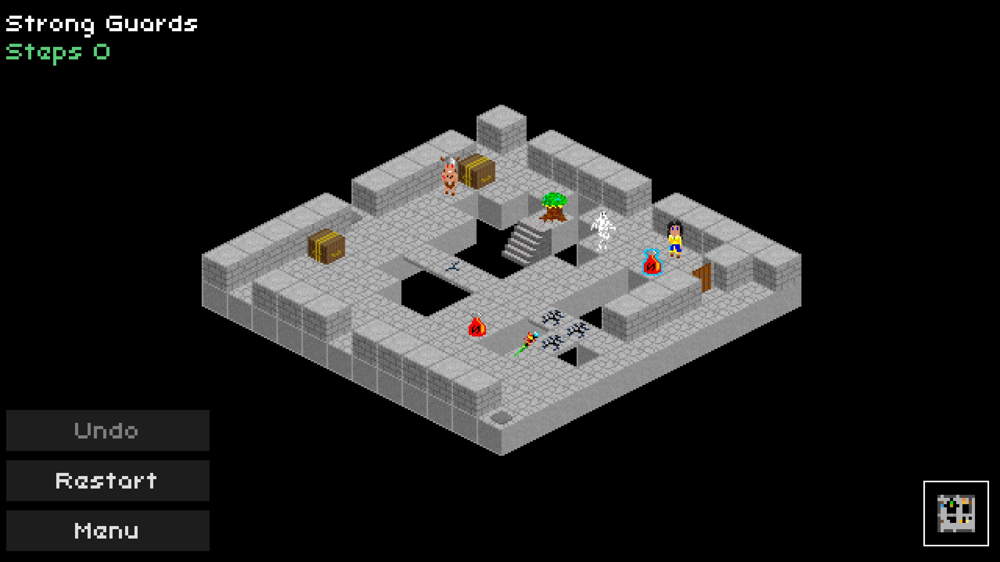
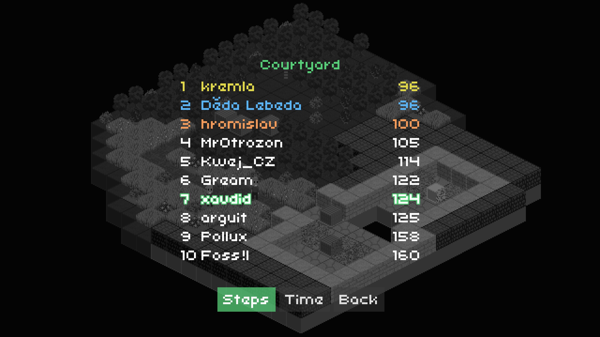
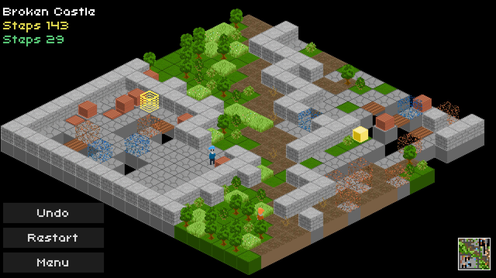
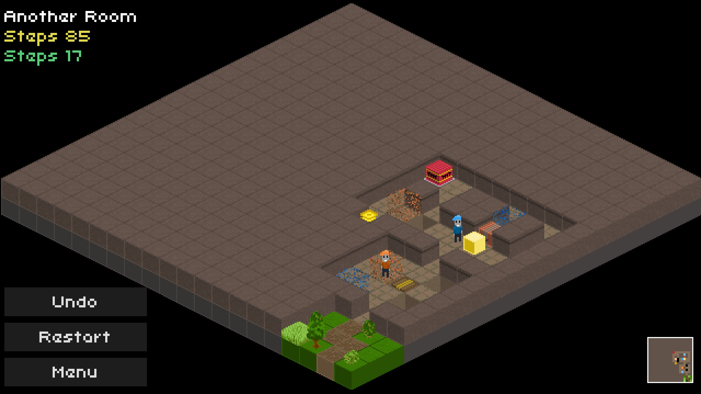
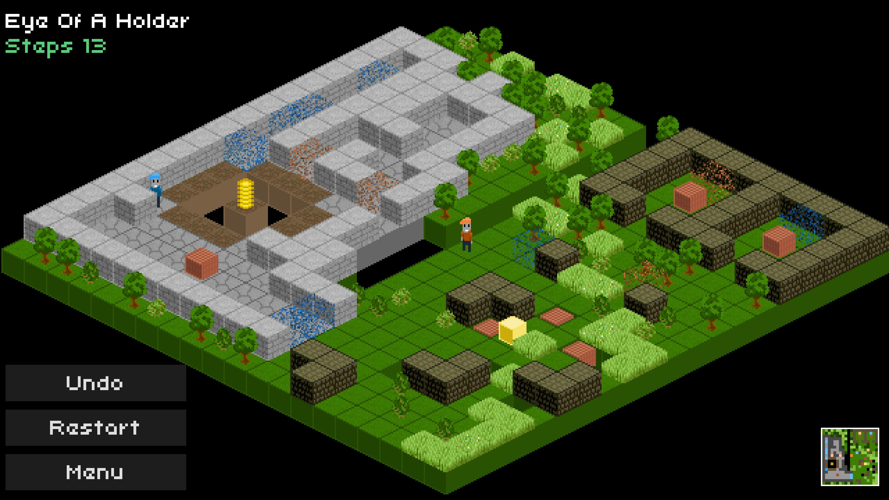
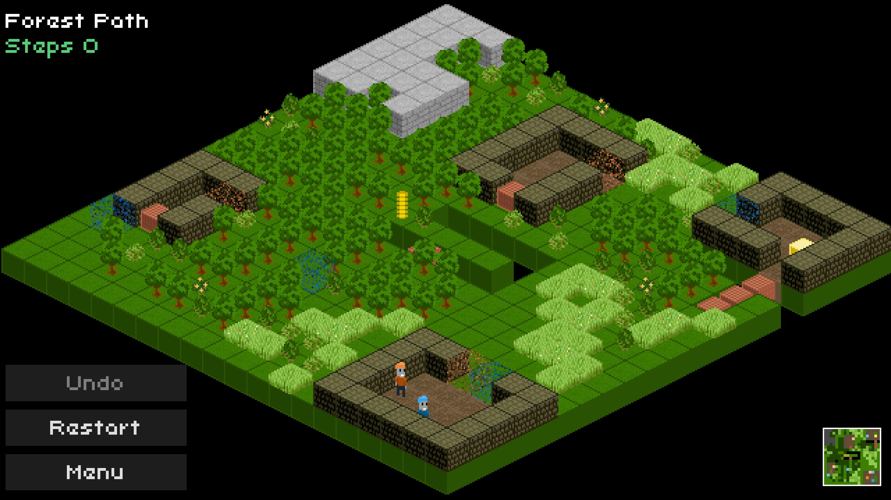
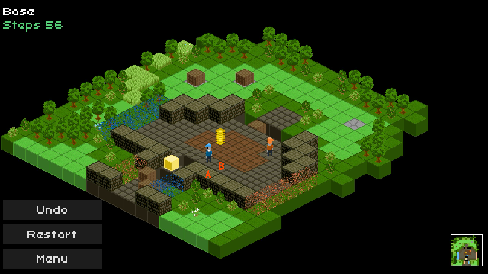
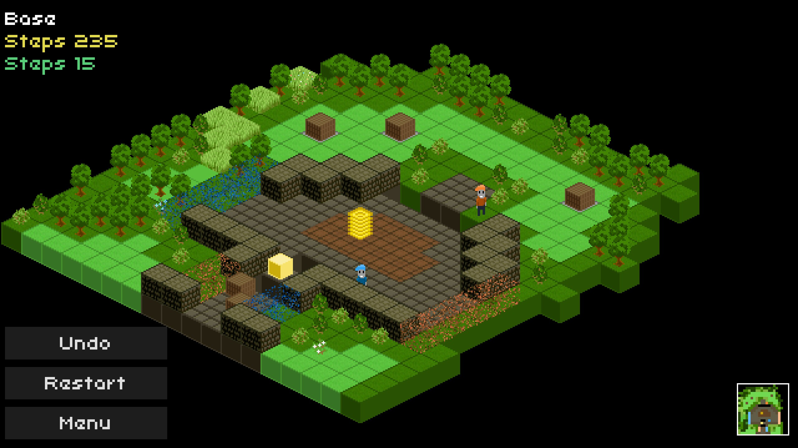
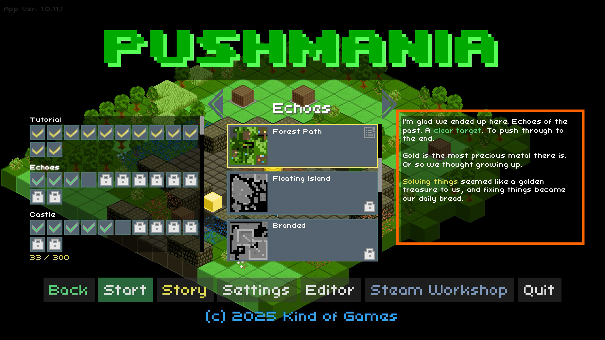

_Pushmania_ is a [block-pushing](https://store.steampowered.com/category/box-pushing) puzzle game about a pair of brothers that get [jumanji](https://www.youtube.com/watch?v=8cdBcfLhJVY)'d into a retro computer game. It's developed by an actual pair of brothers from the Czech Republic whose passion for computer game history is clearly evident in _Pushmania_'s presentation. I've got my quibbles about some of its design choices, but it's got a lot of heart.

<YoutubeEmbed youtubeId="Z8biTFfofIc" />

## The Smooth

The puzzles themselves start as straightforward block pushing: you need to get a golden cube to its target by scooting obstacles out of the way. Before long though, _Pushmania_ adds new gameplay elements like blocks that can be pulled, destroyed, or sent (with cargo!) over long distances. Some levels even have usable items, which added mechanical variety to a fairly well-explored genre.

Visually, the levels range from generic forests to homages to specific retro games like [Prince of Persia](<https://en.wikipedia.org/wiki/Prince_of_Persia_(1989_video_game)>) and [Bomberman](<https://en.wikipedia.org/wiki/Bomberman_(1990_video_game)>). Most themes just change the tiles (swapping grass and trees for lava and rocks, etc.) but some also put the brothers in locale-specific costumes, which is cute. The soundtrack also varies from biome to biome, helping the worlds feel distinct from each other. The loving attention to detail shows how formative these games were for _Pushmania_'s developers.

One of my unexpected favorite features was the co-op. If you've got a pal, you can each control one of the virtual brothers and work together to solve puzzles. Actual co-op is rare in puzzle games and was more fun than I expected, so give that a shot if you can. If you're playing solo, you'll control each character simultaneously, [Semispheres](/games/semispheres/)-style. This was fun too, so don't fret if you're flying solo.

For players looking for further challenge, the game tracks how many steps and seconds you take to complete each level (the fewer the better). You can compete on a global leaderboard for either of those categories, adding a fun goal to strive for on top of completing the puzzles themselves. Additionally, there's a level editor with [Steam Workshop support](https://store.steampowered.com/news/app/3242870/view/500574650502221326?l=english), ensuring there's near-limitless puzzles to enjoy.

## The Bumpy

Getting down to the puzzles themselves, I found their designs inconsistent. Some of the levels were _huge_, with lots of extraneous space unrelated to the critical path.

As a result, you spend a non-trivial amount of time walking your characters across a big area which felt like filler more than challenge. Worse, you can only undo a single move (rather than the more standard "as much as you want"). So if you make a mistake after trekking a long way, you just have to do all that walking again.

On the other hand, I really enjoyed some of the smaller levels. [Sokoban](https://en.wikipedia.org/wiki/Sokoban)-style puzzles shine when you're carefully navigating a small space and some of the early worlds proved they understood this assignment.

## The Rough

While _Pushmania_ has a lot going for it, my frustration with the isometric viewing angle ultimately outweighed its charms. I'm not sure if I'm uniquely bad at parsing such a sharply rotated map, but the lack of clarity made some levels harder than (I think) they were intended to be.

For instance, can you quickly tell where in the center of this map you need to line your blocks up to build a bridge?

I can tell after I squint, but it felt harder than it needed to be.

To me, visual clarity is the key to a great puzzle game. The player should be able to easily understand the state of the world and focus their energy on solving the actual puzzles. Multiple times I'd know exactly how to solve a puzzle but get myself into an unwinnable position because I thought two rows were lined up across a gap when they were actually offset.

There can also be a lot of clutter on the larger maps, with various foliage types (some of which you can walk through) obscuring the grid lines that are so crucial to success. You could argue that deciphering the path is part of the puzzle, but it wasn't fun to me. Much like solving a jigsaw puzzle in the dark, it felt like the devs were making the wrong things hard.

The visual clarity problem got worse when blocks with height were introduced. For instance, can you move from square `A` to square `B` in the image below?

Nope! This is a classic optical illusion. Because `A` is both above and in front of `B`, they look like they're lined up. In reality, there's a row between them:

> Incidentally, this is the same issue I had with [CrossCode](/games/cross-code/). Its puzzles _also_ suffered for mixing height and visual rotation

It was little frustrations like this that made me feel like I was spending more time fighting the map than solving the actual puzzles, which I didn't enjoy.

### Tall Tales

My other gripe was the story, such that it is. While there's a bit of narrative, it only shows up in short text logs between worlds. It leans heavily on vagueness while trying to be mysterious, but I mostly came away confused.

> Note: I only played a couple of hours and didn't get all that far. It's possible the plot really comes together later and I just didn't see it.

There's also a whole story area to explore, but it's gated on progression through levels. The only characters I managed to talk to spouted very-NPC-style dialogue (and LotR quotes) and didn't seem very interested in a conversation. I liked that finding notable artifacts (like books and discs) would unlock new puzzle worlds, but my aimless wandering here felt more like a distraction than a feature.

## Ultimately

Though _Pushmania_ wasn't for me, that doesn't mean it won't be for you. If you can look past the muddled visuals, you may just enjoy the cool block-pushing puzzles beneath. There's decent depth to the puzzles paired with a good mechanical variety which should keep you on your toes for upwards of 15 hours (according to the devs).

As a first outing and passion project, _Pushmania_ has good fundamentals. Brothers Franta and Zdeněk clearly put a lot of care into their work; I look forward to seeing whatever they come up with next.
