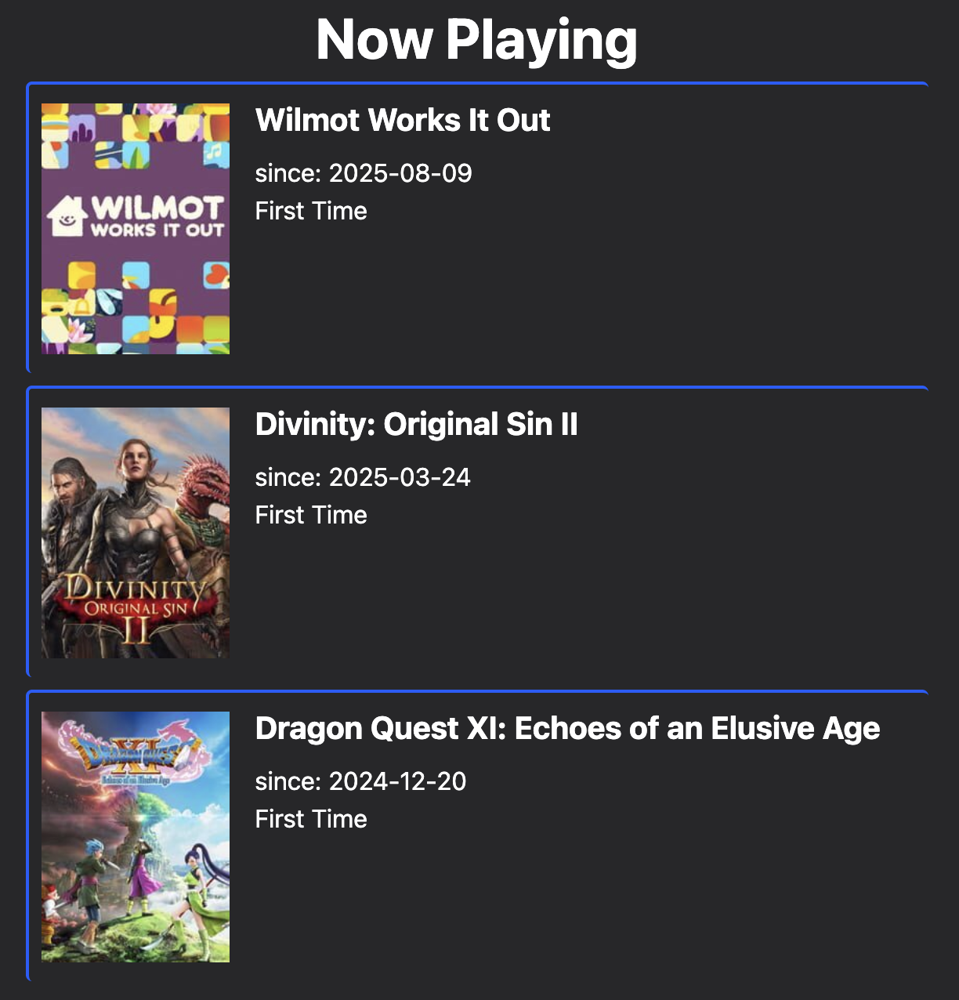

Happy summer everyone! I've got a few little fun updates to share.

## External publication

Firstly, I recently completed my first freelancing assignment with my friends over at ThinkyGames.com. They asked me to play the [Looking for Fael](https://store.steampowered.com/app/2521170/Looking_For_Fael/) demo and give some initial impressions. You can read all about it [on their site](https://thinkygames.com/features/try-and-solve-a-series-of-interconnected-puzzle-rooms-in-the-demo-for-looking-for-fael/).

I had a great time working with them and will likely continue to post there periodically. I may see about adding anything I write externally to my RSS feeds / article list here, but in the meantime stay tuned to my socials, their socials, or [their RSS feed](https://thinkygames.com/feed/atom/) for more!

## A fresh new homepage

My site's homepage was one of the first things I designed and it's hardly changed since the site launched. I like that it says what's in progress, but never loved how little it told you about my actual reviews:

So, I added a recent reviews section! I saved a ton of space by not including the titles and relying on the posters for names instead:

I was stuck this design for a few days until all the sudden, I wasn't. I also tried:

- the boxes from my search results (not bad)
- boxes with titles & posters (too wide)
- name + icon (not visual enough)

After some futzing, this combination of size and density was exactly what I wanted. I like my use of color coding & iconography elsewhere on the site, so it was great to be able to use them here as well. Plus, each box is a link to the media's page!

My only complaint is that the posters aren't all the same height, so there's some extra space in there sometimes (depending on the row composition). Living with that is easier than standardizing all these images, so I'm happy with it for now.

### Works in progress

I also did a teeny redesign for my in progress boxes further down the page, dropping the bottom and right borders to feel like there's less wasted space:

The half-border design is something I shamelessly borrowed from [my friend Sage](https://www.wavebeem.com/blog/2025/jade-and-lime/). I'm not going to adopt that style across the rest of the site, but I liked how it looked here. It also made thematic sense for media that I haven't finished.

## Ratings in the article list

A little one to round us out. I've tweaked the article list to show the rating, if there is one. I've held off doing that because I didn't like the idea of "spoiling" the piece. But ultimately, I think it's useful for skimming, so I went ahead and added it.

Before:

After:

I've got plans for supporting article types in the future (review / update / essay / etc.) and this is a little step in that direction. Stay tuned!
