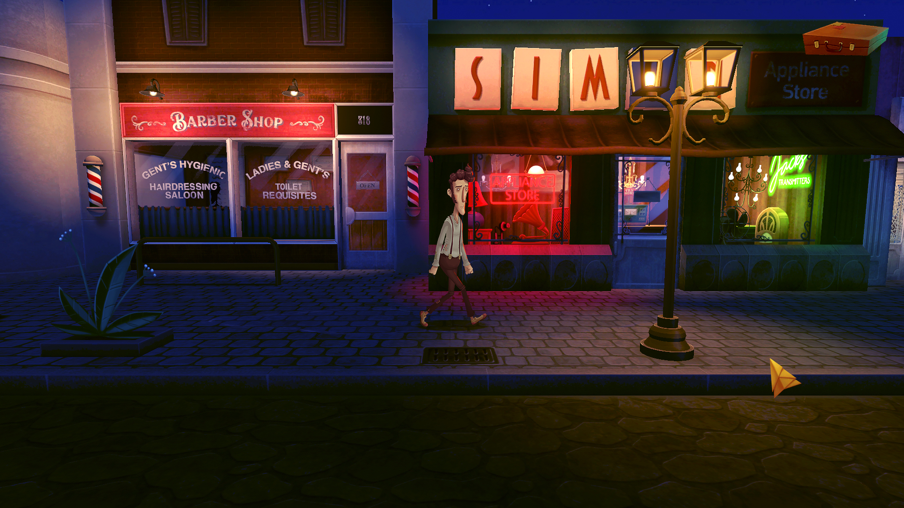
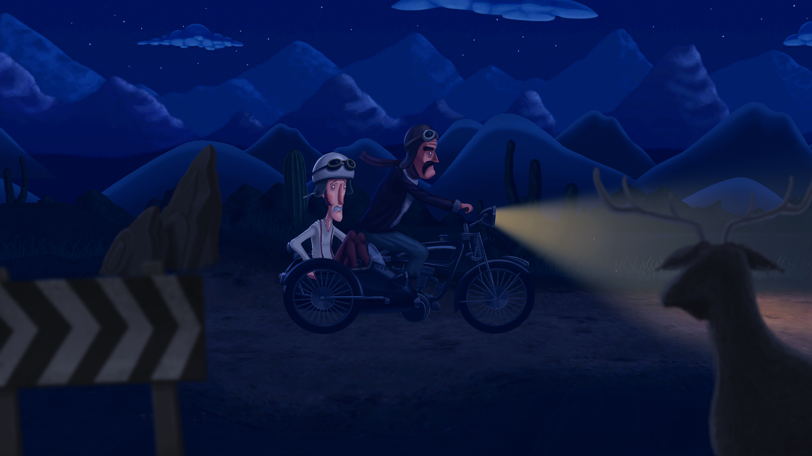

_[Slender Threads](https://slenderthreadsgame.com/)_ is a modern take on a 90's-style adventure game. You are Harvey Green, a traveling book salesman and aspiring novelist, who has just arrived in a small, unsettling town. On his way to meet a local storyteller, things start getting weird: he sees a cloaked figure snatch a rabbit from a bush and he hears a radio say his name. Soon, people start dying all around him at the hands of mysterious shadows and it's up to Harvey to figure out why.

<YoutubeEmbed youtubeId="Sg-1JWW5m5E" />

Though the above trailer and marketing materials describe the game as "psychological horror", there are many genuinely funny moments too. Outside of the game's few deaths, most of the dialogue is lighthearted and fun. I worry that the game's horror focus will put off the scaredy-cats in the gaming community (myself among them!). This isn't the sort of game I'd usually go for, but I'm glad I gave it a shot. You can tell a lot of care and detail went into making it.

## Pointing and Clicking

Gameplay wise, _Slender Threads_ follows the classic point-and-click formula: progression is gated by puzzles which require using the right items in your inventory at the right time. You'll find those items scattered around the town, either by investigating the scenery or by talking to the right NPCs at the right times. Visiting the right screens in the right order with the right items can be tricky, but that's the game.

Piecing together what gets used when is genuinely fun. If you've ever played [Grim Fandango](/games/grim-fandango/) or [The Secret of Monkey Island](/games/the-secret-of-monkey-island/), you'll feel right at home. _Slender Threads_ improves on the classic formula with the addition of a map that lets you teleport to any place you've been before. This cut down the amount of tedious backtracking I had to do.

My fleeting frustrations with the gameplay weren't specific to _Slender Threads_; they're basically a time-honored tradition for point-and-click games. The worst is when you basically know what you need to do, but aren't using the exact combination of items the game expects. Like, who thinks to use an umbrella to lock a door?

Luckily, there weren't many of these misses among the game's many puzzles. For the few I was stumped by, I turned to a [spoiler-free walkthrough](https://adventuregamehotspot.com/walkthrough/3699/slender-threads-walkthrough) that the devs were kind enough to publish. Don't be afraid to use it if that'll help you enjoy the game!

## It's Worth 1,000 Words

The most impressive part of the game is its art direction. Each screen is beautifully drawn and animated, presenting a real, lived-in world. I loved the large supporting cast of townies. They each had distinct personalities, providing a lot of variety to the many conversations in the game.

The voice acting was top-notch, too. Every one of its _many_ lines of dialogue is fully voiced by a talented cast. The writing was similarly polished -- dialogue was funny and snappy throughout. Harvey had a fun comment about every NPC, useful item, or bit of scenery.

I appreciated each little detail. _Slender Threads_ punched _way_ above its weight class in this department.

## The Elephant in the Room

Like I said, I thought the story was well-presented and engaging. But my investment in the story's outcome made the ending all the more disappointing. It failed to resolve the story threads they spent so much time setting up. The ending tries to shine a new perspective on the events of the game, but it doesn't stick the landing. The whole thing left a sour taste in my mouth and ultimately deducted a star from this review's final score.

If nothing else, I think players will find this ending divisive. Some will call it brilliant while others will feel like it's a cop-out. Personally, I'm in the latter camp. It's hard to sing the praises of a story with no conclusion, no matter how interesting it was along the way.

## The Takeaway

_Slender Threads_ gets more right than wrong. Its delightful art direction brings a mysterious town to life while its classic point-and-click gameplay makes exploring fun. I enjoyed my time with it despite frustration around its abrupt ending and a few obtuse puzzles. Worth a play if you like spooky games, adventure games, or especially high-quality voice acting.
