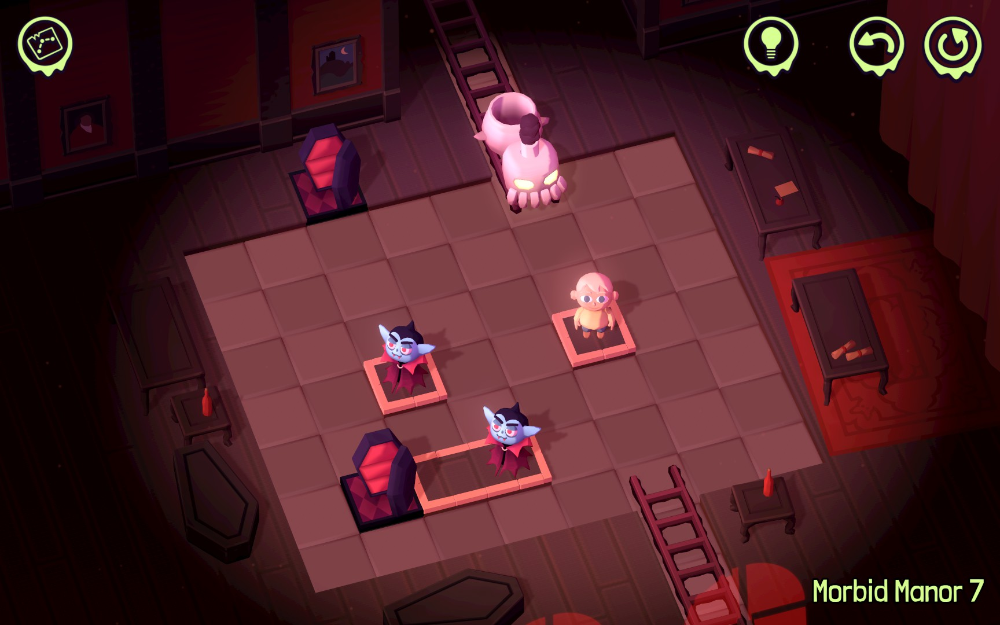
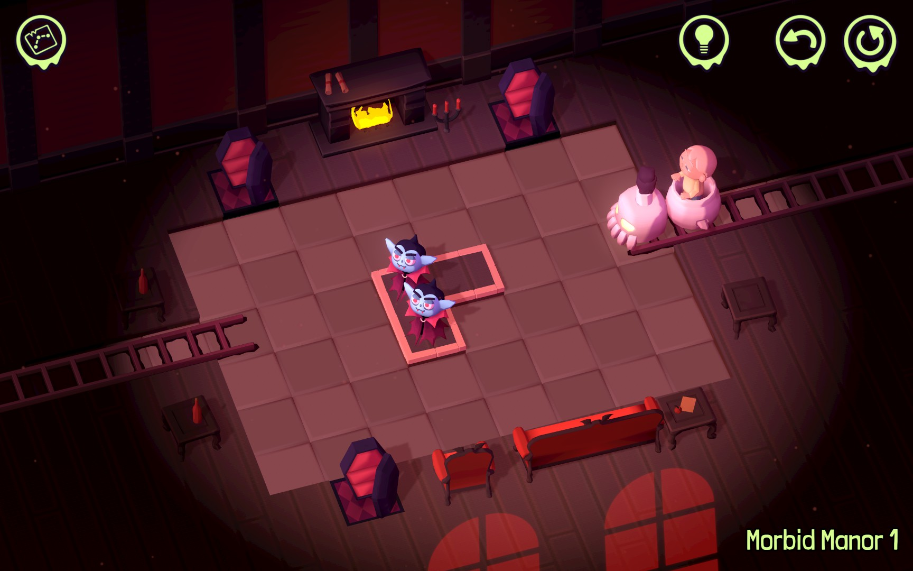
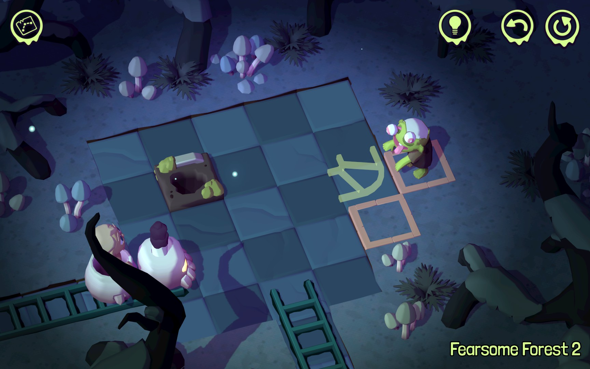
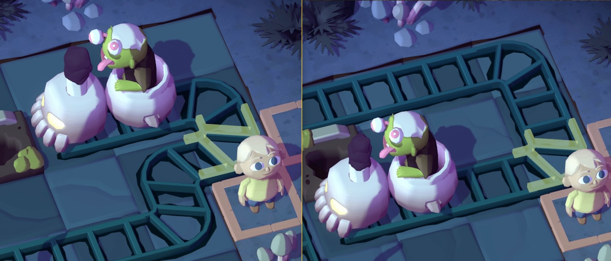
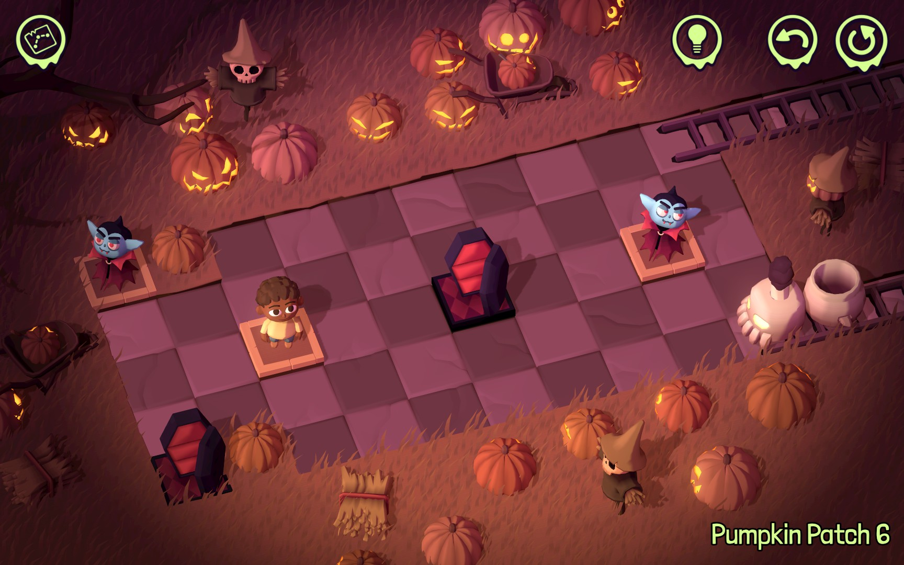
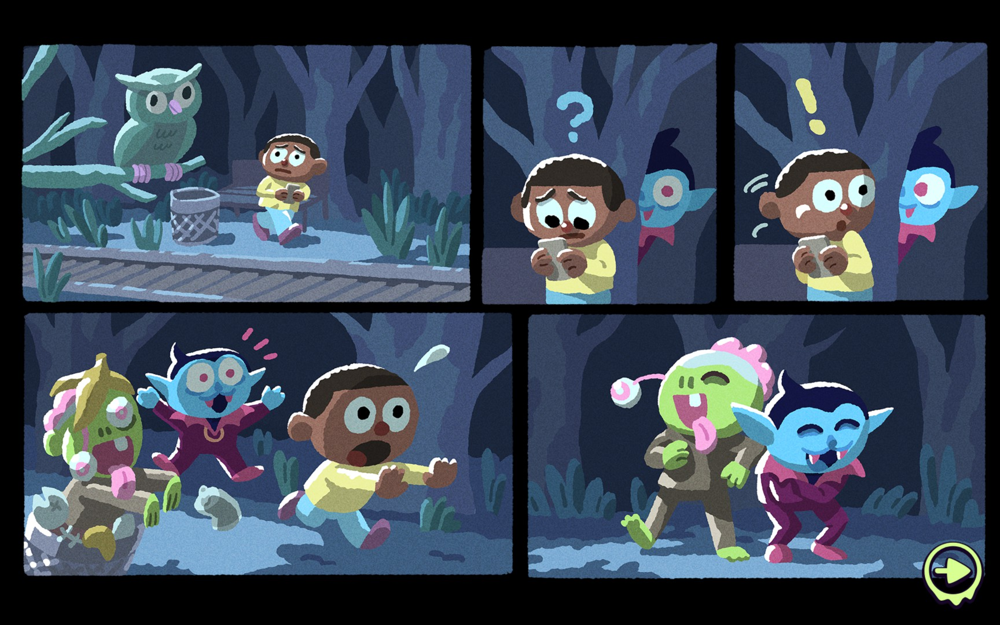

_[Spooky Express](https://spooky.express/)_ is a Halloween-themed pathfinding game from experienced puzzlemongers [Draknek & Friends](https://www.draknek.org/). Its cartoonish charm provides the perfect backdrop for 200+ puzzles across the world of <i>Train</i>sylvania.

<YoutubeEmbed youtubeId="mV1eSyI8XA8" />

## Gameplay

In _Spooky Express_ you lay track between specific start and end points in each level. Along the way, you deliver passengers to corresponding destinations: zombies yearn for graves, vampires want to settle into coffins, and so forth. You can't complete the level if any passenger is left unsatisfied.

Like many pathfinding games, you also can't cross your own track, so careful planning is required to rehome everyone before exiting the level successfully. The core gameplay loop will feel familiar to anyone who played _Spooky Express_' spiritual predecessor, [Cosmic Express](https://cosmicexpressgame.com/) (by the same devs) or [Trails](https://purplesloth.studio/games/trails/), another pathfinding game [I reviewed](/articles/trails-review/) earlier this year.

For a game that's generically the same puzzle over and over, there's a remarkable amount of variety. Sometimes levels are hard because you don't have much space in which to operate. Other times, you can only cross from one area to another through specific choke points, so you have to manage your path carefully. Further complicating things, passengers of the same type are interchangeable. In levels with multiple combinations of passengers and destinations, it's up to you to determine everyone's final resting place.

I liked that _Spooky Express_ ran the full gamut of difficulty. It started gently, with small levels whose solutions are immediately obvious. But as the square footage and number of passengers grew, the number of potential solutions grew with them. Levels were sometimes easy, but they were never boring.

To my delight, bits of _Spooky Express_ feel like a [rule discovery](https://thinkygames.com/lists/best-rule-discovery-games/) game. There's no explicit tutorial, but some levels clearly exist to teach you a new mechanic. It was a lot of fun to hit a level that seemed impossible at first, only to realize there's an interaction available you just hadn't tried yet.

When you do you feel extra stuck, _Spooky Express_ offers you exactly one hint per level. It shows up as a few segments of ghostly track, cluing you into a small part of the solution. While I am in favor of hints in puzzle games as a whole, this implementation was a little hit-or-miss. The hints were always _accurate_, but varied in how helpful they actually were.

Sometimes they actually felt like a new layer of puzzle. Because the track looks non-directional, there are at least two possible interpretations for each hint. So when I was truly stuck, first I had to figure out how/why the hint was relevant, then actually build a solution around it. Some additional direction would have been nice, but I have to admit that their solution was simple and elegant.

## Theme

While the puzzles in _Spooky Express_ are well designed, I _really_ loved its commitment to its spooky aesthetics. I love how the zombies say _traiiiins_ (instead of the more typical _braiiiiins_). And while the focus of each level is the puzzle itself, the background animations are chock-full of fun little spooky elements and easter eggs that help set the mood. As a proponent of [seasonal movies](https://david.reviews/movies/collections/) (road trip flicks over the summer, Christmas movies in December, and of course, spooky everything in October), it's great to see a non-horror Halloween game that really embraces the vibes of the season.

Scoring it all is a [killer soundtrack](https://ghoulnoise.bandcamp.com/album/spooky-express-original-soundtrack-2) by Priscilla Snow, which also deserves special mention. It combines lo-fi beats, train whistles, and some haunting vocals to form the pitch-perfect backdrop for your puzzling. It's also available for purchase for $6.66, which is just delicious.

## Everything else

Per usual, the Draknek team's attention to detail shines through. There are keyboard shortcuts for every function, which is a nice touch. I especially liked the way pressing "left" enters "up + left" if there's a wall directly to your left but space above it. It's more fluid once you get the hang of it (although the game also allows you to manually press "up" then "left" yourself, just like you'd expect).

Length-wise, the main campaign was perfect. I mostly focused on the required puzzles, and hit credits in just over 4 hours. But I only finished a third of the 220 puzzles available, which includes optional puzzles I mostly skipped and a host of challenge levels that only unlock once you've rolled credits. There's something here for all players, regardless of their level of skill (or patience).

As is typical for puzzle games, there's not much of a story. There _were_ some cute little comics about a young zombie and vampire that appeared between sections of the map. But the vignettes were more of a nice interstitial than an actual framing device, which felt like a missed opportunity for a ludonarrative arc.

Lastly, although I played on Steam, _Spooky Express_ is also available on mobile. I have a feeling that its simple control scheme and engaging gameplay will be a great way to spend quiet moments throughout your day.

## In the end

Puzzle games sink or swim based on how well their puzzles stretch your understanding of their mechanics and how their theme supports your experience; _Spooky Express_ excels on both fronts.

Each of its puzzles layers in a variety of mechanics, ensuring each of its levels feel fresh and unique. They range from simple to seems-impossible, so there are puzzles for all players.

The superb Halloween theme of Spooky Express acts as conductor for its train puzzles, bringing the whole game together into a seasonally-appropriate, varied, and delightful outing.
