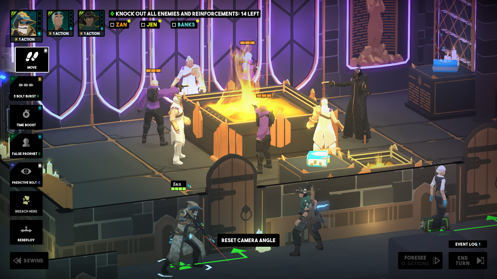
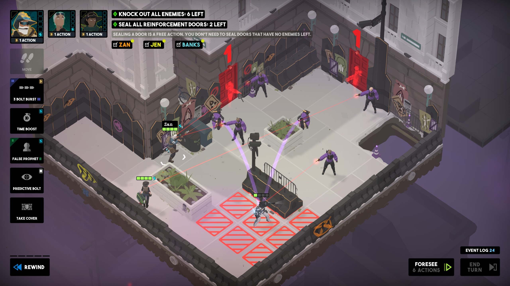
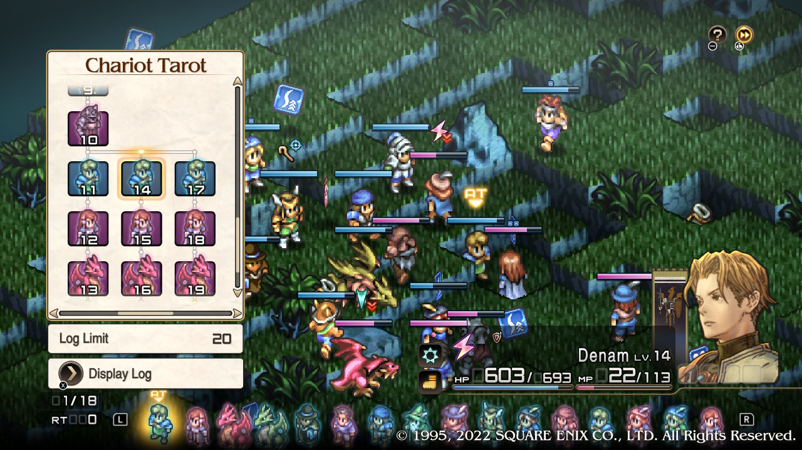
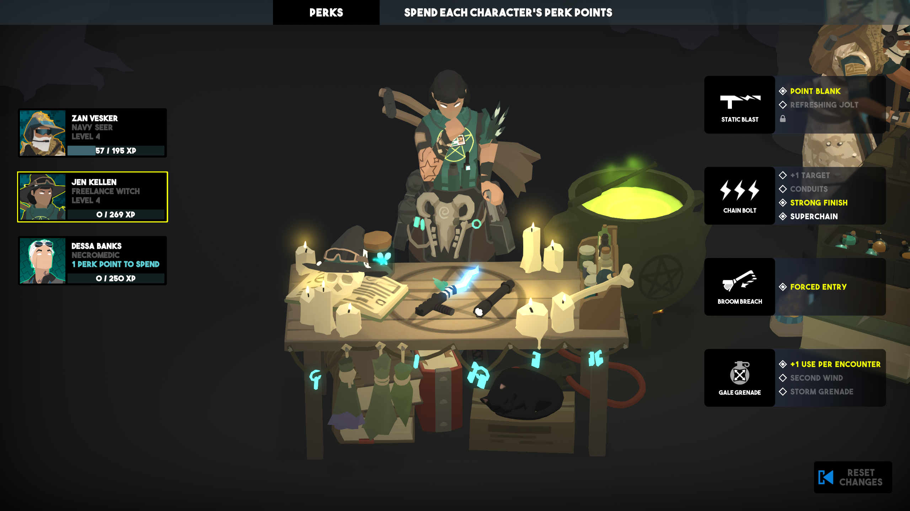
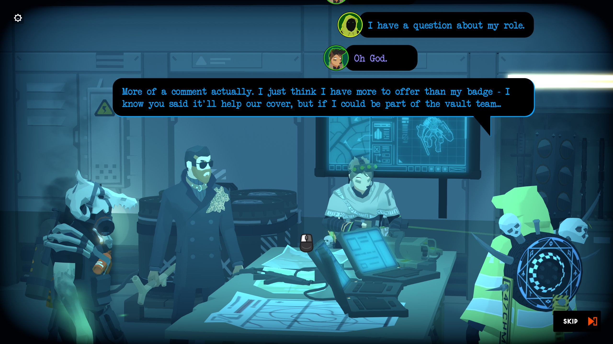
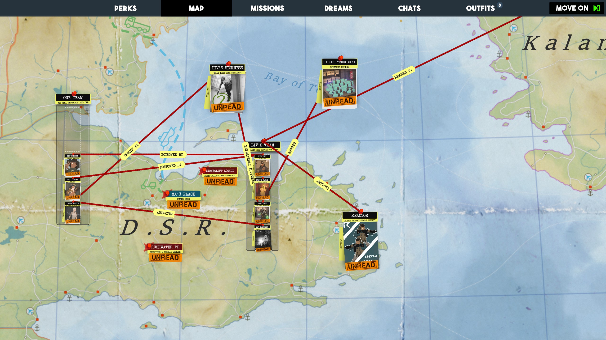

Many tactics games lean on high difficulty and the finality of your decisions to raise the stakes. [Tactical Breach Wizards](https://store.steampowered.com/app/1043810/Tactical_Breach_Wizards/) takes the opposite approach: you can undo everything until you've eliminated your enemies in the most satisfying way you can conjure. The opportunity for infinite short-term tweaking makes for an exceptionally satisfying tactical puzzle experience.

<YoutubeEmbed youtubeId="ILThlN_-uGg" />

## Gameplay

The gameplay is the star of the show in _Tactical Breach Wizards_. Levels are short and - because of the ability to rewind your actions - low stakes. Rooms being brief means there's no fluff - you never need to spend 3 turns finding the enemy and baiting them into a fight. Instead, each room throws you right into the action. If you're clever, most can be completed in under 3 turns, keeping gameplay brisk. Each room has you navigating a specific scenario, like how to deal with 2 enemies and a 3rd that's about to spawn. Missions feel much closer to the puzzle-like engagements of [Into the Breach](/games/into-the-breach/) than a more traditional tactics game (like [XCOM](/games/xcom-enemy-unknown/) or [Fire Emblem](/games/fire-emblem-three-houses/)).

Though you only command a few characters at a time, you're given plenty of tools to accomplish your goals. Each wizard has a basic attack, a mid-level attack, and a few special abilities. The abilities each do a combination of dealing damage, knocking a target around, and applying status effects that modify the effectiveness of future actions. The key to success is the careful application of your arsenal. Each wizard brings different strengths to the table and all abilities are unique, so there are a _lot_ of ways a turn can play out.

While each character can only attack once per turn, special abilities are only restricted by available mana. Many objects give mana when destroyed, so careful planning can yield long strings of actions. For instance, spending 1 mana to blow up 3 barrels (each refunding mana), then spending those to give other characters extra actions. Breaking the game with novel combinations never stops being satisfying.

If you try an approach that you're not happy with, TBW lets you rewind one action, a few steps, or everything you've done this turn. This is my single favorite design decision. Because each decision has potential side effects (like changing character health, moving things around the map, etc.), the number of outcomes on a turn is nearly infinite. As a result, you can rewind and tweak until you're happy with the result of a turn. Each turn becomes an infinite sandbox of possibility and each room becomes a series of those sandboxes. This means your characters can only die (or take damage) if you've confirmed that's an acceptable outcome. If it's not, you can step back and take a new approach.

This design philosophy culminates in one of the most mechanically satisfying final bosses I've ever played, perfectly balancing narrative and gameplay to send the game off with a bang.

_Breach Wizards'_ extreme flexibility and forgiveness means most players won't find it especially challenging. For those wanting a tougher experience, each level features optional bonus objectives that up the ante. They only reward points that can be spent on in-game outfits, but I found them fun. There are also difficulty options to change every aspect of the game (like enemy spawn rate and starting mana), so everyone can play at the level they find most enjoyable. You can also skip levels without penalty, so every player will be able to cater their experience as they like.

> If you want to hear more about the design decisions that shaped TBW, check out Tom's [episode of the Eggplant podcast](https://eggplant.show/43-a-window-into-narrative-systems-with-tom-francis).

The game's UI is decent, making target selection and action execution simple. There's also full zoom and camera rotation, so it's easy to investigate every nook and cranny. I did find that in crowded rooms, I would lose track of my characters a little. More than once I shot a teammate on accident (which was an easy fix, but still annoying). It's also visually tricky to keep track of what enemies are about to do. Each points a laser sight at their target, but when there are 5 such sights crisscrossing the map, it's hard to tell what's going to happen to a given ally. All of this info is readily available on mouseover, but the visuals got a little cluttered.

My other issue was that my liberal use of rewinds made me really wish for a "redo" button. I'd get a pretty good outcome, then rewind to try out a new approach that might be better. If I decided to stick with my initial method, there wasn't a good way to recreate what I had tried before. There _is_ an action log, but I didn't find it especially useful in these situations. [Tactics Ogre](/games/tactics-ogre-reborn/) has one of the best rewind-retry UIs I've seen in a game like this, which shows you each branch you left behind when rewinding and allows you to jump back to any of them:

A similar approach would have been a big boon here, but you do a _lot_ more rewinding in TBW and I can understand if this wasn't technically feasible.

## Customization

In between missions, you have the opportunity to customize your squad: you're given perk points to power up your abilities. These range in scope, from a little bit of extra damage / knockback to adding whole new bits of functionality, radically changing how an ability is used.

The perks definitely aren't created equal, and some are much stronger than others. But, as a strictly single-player game, I think that's not a big deal. Because each perk might be useful in a specific circumstance, even the ones that don't seem strong might be worth taking. It feels like the dev focused more on making upgrades interesting than equally powerful, an approach I largely agree with. That said, there are definitely a few "clearly stronger than the rest" perks that I enjoyed using (and abusing).

If you lock in something you're not happy with, you also have opportunities to reset a character's perks. This further encourages experimentation and customizing your builds for your play style or the mission at hand.

## Story / Writing

In addition to its stellar gameplay, Tactical Breach Wizard's story and writing was a highlight. As [Tom Francis](https://www.pentadact.com/) is the writer behind [Gunpoint](/games/gunpoint/) (one of my all-time favorites), it should come as no surprise that the dialogue in TBW is snappy and funny throughout.

The overarching plot is good as well, expertly balancing small, heartfelt character development moments with a larger geopolitical intrigue. There's a good rogues gallery of minor villains and a fairly compelling antagonist who I just loved to hate. The game also takes time to ensure you're following the plot with interstitial sections where you assemble your own [murderboard](https://www.youtube.com/watch?v=wpTFcVQOTqI) (something I enjoyed _way_ more than I expected to):

While the theme of "swat teams breaching rooms" is well realized in the gameplay, I would have liked it to lean a little more heavily into the "wizard" aspect. Yes, all of your abilities are technically "spells". But they mostly feel like they could just as easily have been high tech gadgets. For example, the basic attack where you shoot a lightning bolt feels an awful lot like a lightning gun with a lightning sound effect. There are a few more mechanically "magical" abilities (like a bouncing ghost skull, spawnable portal to a pocket dimension, and transforming into an animal) but they're used much less than your standard shooting, grenading, and ramming actions. It didn't stop me from enjoying the excellent gameplay, but everything felt more "tactical breach" than "wizard". The [soundtrack](https://robertgregoryarzola.bandcamp.com/album/tactical-breach-wizards-original-game-soundtrack?from=discover_page) was similar- it's great, but would feel right at home in a non-wizard SWAT game too.

## The Verdict

_Tactical Breach Wizards_ is the complete package. Its gameplay is superb, offering plenty of space for experimentation. It prioritizes fun and flexibility over a punishing difficulty, a rarity in the puzzle/tactics genre. It goes to great lengths to encourage experimentation and gives you many tools to work with. The developer says it best:

> We hope you enjoy our game in all the wavs we intended, and some we never thought to.

It may have taken 7 years to come out, but it was absolutely worth the wait.

<ReviewSummary review={props.frontmatter.review} />

_[Tactical Breach Wizards](/games/tactical-breach-wizards/) is available on PC / Steam Deck via [Steam](https://store.steampowered.com/app/1043810/Tactical_Breach_Wizards/)_.
