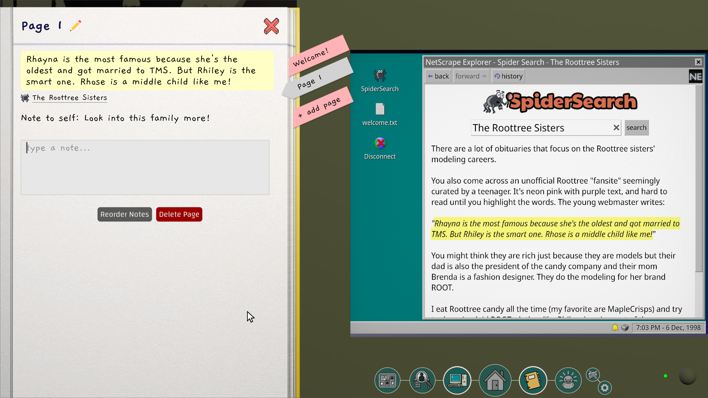
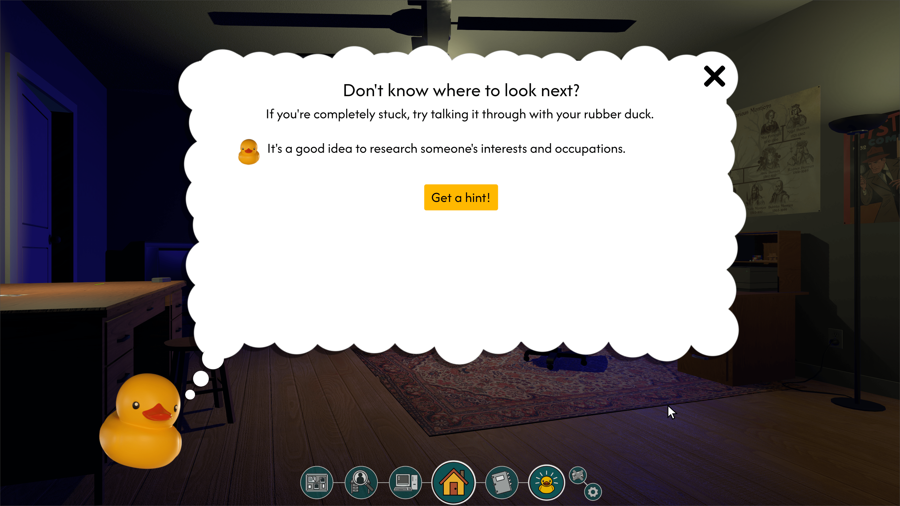
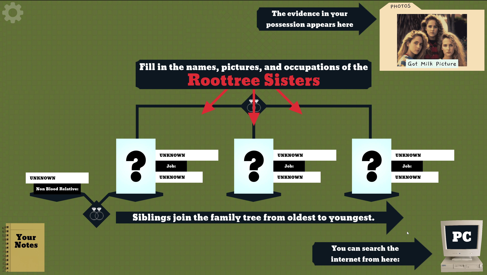

> note: This review has some medium tutorial spoilers in collapsed sections to explain how the game is structured. Everything else is spoiler free.

I regret to inform you that the Roottrees... are dead. Well, some of them, anyway. The lucky ones left on the family tree are owed a fortune -- as long as they can be proven to be a **blood relative** of the fabled Roottree patriarch. As a genealogy expert in 1998, it's up to you to fill in their entire family tree to determine who gets a piece of the pie (or the candy company, as it were). Armed with your trusty notebook and the dulcet tones of a dial up connection, it's researchin' time.

<YoutubeEmbed youtubeId="hspBJQ0X90Q" />

We loved every minute of this game, relishing the retro feel of early search engines and the fun of discovering family drama via old journal entries and corporate records. If you've played [Return of the Obra Dinn](/games/return-of-the-obra-dinn/), you'll find the process of solving these puzzles familiar (even if the flavor is totally new). You'll explore a wide world of information (a web, some might say), connecting dots from disparate sources to build a complete picture of events. It's not a fast-paced action game, but rather the kind of thing you'll fall asleep thinking about, waking up the next morning with a new theory to test against your slowly filling family tree.

## How It Works

The game opens with a brief tutorial about the mechanics of the family tree. For each person on the tree, you need to fill in their face, occupation, and birth name, ensuring that siblings are listed oldest to youngest. Every time you've correctly identified 3 family members, the game will confirm your correct answers.

Gameplay will see you searching the internet and reading old periodicals on the in-game computer. Relevant terms will dish up details useful for filling in part of the family tree, or new leads to pursue. _Roottrees_ requires you to be thorough and methodical, but also creative. Sometimes you'll need to search for someone by their nickname, or learn about them via articles about their spouses, for example.

For example, the first few steps of the tutorial:

You know you're looking for "The Roottree Sisters", so you do a web search for that phrase. You get a page that says:

> There are a lot of obituaries that focus on the Roottree sisters' modeling careers.
>
> You also come across an unofficial Roottree "fansite" seemingly curated by a teenager. It's neon pink with purple text, and hard to read until you highlight the words. The young webmaster writes:
>
> "Rhayna is the most famous because she's the oldest and got married to TMS. But Rhiley is the smart one. Rhose is a middle child like me!"
>
> You might think they are rich just because they are models but their dad is also the president of the candy company and their mom Brenda is a fashion designer. They do the modeling for her brand ROOT.
>
> ...

There's a bunch of info there, but the key pieces are their first names and relative ages. Continued searches lead you to an unlabeled photo of all 3 girls. Using context clues and the information you've gathered, you can piece together this first part of the tree.

The best finds will add new pieces of evidence to your collection, such as book excerpts and song recordings. Of course, those just lead to other clues, which lead to other clues...

<YoutubeEmbed youtubeId="1Paj4mSbegg" params={{ start: 113, end: 124 }} />

As you navigate the story, you'll find it useful to highlight information that could be important later. All text can be highlighted and stored in your notebook. The UX here is very well thought out. Highlighting and categorizing is smooth and there's a button to jump back to the exact page the highlight came from:

One of the biggest challenges comes down to knowing what to highlight. Take notes about everything and you'll be overwhelmed. But record nothing and it'll be tough to remember where you saw key pieces of information. What may seem like an inconsequential detail at first sometimes proves vital to a mystery that you didn't even know you were investigating at the time.

## Letting Loose

Once you've cracked the tutorial, you're set loose to fill in the entire 50-member family tree. You can attack it in whatever order you'd like. The open-endedness of this challenge is intoxicating. There's just _so much_ to go and find. Best of all, there's a conspicuous `TOP SECRET` envelope pinned to the board from the very beginning. Once you've filled in the whole board, you might just be ready for its challenge.

After completing the entire tree, you're rewarded with part 2: "Roottreemania". It expands the story with a new section to fill in. Although the new tree is smaller, a steep increase in difficulty meant it took us longer to complete than part 1. We loved getting to put our sleuthing skills to the test. When we felt stuck, the integrated hint system kept us moving.

It's worth mentioning that when we'd sit down to play _Roottrees_, we'd play it in minimum 3-hour stretches. Exploring each new clue and re-evaluating what we thought we knew kept us glued to our couch. We repeated this process for 5 days straight (staying up _way_ past bedtime) until we'd blown through the game's ~18 hour runtime.

We really appreciated how each half ends with a [detective dénouement](https://en.wikipedia.org/wiki/Detective_d%C3%A9nouement), tying together all the loose ends and ensuring all players understand exactly what happened. It added a nice bit of closure that's much harder to find in real-life genealogy.

We also liked the game's humor. Most of the text is fairly matter-of-fact, but there are some funny things to find too. The cheeky lines go a long way towards keeping the act of "reading tons of text" from dragging too much.

Note that I keep saying "we". I played through the whole thing with my editor/wife. It was a _great_ pseudo co-op experience. Having a second perspective along for the ride proved invaluable.

## A New Start

If you follow the puzzle game scene, you might have seen _The Roottrees are Dead_ recommended over the past year, despite its impending Steam release. It's not time travel -- the version of the game we're reviewing now is what the devs are calling a remake / sequel (a "requel", if you will).

The original concept for _Roottrees_ was created in early 2023 for the [Global Game Jam](https://globalgamejam.org/). Knowing he had something special on his hands, creator Jeremy Johnston expanded and polished the game, releasing it later that year for free [on itch.io](https://jjohnstongames.itch.io/the-roottrees-are-dead). Despite its warm reception in the puzzle community, he [wasn't willing](https://jjohnstongames.itch.io/the-roottrees-are-dead/devlog/632664/the-roottrees-are-finally-dead) to release it on Steam because of its reliance on AI-generated art.

He was soon approached by Robin Ward, who recognized the game's potential and was interested in [leading/funding the development](https://eviltrout.com/2023/07/17/the-roottrees-are-dead) of a more traditional release. They took this opportunity to:

- replace **all** the AI art with illustrations by [Henning Ludvigsen](https://www.henningludvigsen.com/)
- commission a jazzy noir soundtrack
- add a small voice cast for certain characters
- add the aforementioned "sequel", Roottreemania
- edit the game's nearly 90,000 words
- redesign the interface for a dramatically improved user experience. For comparison, here's the old version of the first screenshot above:

I'm glad this game is getting a second chance at widespread acclaim; so is my co-detective/wife. As an artist herself, she maintains that she'd never have given it a fair shot when it used AI "artwork", which would have been a shame. Now she, and everyone else with similar reservations, will be able to enjoy this all-time great.

## Wrapping it Up

In a lot of ways, _[The Roottrees are Dead](https://roottrees.com/)_ feels like lightning striking twice. After _Obra Dinn_, I was skeptical we'd ever see another game like it. _Roottrees_ doesn't hold your hand, but gives you the tools to solve the whole mystery, if you're up to the challenge. It's not often a game trusts you enough to set you totally loose, but it's all the more rewarding when it does.

This Steam release is packed full of improvements (including an _entire sequel_), so even if you played the original freeware version, there's plenty worth coming back for. If this is your first time with the Roottree family, enjoy. You're in for a treat!

<ReviewSummary review={props.frontmatter.review} />

_[The Roottrees are Dead](/games/the-roottrees-are-dead/) is available on [Steam](https://store.steampowered.com/app/2754380/The_Roottrees_are_Dead/)_ and releases Jan 15, 2025.
