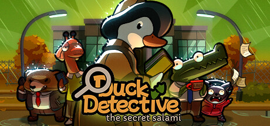

{/* I'm not sure there'll be a 2024 link, so I'll point to an archive if I need to. */}
{/* https://web.archive.org/web/20250130043921/https://thinkygames.com/awards/ */}

It was my great honor to be a juror for the [2024 Thinky Awards](https://thinkygames.com/awards/). They showcase the year’s best puzzle games across a variety of categories, such as "Most Innovative", "Most Accessible", and of course, "Game of the Year".

There are _tons_ of awesome nominees and as a juror, I was lucky enough to be sent keys for some of them. Usually I'd write a full article reviewing every game (which is my typical rule when a dev is kind enough to [send me a key](/contact/#developers--publishers)), but the number of games and the short timeline meant that wasn't realistic.

Nevertheless, I wanted to make sure I at least acknowledged each game I got to try. For the shorter ones, I played the whole thing and you'll see my full, scored review. For the rest, I played a few hours and shared some thoughts about if / when / how soon I'll be revisiting each.

Each one of this year's nominees did something special or unique and I enjoyed them each in their own way. No matter what sorts of puzzles you go for, there'll be something here for you!

Proceeding alphabetically:

## 20 Small Mazes

<EmbeddedPlay slug="20-small-mazes" />

<SteamGame steamId="2570630" isFree />

## Arranger

  

I loved the watercolor art style. Its design is a brilliant integration of [Sokoban](https://en.wikipedia.org/wiki/Sokoban) puzzles and (simple) strategy games. Navigating around the map was a puzzle in and of itself, which was a fun twist. There's some fun story elements as well, which I'm interested in seeing more of.

Verdict: **Will play through!**

<SteamGame steamId="2596420" />

## Bee Magic

I liked the concept of "use your path to cast spells". The size of the space affects what you can cast; working effectively in this restriction is the core of these puzzles. After you complete the initial challenge, you're able to try it again (and again) while using a progressively smaller set of spells. That you can clear the puzzle in so many ways signals some clever design. But, diving back in with additional restrictions didn't appeal to me, so I dropped it.

Verdict: **Neat concept, but probably won't come back to it.**

<ItchGame itchId="2864555" />

## The Court of Wanderers

A spartan presentation gives way to surprisingly involved puzzles. Rotating individual item segments quickly yields more interesting situations: rotating rocks, pillars, and the rotators themselves. Even in my short playtime, I hit some puzzles that I thought I solved before realizing there was an extra trick after the fact. I loved that it kept me on my toes, but I'm not interested in an entire game of it. Pleasantly challenging though!

Verdict: **Fun and challenging, but unlikely to revisit.**

<SteamGame steamId="1640370" />

## Croquet Conundrum

The simplicity of croquet paired with some decently tough puzzles. New twists are introduced slowly, giving me time to really understand how they all worked. Even the hard puzzles felt fair because everything was explained and presented up front. It had a calming art style while being fun and relaxing to play.

Verdict: **Would like to revisit.**

<ItchGame itchId="2401407" />

## Cryptmaster

I'm not much for word games, but _Cryptmaster_'s humor and narration won me over. I liked its simple battle system and truly original design. I may end up playing in turn-based mode, but I really want to see what else it has to offer.

Verdict: **Definitely revisit.**

<SteamGame steamId="1885110" />

## Duck Detective

<EmbeddedPlay slug="duck-detective-the-secret-salami" />

<SteamGame steamId="2637990" />

## Entwined Time

Of all the nominees, I found _Entwined Time_ to be the most mechanically fascinating. You can revert moves, but sometimes doing them in reverse leads to brand new states (e.g. a revert doesn't always leave you where you started). Being able to revert each robot individually means there's a _lot_ of design space to explore. It also felt like one of the harder games I tried, forcing you to really understand the internal logic of its motions.

It had the best hint system of any of these games: you could play a simplified version of a level to better understand its key concepts. It also includes developer solutions for everything, so you'll never be too stuck. There are a _ton_ of levels, but I'd like to play through them at my own pace.

Verdict: **Absolutely want to play through, but will probably do it slowly.**

<SteamGame steamId="3147300" isFree />

## Epigraph

Epigraph isn't a bad game, but it didn’t really click with me (despite enjoying so many of the games that inspired it). Lots of people like it, so don't let my low review put you off it if it’s up your alley!

<EmbeddedPlay slug="epigraph" />

<SteamGame steamId="2789770" />

## I Wanna Lockpick

I think _Lockpick_ took the cake for "most mechanics". The premise is simple: match keys to their matching doors and reach the goal. Before long, there are multi-key doors, multi-color keys, doors that blow up all your keys, ice doors, old doors, and more.

The gameplay itself was decent, but I was spending a lot of time counting keys and being annoyed about the simple platforming. I do want to use the (helpful) "unlock everything" setting to see all the mechanics though, so I'll probably run through that one afternoon.

Verdict: **Fun, but won't play the whole thing. Want to see the mechanics though, so I'll warp my way to the ending.**

<ItchGame itchId="1303224" />

## Isle of Sea and Sky

This felt a lot like [Animal Well](/games/animal-well/) with the platforming replaced with block pushing. I felt the same sense of adventure and exploration as I started to realize how interconnected everything was. There are new powers to find and new puzzles aplenty. The art was nice too.

Verdict: **Gotta see more.**

<SteamGame steamId="1233070" />

## Leaf's Odyssey

Its simple art belies a tough challenge based on [Deadly Rooms of Death](https://en.wikipedia.org/wiki/Deadly_Rooms_of_Death). The enemies' predicable movement patterns allow you to manipulate them to solve puzzles, which I found very clever. There's a _lot_ of great QoL features, like checkpoints for partially resetting a room and a journal that automatically records new enemy behavior. Each room pushed boundaries for what I thought possible and I loved the feeling of a solution really clicking into place.

Verdict: **Likely to revisit.**

<SteamGame steamId="2880750" />

## Leap Year

<EmbeddedPlay slug="leap-year" />

<SteamGame steamId="2951770" />

## Paper Trail

Beautiful art and a reasonably interesting story paired with an interesting paper folding mechanic. The only problem was, I didn't find the puzzles all that fun. I liked the idea of them, but the actual execution felt a little tedious. It had the bad luck of being played alongside some really top-tier puzzle games, which I think hurt it by comparison.

Verdict: **May eventually revisit.**

<SteamGame steamId="1889740" />

## Reliquia Park

What seems like a bog-standard block-pushing game quickly gives reveals itself to be a fascinating "metroidbrania" (a portmanteau of the [Metroidvania](https://en.wikipedia.org/wiki/Metroidvania) genre and games where progression comes from learning new puzzle mechanics). The game is totally stateless -- you record passwords as you progress and can teleport anywhere you've got a code for. I was intoxicated by slowly learning the rules for each area's mechanic,and I can't wait to dive back in.

Verdict: **Absolutely going to play.**

<ItchGame itchId="2933270" />

## Robot Detour

<EmbeddedPlay slug="robot-detour" />

<SteamGame steamId="2666840" />

## Slider

I loved the sliding [15 puzzle](https://en.wikipedia.org/wiki/15_puzzle) as a kid and it's great to see that same premise applied to an entire game world. Despite its simplistic graphics, I was immediately charmed by the characters, music, and inventive interactions that happen while sliding the world around.

Verdict: **Certainly revisit!**

<SteamGame steamId="1916890" isFree />

## Star Stuff

One of the most accessible programming games I've ever played. You write short instructions for your robot companions and interleave your actions with theirs to reach each level's goal. The developers took great care to make debugging simple. The art style is friendly and bubbly, plus there's a little story. It did everything well and I plan to see the rest of it when time permits.

Verdict: **Excited to revisit.**

<SteamGame steamId="1955110" />

## Wilmot Works it Out

I enjoyed [Wilmot's Warehouse](/games/wilmots-warehouse/) and was excited to see their next foray into zenlike organizational games. This time around it's jigsaw puzzles, which is a great fit for this relaxing yet engaging experience. The art is cute and the writing helped us connect with the punctual mail person. I sort of miss the upgrade system, but I think the more casual experience fits their vibe better.

Verdict: **Will finish!**

<SteamGame steamId="2060590" />

## Other Nominees

Throughout the year, I also played (and reviewed) the following nominees:

- [Against the Storm](/games/against-the-storm/)
- [Animal Well](/games/animal-well/)
- [Balatro](/games/balatro/)
- [Botany Manor](/games/botany-manor/)
- [The Rise of the Golden Idol](/games/the-rise-of-the-golden-idol/)
- [Tactical Breach Wizards](/games/tactical-breach-wizards/)

## Conclusion

That's it! A big thanks to [Joseph](https://josephmansfield.uk/) from [Thinky Games](https://thinkygames.com/) for reaching out and to all the devs for releasing such compelling games. Congrats to the winners and I'll catch you all soon!

<SubscribeBlurb
  blurb="To be notified about new reviews and articles, consider subscribing via"
  showSteamButton
/>
