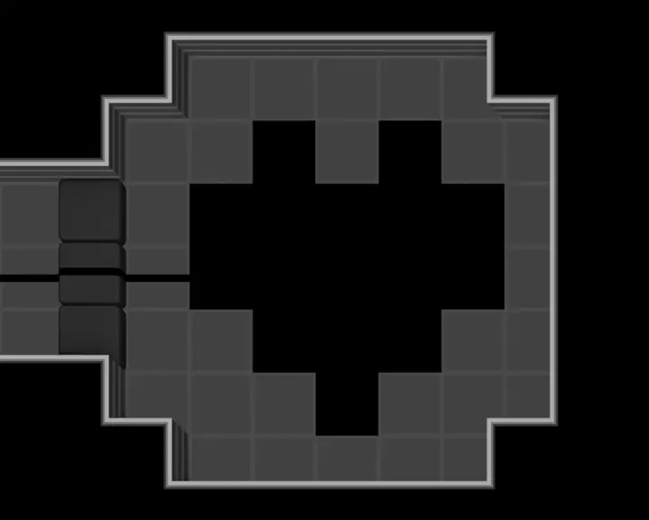
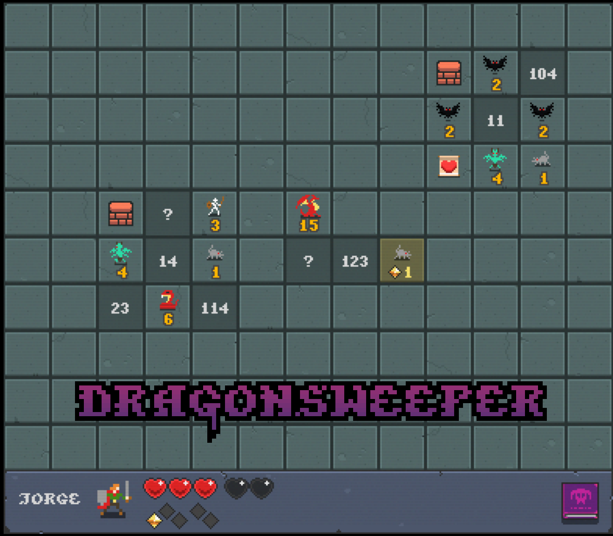
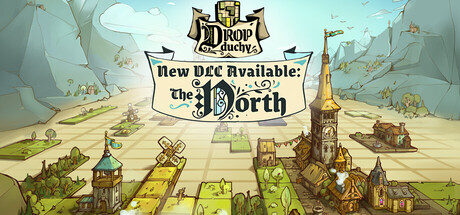
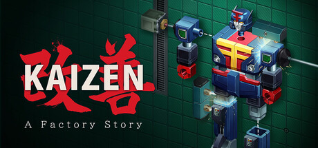
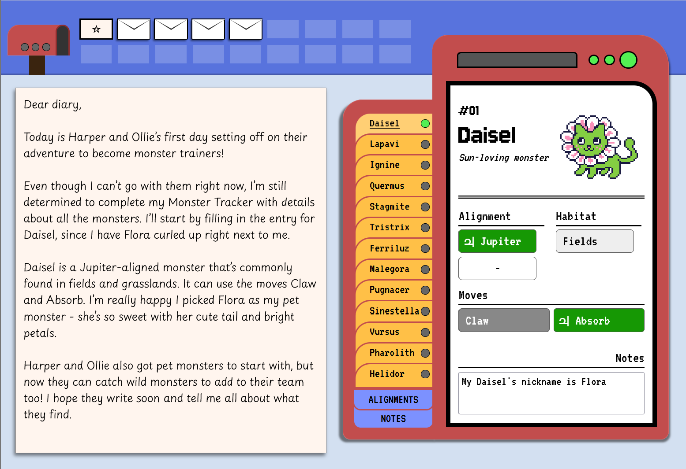
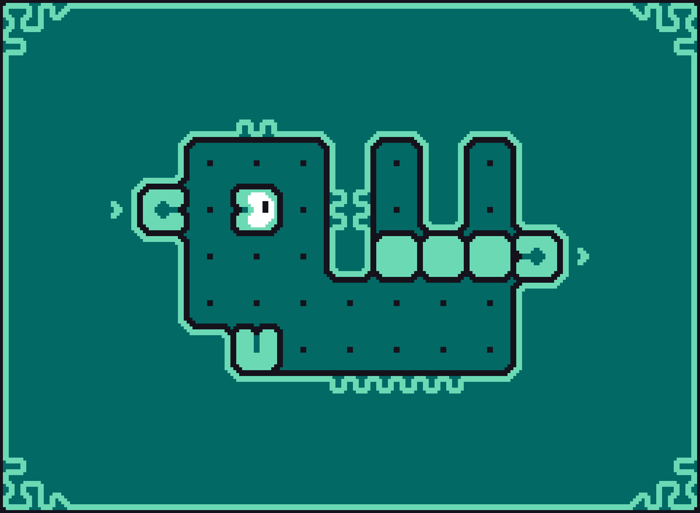
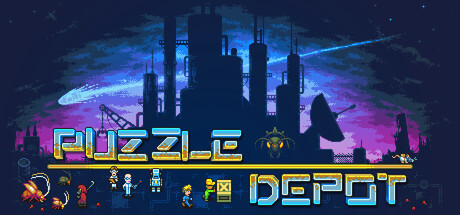
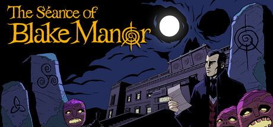
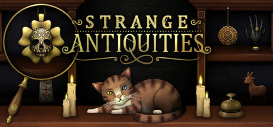

The folks at [Thinky Games](https://thinkygames.com/) were kind enough to [invite me back](/articles/thinky-awards-2024-impressions/) to be a juror for their annual [awards show](https://thinkygames.com/events/awards/)! There are a ton of great games and it's been an absolute blast playing through as many as I can while building my ballot.

In case you don't have time to play them all (and let's face it, who does?), here's a rundown of everything I finished (or at least tried) that's been nominated.

Where relevant, reviews are scored [out of 4](/rating/games/). Here are all the (beatable) nominees I've played, in alphabetical order:

## 0Player

An experience that pushes the definition of a "game", _0Player_ is just an image. No moving pieces, no feedback, just an image. But, it's an image that contains a "playable" puzzle game. You move the pieces in your head and intuit the way the mechanics should fit together based on your progress so far. Corey's [glowing feature](https://thinkygames.com/features/this-new-free-sprawling-cryptic-puzzle-game-is-played-with-only-a-single-image-and-your-imagination/) sold me on at least giving it a shot.

I was impressed at how intuitive it was to "play". Each puzzle was self-contained enough that I could slide everything around in my head. And, when moving between puzzles, it's easy enough to remember which wires have been illuminated. For a thing you can't actually play, it worked surprisingly smoothly. It was a fascinating experience and is certainly pushing the boundaries of the genre.

My biggest gripe is how much more focus it takes to play when compared to a normal game. Normally I can take short breaks during a game or play while I'm watching TV. But without taking notes on the image (which I could do, but didn't for simplicity), it's hard to jump in and out.

<ItchGame itchId="3756235" />

Verdict: **Will likely revisit when I can set the time aside to play.**

## Blue Prince

<EmbeddedPlay slug="blue-prince" />

<SteamGame steamId="1569580" />

## Chroma Zero

One of my top games from this list, it's a visually striking game directly inspired by the sense of discovery in [Outer Wilds](/games/outer-wilds/). It's very open ended and, while there's a couple of small things that get unlocked, most progression is in your mind. Walking around and experimenting to learn about the world is always a blast. There's a lot of interconnected elements at play! The low-poly environment works great as a stripped-down setting. The sense of scale was cool too, since everything around you is so huge. Plus I love a game with a [spoiler-light hint guide](https://steamcommunity.com/sharedfiles/filedetails/?id=3391124193).

Verdict: **Excited to play. Soon.**

<SteamGame steamId="3121470" />

## Cipher Zero

<EmbeddedArticle slug="cipher-zero-review" />

<SteamGame steamId="1332180" />

## Die in the Dungeon

Draws heavy inspiration from [Slay the Spire](/games/slay-the-spire/), but forges its own path using dice and a board instead of cards. The board's spatial component added a lot of additional strategy since dice can have different effects based on what they're next to on the board, which I liked. Pleasant art and a lot to unlock, too!

Verdict: **Will give it at least a few more runs.**

<SteamGame steamId="2026820" />

## Dragonsweeper

<EmbeddedPlay slug="dragonsweeper" />

<ItchGame itchId="3245484" />

## Drop Duchy

Probably the most unique nominee this year, I described it as a "roguelike deckbuilder battle Tetris" to my friends. You assemble a deck of buildings, each producing military might or resources based on what's placed around them (e.g. producing wood for every adjacent forest tile).

Each encounter has you shuffling that deck into a pile of tetrominos and playing Tetris as normal. Each time you fill a row, you score all the resources from the tiles on that row, which let you upgrade your buildings. You're also responsible for placing enemy military buildings when they come up, which need to be placed so they're at as much of a disadvantage as you can muster. Once all the pieces are placed, your military faces off with theirs and if you survive, you keep accrued resources and live to fight another day.

It may sound like a lot, but all of these systems work together in harmony for a deep, strategic experience that always keeps you on your toes. There's also an extensive tech tree, unlockable factions, and unique boss fights at the end of each area. The UI could use a little polish, but I was impressed by how well everything came together. Just make sure to play with a mouse, not a controller.

Verdict: **Definitely coming back for more.**

<SteamGame steamId="2525310" />

## Gentoo Rescue

A simple premise belies a series of levels that just keep going deeper! Literally. Its recursive level structure is ingenious, using completion of sublevels to block paths on root-level puzzles. There are also a ton of unexpected interactions to discover (and a journal that ensures you understand each once you've discovered it).

You don't actually unlock anything (in what I've played so far) but you deepen your understanding of how disparate elements interact, which is both fun and surprisingly complex. Each puzzle is intricately designed and I came away super impressed with the overall level of polish. There's a lot of the game, but I'm excited to dive back in.

Verdict: **Excited to see all it has to offer!**

<SteamGame steamId="2830480" />

## Glowkeeper

One of many games that seems simple until it combines its mechanics in unexpected ways. (See also: many other games in this list.) I liked what I played of it, but it's a little lo-fi for my tastes. The music is good, but outside of the player character everything is simple sprites. It seems like there are some cool hidden mechanics, but in a world with so much competition, this didn't jump out at me.

Verdict: **Neat game, but not one that really pulled me in.**

<SteamGame steamId="3410660" />

## Is This Seat Taken?

A visually charming take on constraint puzzles. The difficulty ramped up nicely through the levels we played and the overall ascetic was well executed. There's also a cute little narrative, which is a relative rarity among nominees.

Verdict: **We'll finish this one sometime!**

<SteamGame steamId="3035120" />

## Kaizen: A Factory Story

<EmbeddedArticle slug="kaizen-review" />

<SteamGame steamId="2275490" />

## Leap Year: March

I loved how tight the design of [Leap Year](/games/leap-year/) was. Each room is crafted with a very specific purpose, even if you don't understand it right away. The whole thing is wildly elegant. It was short and sweet too, leaving me wanting more. Well good news, there's more!

Its _March_ DLC expands on the mechanics from the base game while ratcheting up the difficulty. I thought I'd love it, but actually came away a little overwhelmed. More puzzles is good, but I thought the base game difficulty was spot on. It was tricky but never too hard and I constantly felt like I was making progress. In the DLC, I kept wandering around, unsure how to progress, since the scope is larger and the puzzles are harder. It's more of a good thing, but maybe _too_ much.

Verdict: **Might revisit because I loved the base game so much, but also might not. It didn't click with me like the base game did.**

<SteamGame steamId="3458170" />

## Ligo

A challenging multi-agent movement game about squashing ghosts to squish golden goombas. It packs a ton of unexpected mechanics into just a few levels (which reminded me of [Entwined Time](https://store.steampowered.com/app/3147300/Entwined_Time/), a nominee from last year I really liked). It's _tough_ though. The animations are nice and the presentation is nice, but we really spun our wheels for a while on some of the early puzzles. Would have really appreciated a hint system.

Verdict: **Won't revisit. Well made, but not my style of game.**

<SteamGame steamId="2462810" />

## LOK Digital

<EmbeddedPlay slug="lok-digital" />

<SteamGame steamId="2207440" />

## Mind Diver

An ambitious, non-linear exploration of a sci-fi story. The puzzles felt fairly straightforward and it didn't feel like we had to deduce much, but it's a fascinating concept. The UI is a little clunky and it leans _heavily_ on audio logs as a storytelling medium. Thankfully you can fast-forward them, but it's still just slower than reading. Everything is nicely voice acted though, which is always a plus.

Verdict: **May eventually revisit since I do sort of want to know what happens.**

<SteamGame steamId="2259330" />

## My Friends the Monster Trainers

A cute, tiny Roottrees-style game about identifying creatures in a ~~pokédex~~ catalogue. It's definitely on the easy side, but I liked the way it wove a little narrative into its epistolary clues. Perfect for what it is.

Verdict: **Simple, but delightful!**

<ItchGame itchId="3940530" />

## Nurikabe World

I've had my eye on this ever since I read the [glowing review](https://buried-treasure.org/2025/06/nurikabe-world/) on Buried Treasure, one of my favorite blogs. It's "just" a series of [nurikabe](<https://en.wikipedia.org/wiki/Nurikabe_(puzzle)>) puzzles, but presented with beautiful art and sound effects. It teaches you all the rules gradually while maintaining a calm, meditative experience. It's beautifully done and there's good variation in level design.

Verdict: **Will revisit occasionally, but I don't often sit down to play 100 sudoku in a row.**

<SteamGame steamId="2964540" />

## Nuworm

It's always fun when a game does something totally unique with movement. In this case, you can't move backward, only rotate and switch characters. The puzzles are tiny and tightly designed around specific ideas which do a good job teaching you. It's on the harder side, but maybe I just didn't spend enough time with it. I could have used a hint system, but given the game's small scope, it makes sense that it's a little bare bones.

Verdict: **Inventive little game, but I'm not patient enough to play the whole thing.**

<ItchGame itchId="3382361" />

## Öoo

{/* FIXME: slugify w/ locale: 'sv' */}

<EmbeddedPlay slug="ooo" />

<SteamGame steamId="2721890" />

## Orbyss

<EmbeddedArticle slug="orbyss-review" />

<SteamGame steamId="1385340" />

## Puzzle Depot

A fascinating evolution on the [block-pushing genre](https://thinkygames.com/lists/best-sokoban-games/) that adds equipment, leveling up, and an expansive open world. You can solve puzzles in different ways depending on what gear/stats you have, which is truly a triumph of puzzle design. It also means there's a _lot_ of information to keep in your head, which might not be for everyone.

There's some cute writing and a little story to boot. But, the game is huge. Like intimidatingly so. I always felt like I'm solving things in the wrong order or destroying gear I wasn't supposed to lose. I can appreciate it for what it is, but I found it more stressful than fun. Kudos to them for the design though!

Verdict: **A masterclass of design, but not really my cup of tea. I love the idea of it though.**

<SteamGame steamId="3108190" />

## Rise of the Golden Idol DLC

I did micro-reviews of each of these DLCs on the [Rise of the Golden Idol](/games/the-rise-of-the-golden-idol/) page, but suffice it to say that more Golden Idol is always a good thing!

Verdict: **Already played; loved.**

<SteamGame steamId="3333860" />

## The Séance of Blake Manor

Another great entry in the burgeoning investigative genre. It gives you a lot of latitude to follow the leads you're interested in whatever order you want. The UI for tracking mysteries and clues is _incredibly_ slick, too. It manages information so well that I suspect they'll be able to ratchet up the difficulty, which I'm looking forward to.

I'm not nuts about the occult theme or how reading consumes in-game time, but I suspect it won't stop me enjoying it. Will be a perfect fit during spooky season.

Verdict: **Very cool investigative mechanics. Will revisit in October!**

<SteamGame steamId="1395520" />

## Spooky Express

<EmbeddedArticle slug="spooky-express-review" />

<SteamGame steamId="3352310" />

## StarVaders

Another game with distinct Slay the Spire influence, but done in an anime mech-battle style. The deck building and upgrading experience is fairly standard, but the grid that you and enemies maneuver across is a good spin.

Having to position yourself and aim your attacks doesn't come up much in this genre. There's also a ton of characters and mechs to unlock, each with unique cards and items, which would help keep things fresh. I was also intrigued by its time-loop story. I'm not sure it'll resolve well, but it's certainly an interesting (and appropriate!) hook.

Verdict: **I want to see all the unique cards and items, but it's up against a lot of stiff competition in this genre.**

<SteamGame steamId="2097570" />

## Strange Antiquities

A sequel to [Strange Horticulture](/games/strange-horticulture/), another puzzle game we quite enjoyed. It delivers more of the same: matching items to descriptions, exploring a town, chatting up the townsfolk, and making decisions that affect the outcome of the story.

All the animations are buttery smooth and all of the puzzle elements delightfully tactile as you're clicking and dragging. The occult theme is well-realized and there are a lot of threads to follow. We loved this one!

Verdict: **Excited for more, but will save it until spooky season.**

<SteamGame steamId="2885870" />

## Strange Jigsaws

<EmbeddedPlay slug="strange-jigsaws" />

<SteamGame steamId="2702170" />

## The Roottrees are Dead

<EmbeddedArticle slug="the-roottrees-are-dead-review" />

<SteamGame steamId="2754380" />

## Type Help

After playing _Roottrees_ last January, we were hungry for more deduction games. [_Type Help_](https://william-rous.itch.io/type-help) was the go-to recommendation for folks who had already played all of the mainstream recommendations. We liked it, but its minimal UI held the game back rather than helped it. At the time, I wrote:

<EmbeddedPlay slug="type-help" />

Well GOOD NEWS! The folks behind _Roottrees_ are giving _Type Help_ the same glow-up treatment. They've also changed the name to be something remotely findable. So stay tuned for **The Incident at Galley House**, launching sometime next year.

Verdict: **Played it, loved it, but wait for the remake.**

{/* <ItchGame itchId="3268593" /> */}

<SteamGame steamId="3641000" />

## Until next time

No matter who wins each category, each of these games is deserving of their place on the podium. Congrats to everyone involved and thanks again to the Thinky crew for having me!

<SubscribeBlurb
  blurb="To be notified about new reviews and articles, consider subscribing via"
  showSteamButton
  centered
/>
