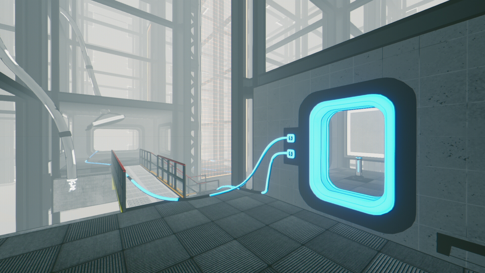
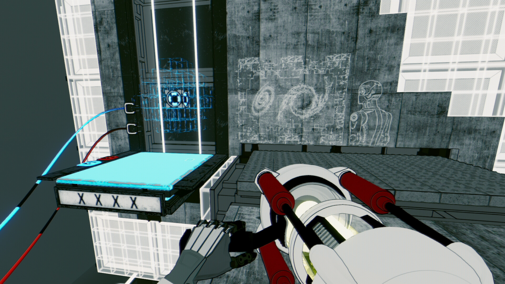

While some games are coy about their inspirations, _Total Reload_ leans into the [Portal](/games/portal/) and [Talos Principle](/games/the-talos-principle/) comparisons with direct references and a strikingly similar styles. Unfortunately, it's an unflattering comparison. Though _Total Reload_ has its moments, it fails to recreate the magic of the games that so thoroughly inspired it.

<YoutubeEmbed youtubeId="9Y9cRKtV34Y" />

Let's start with the good: the puzzles are pretty decent! Each level requires you to connect and power wires into a main hub. Your time is mostly spent re-wiring elements and flipping switches to direct power between elements. Some levels throw bridges, force fields, and floating platforms into the mix.

I also enjoyed the general layout of the game. The main path is itself a big puzzle. As you progress, you'll reach impassible areas where you're missing a powered wire. Each of these spots is accompanied by a teleporter that drops you into a self-contained sub-level. Once complete, you pop back out to the critical path to find the wire you need, allowing you to proceed with the puzzle. Jumping back and forth like this is a little disorienting, but I generally liked it as a framing device.

I do wish the main path provided more of a sense of place though. It's an endless series of hallways, elevators, and wires that feels pretty samey after a while. It was reminiscent of _Portal 2_'s industrial backdrop, but lacking in the worldbuilding. I fully bought into the back walkways of _Portal's_ Aperture Science headquarters being access points for actual maintenance staff. On the other hand, the flooring and lack of walls in _Total Reload's_ world felt arbitrary, placed there because it looked cool rather than because it was part of a larger story.

Unfortunately, as the game progresses, the levels get bigger. They're not too complex, but they take up a lot more physical space. As a result, I spent a lot of time trudging back and forth between elements. There's no sprint button and the platforms move pretty slowly. This is partially for gameplay reasons, as you'll sometimes need to hit a switch before reaching a platform before it departs. But the rest of the time, it means you slowly drift across these cavernous spaces giving you plenty of time to consider what you could be doing instead.

The narrative was the weaker half of the experience. The game begins when you're dropped into a robot body previously occupied by HAWKING, an artificial super intelligence. It talks a big game about needing to save the universe, but narrative payoff is slow to come. In the meantime, it prattles on about the complexities of space and physics. It feels more like someone you wish you hadn't started a conversation with at a party rather than an all-knowing entity. There are occasional cute references to contemporary media, but they don't do much to humanize HAWKING as a companion.

It wasn't long until I got suspicious about its unusual speaking patterns. Its cadence was _too_ rushed and it kept mispronouncing words (like "outside" and "wire"), which was uncharacteristic of someone who is supposed to be the endgame of Artificial Intelligence. After I emailed them, the developer confirmed that HAWKING is voiced by (modern day) AI technology They made the case that because the character is an AI, it makes sense for an actual AI to bring it to life. I didn't ask for further details about the exact generation methods, but I feel like the results speak for themselves (make sure to listen all the way to the end):

<YoutubeEmbed youtubeId="k0srvz1mFRw" />

I haven't (to my knowledge) come across much AI in games (yet), but I was surprised at how much life it pulled out of the game. I understand that voice acting is expensive and devs have to work with what their budget allows. But, [Ellen McClain's very human performance](https://www.youtube.com/watch?v=xVrROaxZOXg) as GLaDOS is one of the hallmarks of the genre. So ironically, the dev's pursuit of inhumanity feels like it brought them farther from a convincing result. I understand why they made this choice, I just wish they had chosen differently.

## In the end

Ultimately, _Total Reload_ isn't without its moments in the sun. I liked the way it was strung together and wires are an underused mechanic in the puzzle sphere. But its lackluster narrative, slow puzzles, and shoddy voice acting held it back from being something I could comfortably recommend over its competitors.
