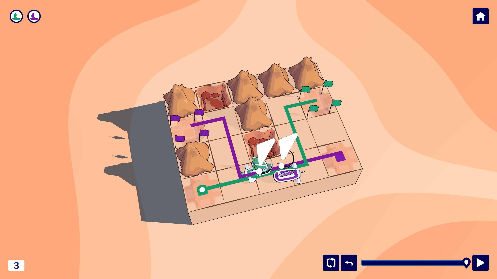
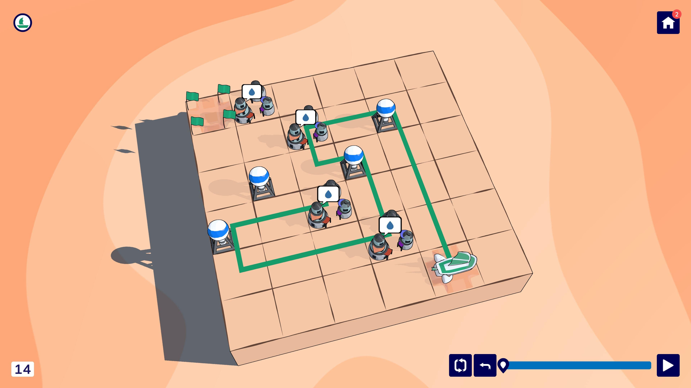
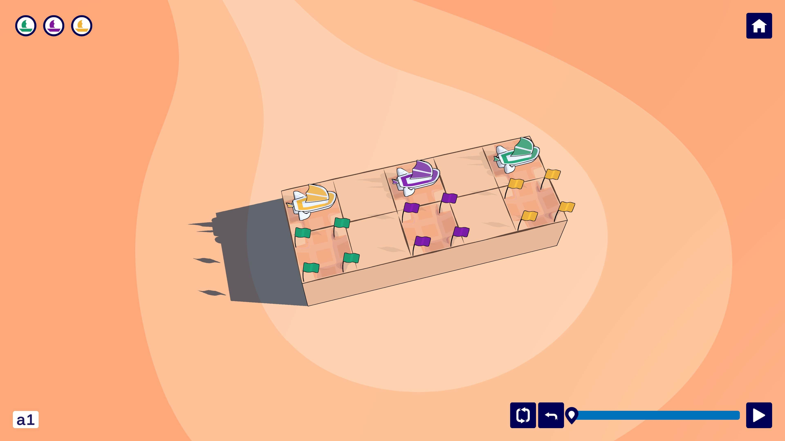

_Trails_ is the latest game from the Berlin-based game development collective [Purple Sloth Studio](https://purplesloth.studio/). It's a relaxing outing where you plot a course for a fleet of ships through beautiful desert landscapes. You'll have to navigate obstacles, locked doors, and unstable terrain on the way to your target. There's no narrative or much of a theme, but the meditative brain teasers kept me coming back for more.

<YoutubeEmbed youtubeId="jcl6h1oa65o" />

Like its name suggests, the main gameplay is drawing paths across each level's grid. A path cannot intersect itself, so you learn early to not visit a ship's target until that ship has completed its tasks. And though the separate paths of each ship can overlap, the ships themselves will crash if they're in the same square at the same time.

Some levels also require you to deliver cargo to outposts while carrying only a single item at a time. Complicating your plans are the obstacles scattered across the levels. You'll need to avoid holes, flames, surveillance drones, and more on your way to target.

While _Trails_ starts easy, it doesn't stay that way. I was impressed by the game's gentle yet firm difficulty curve. Though it introduces mechanics one at a time, it starts combining them in devilishly tricky ways.

By the time I reached the final level, I found myself taking breaks to let potential solutions marinate in the back of my mind. Returning to solve a tricky puzzle always felt great. And because nothing was randomly generated, and nothing required fast reactions or timing, the experience stayed peaceful and relaxing even when the levels got challenging.

For puzzle sickos wanting to go the extra mile, there are challenge levels that push the problem space to its limits. I only did a few, but I came away impressed with how tricky these seemingly-simple puzzles could get.

Though the gameplay is strong, I found the weak theme and lack of narrative a little disappointing. Though you're in a desert, there's nothing especially desert-y about the gameplay. It could just as easily take place in a jungle or ocean (which would make the use of ships make more sense).

Similarly, there's no in-game reason that you're navigating these puzzles or explanation for why there are flame traps and locked pyramids in your way. I realize this is like judging Sudoku for not justifying why the grid comes with some numbers pre-filled. But an intro splash screen explaining who I'm supposed to be and why I'm racing across a treacherous desert would have gone a long way towards providing a sense of place.

Minor grips aside, _Trails_ impressed me with the strength of its puzzles and its chill atmosphere. It combined many elements in fun and inventive ways which kept every level feeling fresh. I enjoyed it enough to ponder solutions even when I wasn't playing; always a great sign.
