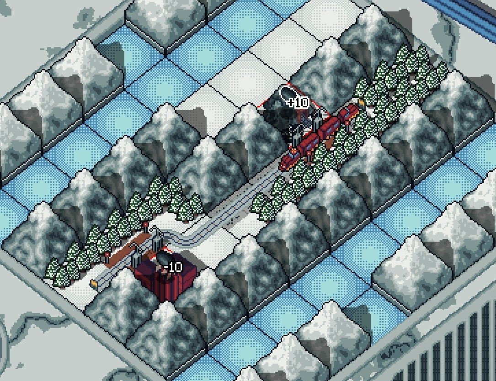
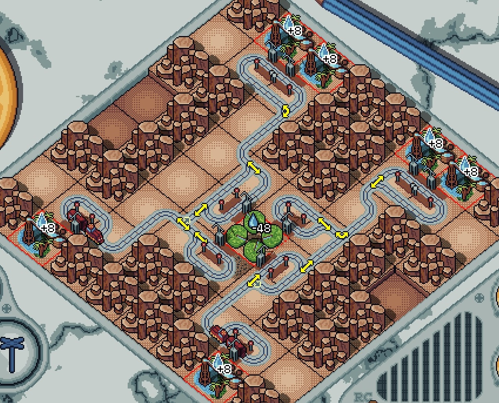
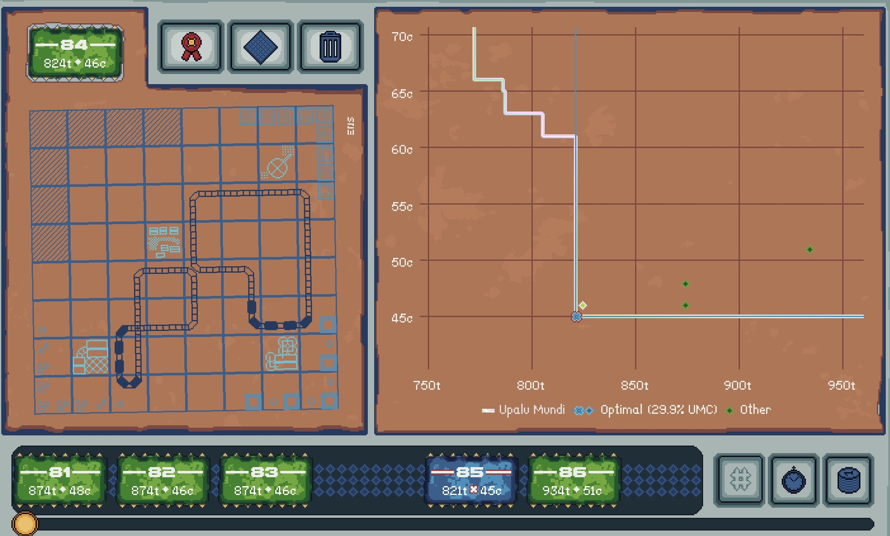
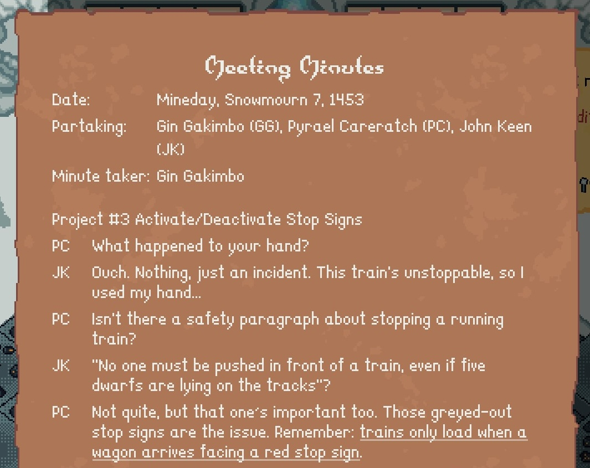
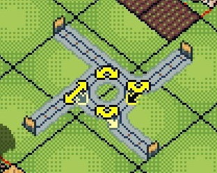

All aboard! We've got cargo to deliver and a limited amount of time in which to do it. Can you help a bunch of mining dwarves optimize their trickiest train routes?

Welcome to the world of _Upalu Mundi_, the debut game from [True Baboons](https://truebaboons.com/). It crosses the train logistics from [Factorio](/games/factorio/) with the puzzle & optimization-focused gameplay of a [Zachtronics](https://www.zachtronics.com/) game. Its cozy pixel art and charming narrative tie everything together for an imminently pleasant outing.

<YoutubeEmbed youtubeId="gmEIGLZZX5E" />

In _Upalu Mundi_, you step into the shoes of a dwarf named Pyrael, Mountain Mining Industries' newest train network engineer. You and your team are responsible for designing new rail lines to move all manner of cargo from its source to its destination. But that's easier said than done! Each of the game's self-contained levels has a twist to help them each feel unique. Sometimes you're working in cramped quarters, while other times you only have a few engines or cargo wagons to work with, restricting the possible design space.

You quickly graduate from laying simple rails to building complex train systems. To aid this effort are a variety of switch types (like "alternating" and "if empty"), plus a simple-but-effective signal system for preventing deadlocks. Combine them well and you can produce pretty complex designs. It's a good thing too, since the back half of the game's roughly 75 levels will force you to get pretty creative!

Like the Zachtronics games from which _Upalu Mundi_ draws [so much of its inspiration](https://bsky.app/profile/patrickbeer.bsky.social/post/3lrcx3p2hq22z), finding _a_ solution for each puzzle isn't too hard. But if you're content with any old solution, you're missing one of the game's main joys: optimization. Each working blueprint is scored based on its duration and cost: each rail segment costs 1g, plus small penalties for paving over fields and flora. The more efficient (by either metric) your design, the closer you'll be to the optimal solution curve (as provided by the magical and eponymous "Upalu Mundi").

I liked that the game doesn't force you to choose between writing cheap or fast solutions (though every solution must complete in fewer than 999 cycles, so there _is_ a failure condition). Instead, you can produce an optimal outcome (should you choose to pursue that) at any speed or cost, provided your blueprint is cheap or fast enough, respectively. Though I'm not one to dwell on a completed level, re-assessing a solution to eke out small improvements was good fun. Taking the time to build a deeper understanding of each puzzle helped me appreciate what made each unique.

## Telling a tale

Each level is neatly teed up by a memo between you and your coworkers. Though there's not a lot of explicit _narrative_ in the game, many of the memos help set the scene for the puzzle. For instance, one catalogues a conversation with your boss about a brewery's need to move both wheat and patrons into their facility; it proceeds a level whose cargo is exactly that:

These bits of text do a great job providing a sense of place, elevating _Upalu Mundi_ above games that are just an endless series of contextless puzzles to solve.

Other memos focus more on the office scuttlebutt, providing some backstory about you and your coworkers. They're mostly standalone vignettes without gameplay impact, but act as charming little diversions that help with the game's overall pacing. Of all the things to emulate from Zachtronics games, I'm glad the frame story made the cut.

Rounding out the narrative elements are small newspapers that pop up between each of the game's major sections. One of my favorite little touches is how certain articles are dynamic, based on how you solve certain puzzles. I won't spoil exactly how this plays out, but this responsiveness does wonders for the overall immersion of the game without drawing focus. It's an impressively effective little design!

## Little derailments

My few gripes are focused around the UI. Everything is well thought out, but certain puzzle game staples are missing. For example, there's no way to undo an action. It's easy enough to re-add something you removed unintentionally, but accidental puzzle resets and removing very specifically-crafted intersections were costly mistakes. A way to jump to specific moments in the simulation would have been nice too. I might have a bug around cycle #350, but getting the simulator to stop just before then was a manual, error-prone operation.

Also, I had a lot of trouble remembering which intersection type was which and exactly how the more complex ones functioned (e.g. which arrow does an empty train follow- the yellow one or the grey one?). The included documentation is descriptive, but it was a little frustrating to have to refer to it so often.

## In the end

All told, _Upalu Mundi_ is a stellar game. Its puzzles are engaging and I enjoyed the focus on optimization rather than sheer difficulty. All its window trimmings (story, art, music) come together to support the experience rather than distract from it. This is one of the finest Zachtronics-inspired games I've ever played; I hope it finds the success it deserves.
