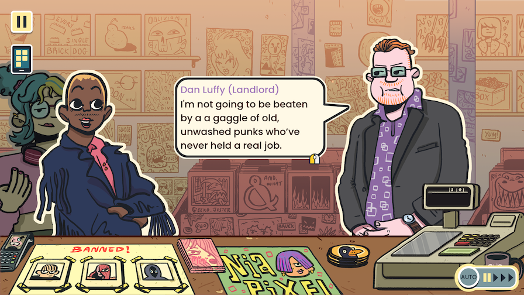
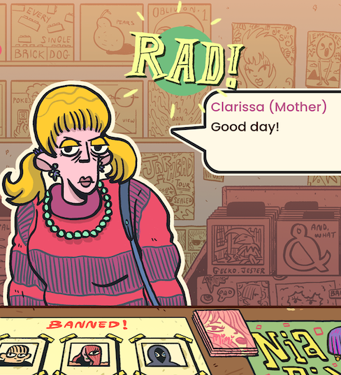
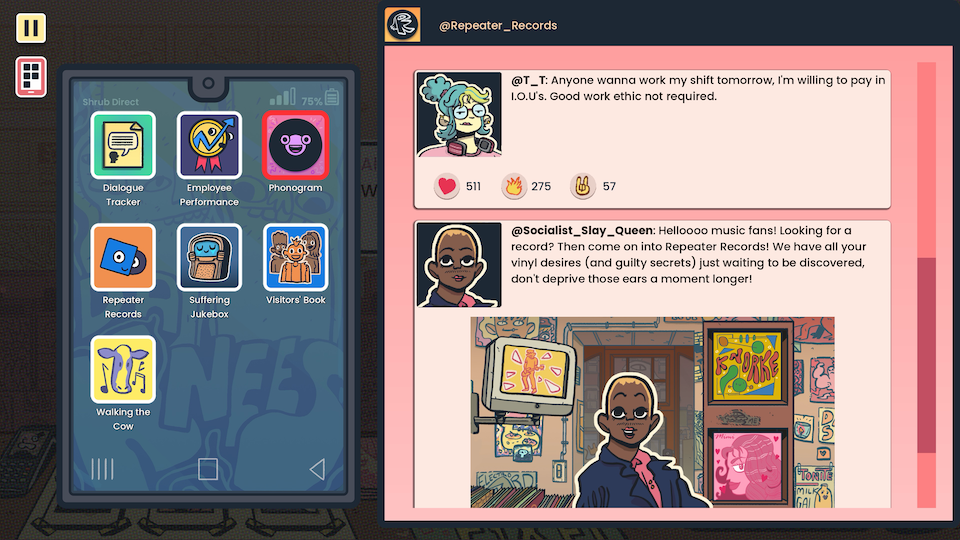
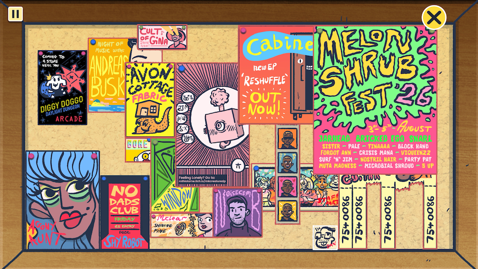
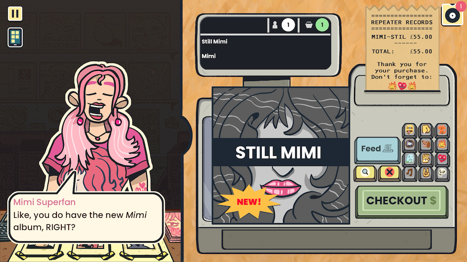
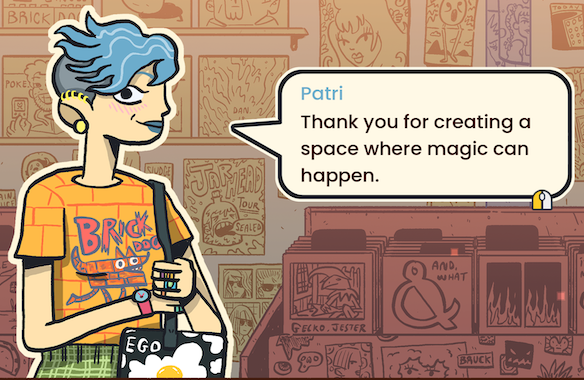

_Wax Heads_ is a cozy little game ostensibly about recommending the perfect album for each customer in your neighborhood record store. It's a little light on gameplay, but its engrossing worldbuilding and undeniable charm kept us engaged throughout its roughly 8 hour runtime.

<YoutubeEmbed youtubeId="iN9iki1pggw" />

You're the newest employee of Repeater Records, a neighborhood staple owned by a washed-up pop star from the 80s. Throughout the course of the game you'll bond with your fellow employees, navigate the interpersonal drama of the London alt-music scene, and try to prevent the store from getting bought out by a slimy businessman from the owner's past. The narrative explores themes like the evils of capitalism and AI as well as the value of community through an unapologetically punk lens. The vibes are good and your work at the counter work never feels like a chore.

Gameplay wise, _Wax Heads_ is first and foremost, a visual novel. While the moment-to-moment activity involves meticulous record recommendations based on vague instructions, your only real reward is the way the customers react to you. Pick well and they'll rush home to enjoy what's sure to be a new favorite; miss the mark and they'll grumble and sulk out of the store. In a game all about building relationships, letting someone down is the ultimate failure.

It's unclear if the accuracy of your selections affects storylines (we aced most sales, so we only saw a happy path). But one thing's for sure: successful recommendations advance each customer's story. You'll help patrons find love, evolve their musical tastes, and react to news about favorite artists. These mini-arcs mean every customer feels like a real person with needs and dreams, which is hard to pull off in such a large, varied cast.

The album selection gameplay is charming, if simple. There are only ever 10-20 items stocked on the shelves, so there's not much to sift through. Plus, many patrons' requests are oddly specific. For example, you encounter a teen interested in "romantic rap". Even if you didn't read the in-universe blog post that mentions a newly hard-launched relationship between two rappers, the answer to the customer's request is readily apparent: only one of the three rap albums on the shelf was released by a duo. It's heavily reminiscent of [Strange Horticulture](/games/strange-horticulture/) (which is clearly intentional, given the devs [recently interviewed each other](https://www.youtube.com/watch?v=ljDBWXOKp6I)).

Despite its simplicity, the act of picking an album someone would love grew on me. I got good at it too, and the game encouraged a real pride in my mastery. I made sure to read all of the in-universe social media and periodicals to make sure I was on top of industry scuttlebutt. This mastery is totally inconsequential, but the game's extensive worldbuilding made everything feel very _lived in_. Like, I suddenly cared that a pop diva was accused of using a ghostwriter because I knew her superfan (who'd visited the shop twice already) was going to be crushed. That album soon had a big "SALE" sticker slapped on it since demand dried up after the accusations were made public.

More than anything else, the way the setting reacts to the story is the core strength of _Wax Heads_. Developers Murray Somerwolff and Rothio Tome manage to weave a dense, messy web of interpersonal drama that plays out across conversations, posts, articles, and more. Everything has emotional stakes, despite the gameplay itself having no real failure mode.

Besides the main gameplay loop, there are a smattering of mini-games to add variety. You'll fit items into boxes, manage the sound board at the local pub, and design posters for upcoming shows. None of these were especially compelling, but they were also short enough as to be inoffensive.

Oddly, my favorite not-even-really-a-minigame was the custom emoji you can put on each customer's receipt. It has (almost, except for a couple of specific bonus puzzles) no effect on the sale, but provides a compelling avenue to interact with the customer. The mean ones always got reminders to "🪦💀🪦💀🪦💀" while nice ones were showered with "😸♥️🎵🤘". It was silly, but it was an extra way to engage with the world around me and felt like a little treat every time.

## In the end

_Wax Heads_, in a word, rocks. Its touching narrative is supported by a big ensemble of customers, plenty of music, and a surprisingly engaging worldbuilding. It inspired us to finally visit our local record store. Not to buy anything, but just to soak in the vibes.

Finally, it seems only fair to leave you with a few album recommendations, just like the game's credits do. Mine are:

- [_Somewhere in the Between_](https://song.link/i/1232777709) by Streetlight Manifesto
- [_All Points Bulletin_](https://dispatchmusic.bandcamp.com/album/all-points-bulletin) by Dispatch
- [_The Modest Revolution_](https://enterthehaggis.bandcamp.com/album/the-modest-revolution) by Enter the Haggis
