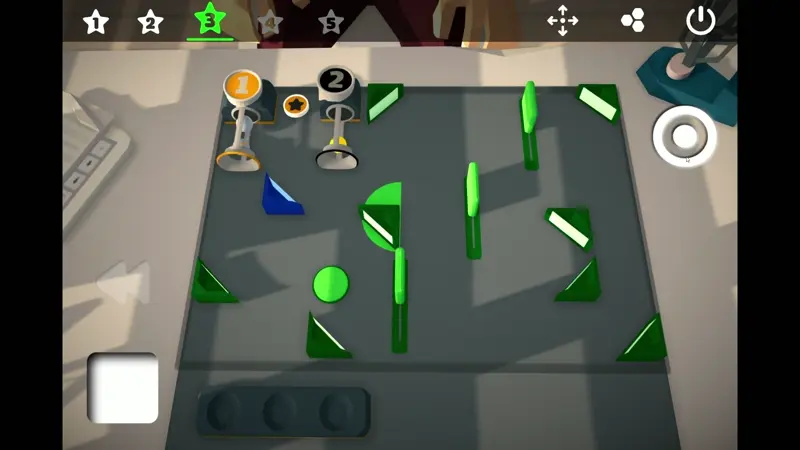
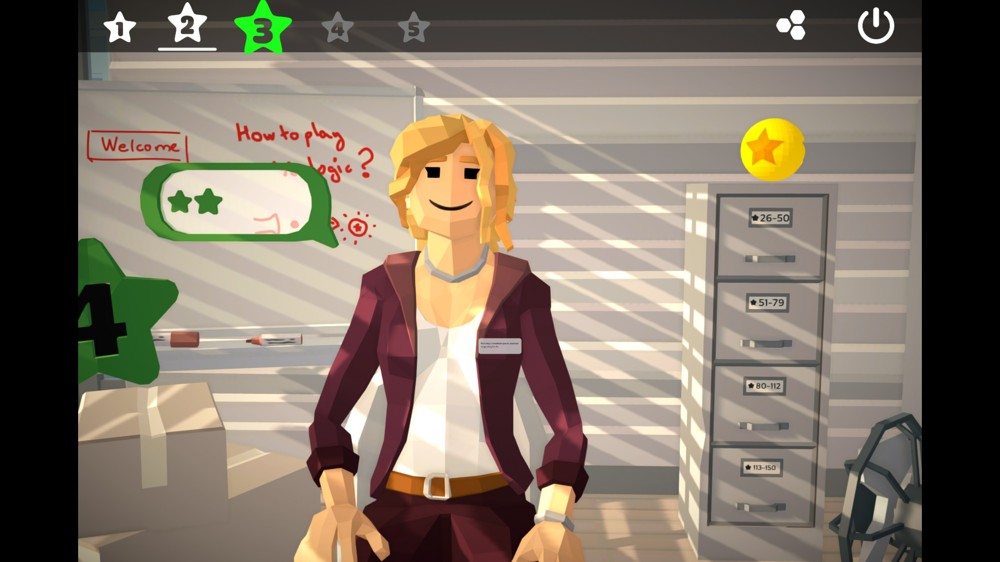
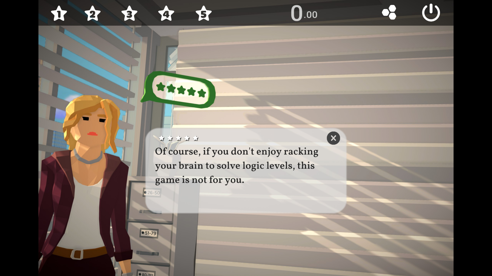

[Youlogic](https://store.steampowered.com/app/2593830/Youlogic/) is a physics-heavy puzzle game launching this week on Steam. It consists of a series of short levels where you're tasked with launching a golf ball at a target:

<YoutubeEmbed youtubeId="oeXa2nfTEiI" />

Though it starts simple, the game iterates on mechanics quickly, which I liked. It starts simple, requiring you to adjust how hard you're launching the ball. Soon, there are multiple launchers, multiple golf balls, ramps to place, and interactive elements (like buttons) that the balls will hit on their journey. Understanding which elements are important to a solution becomes tricky sooner than I expected. _Youlogic_ isn't afraid to iterate on mechanics quickly, a pace of novelty that I enjoyed.

Another element that's unusual in puzzle games is an emphasis on timing. Because everything happens in real time, choosing when you fire each launcher and how much force you put in is an important part of your solution. When you've figured one out and put everything in motion at the exact right time, it's immensely satisfying:

On the flip side, it's frustrating to know how to solve a puzzle but not be able to get the timing quite right. There's a keybinding for selecting a launcher, but the launch action is a click-drag-release. When you're trying to move quickly, it's hard to move with the precision you need. Resetting a level is fast and painless, but the solution taking _too_ many tries to perfect got old quickly. It's odd too, because this is a style of puzzle I really loved in [CrossCode](/games/cross-code/) but struggled to enjoy in _Youlogic_. I think it comes down to the level of precision expected. CrossCode has larger timing windows and simpler controls, which affect the sorts of puzzles they can make players do.

The biggest letdown for me was the inclusion of the "virtual assistant". While the graphics for the puzzles are simple but effective, your assistant comes across like an unsettling [Playmobil character](https://www.google.com/search?q=playmobil+face&udm=2) whose facial detail doesn't match everything else:

The game's marketing materials mention that "[it] tells a story about you and your virtual assistant". But, there didn't seem to be a lot of "story", as it were. She explains puzzle concepts to you and makes small talk, but she doesn't have a name or a narrative arc, so I struggle to describe _Youlogic_ as having a story. Instead, you're acquiring stars by completing puzzles to unlock new areas of this facility. But at that point, why even say there's a story at all? I think it would have benefited from cutting scope and being purely the puzzle game it set out to be.

And, not that it really matters, but the assistant came off as sort of mean and condescending, which I didn't really care for?

There are some brief cutscenes, during which you can move the camera around. That could be fun (if there are interesting things for you to find) but in practice, it just means the focus of the scene is usually out of frame. Other parts of the UI are similarly baffling: most buttons are oversized on a computer monitor and I repeatedly had to zoom/pan the camera to actually work on a puzzle (in what should have been a fixed frame).

I'm ultimately disappointed, because I genuinely liked some of the puzzle mechanics here. Understanding and executing the solution to a hard level was immensely satisfying, but those highs were few and far between. In the meantime, you're left with puzzles that demand precise timing that are more frustrating than fun. That said, if dexterity puzzles are your bread and butter, you may be able to look past the downsides and really enjoy _Youlogic_.
