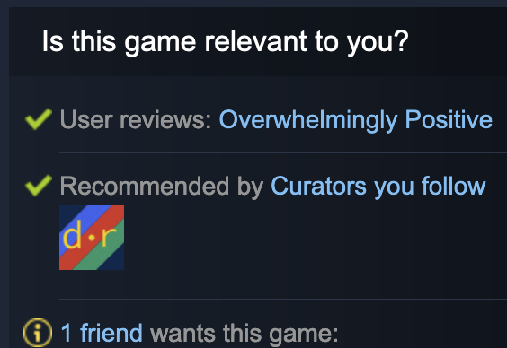
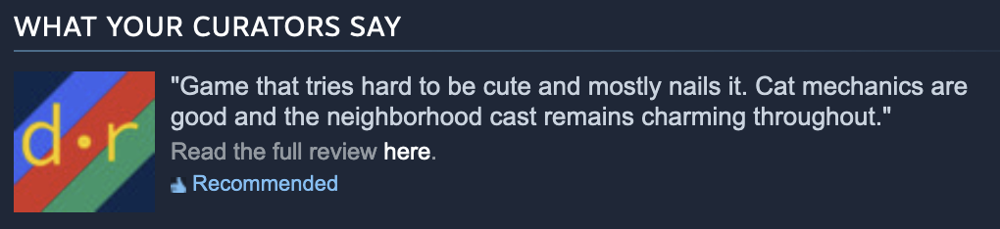

import ExternalLink from "../components/links/ExternalLink.astro";
import SubtleLink from "../components/links/SubtleLink.astro";
import SteamFollowButton from "../components/SteamFollowButton.astro";
import OmniLink from "../components/mdx/OmniLink.astro";
// could make this generic and not have to redo it for every page, but there's only 2 so far?
export const components = { a: OmniLink };

# About / Manifesto

I'm <ExternalLink href="https://xavd.id">David</ExternalLink>; these are my reviews! I run this site to share what I think of everything I play, watch, and read.

## Why This Exists

Since 2016, I've used <ExternalLink href="https://airtable.com/">Airtable</ExternalLink> to catalog my media consumption. Then, each January, I'd write a <ExternalLink href="https://xavd.id/blog/tags/yearly-review">yearly review</ExternalLink> of my favorite things from the previous year.

Eventually, I wanted a place where I could share _all_ my reviews with friends and family, not just the best ones, so `david.reviews` was released in late 2023.

### A Different Kind of Website

Throughout 2024, I grew increasingly frustrated with the state of the web. Articles online are designed for SEO (and now, AI), not humans.

I got curious what a long-form review site would look like if it wasn't profit motivated. If a website wasn't optimized for engagement and revenue, then it wouldn't need auto-playing video following you as you scrolled. You could also skip the exaggerated SEO headlines and ads plastered over everything. Gone too are sponsored posts or "recommendation" posts that are just lists of Amazon referrals.

So, that's my goal with _david.reviews_: to create **a media review site you actually enjoy reading**. It's wicked fast, information dense, and respects you as a reader. There are no modals, no sponsored content, no fluff. 100% written by me, a real person who really likes games and movies and books.

### Why Now?

It might seem silly to launch a traditional review site in 2024. It's an extremely crowded field and AI-generated content is everywhere at this point.

But that's also why it feels like it's the _most important_ time to launch this project. In a world that's losing some of its humanity, we need small, independent reviewers: real people who write to inform, not just to get eyeballs on the site.

## Support The Site

Like I mentioned, this site aims to be non-commercial. That means no ads, no banners, no subscriptions, and no harassing you for support. That said, it's not totally free to run.

To help, you can:

- Sign up for Airtable: <ExternalLink href="https://airtable.com/invite/r/7A1YRa26">airtable.com/invite/r/7A1YRa26</ExternalLink>
- Follow me on Steam: <ExternalLink href="https://store.steampowered.com/curator/45203122/">steampowered.com/curator/45203122</ExternalLink>
- <SubtleLink href="/contact">Send me</SubtleLink> your game or book

and optionally keep reading to find out why that's useful.

### Sign Up for Airtable

My biggest cost is Airtable, which costs $20 / month. (I may eventually stand up a Django server instead, but I've built a lot onto Airtable and moving would be a lot of work that I'm not prioritizing now.)

The best and easiest thing you can do is **sign up for Airtable** using <ExternalLink href="https://airtable.com/invite/r/7A1YRa26">my referral link</ExternalLink>. Each person that does this gets me $10 in credit, which goes a long way towards making this site cheap to run.

Plus, Airtable rocks; there's a reason I backed my whole site with it. So sign up, and enjoy: <ExternalLink href="https://airtable.com/invite/r/7A1YRa26">airtable.com/invite/r/7A1YRa26</ExternalLink>.

### Follow My Steam Curator

In order to prove I'm an outlet worth sending review copies to, I typically have to demonstrate some level of readership and audience. Because everything on this site is available via <SubtleLink href="/feeds">RSS feeds</SubtleLink>, it can be hard to prove I have an audience. A Steam curator page helps solve this by showing an explicit follower count and some basic analytics from Steam about how often people buy games I've recommended.

So, kindly hit that big "Follow" button: <ExternalLink href="https://store.steampowered.com/curator/45203122/">steampowered.com/curator/45203122</ExternalLink>

As a bonus, my recommendations will show up on your Steam store pages:

and in the _reviews_ section:

If that sounds great, please:

<SteamFollowButton />

### Send Me Your Game

I play a lot of indie games, which typically cost money. If you're a developer (or publisher) who wants to see your game reviewed here, please <SubtleLink href="/contact">get in touch</SubtleLink>!

## Tech Stack

- This site is (almost) entirely static, built with <ExternalLink href="https://astro.build/">Astro</ExternalLink>, and styled with <ExternalLink href="https://tailwindcss.com/">Tailwind</ExternalLink>
- The data is stored in <ExternalLink href="https://airtable.com/">Airtable</ExternalLink>
- The source is available on <ExternalLink href="https://github.com/xavdid/david.reviews">GitHub</ExternalLink>
- The <ExternalLink href="/og.png">social media image</ExternalLink> was created by <ExternalLink href="https://www.karenbrownman.com/">Karen Brownman</ExternalLink>
- Game covers are sourced from <ExternalLink href="https://www.igdb.com/">IGDB</ExternalLink>
- Movie posters are sourced from <ExternalLink href="https://www.themoviedb.org/">TMDb</ExternalLink>
- Book covers are sourced from the Google <ExternalLink href="https://developers.google.com/books">Books API</ExternalLink>
